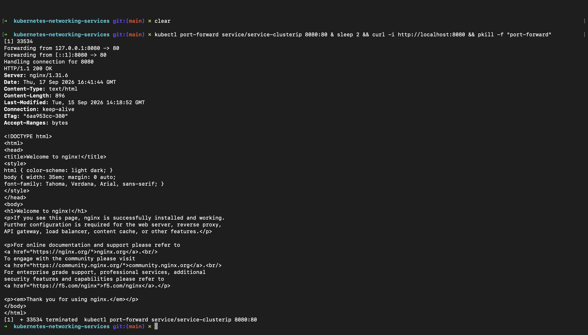
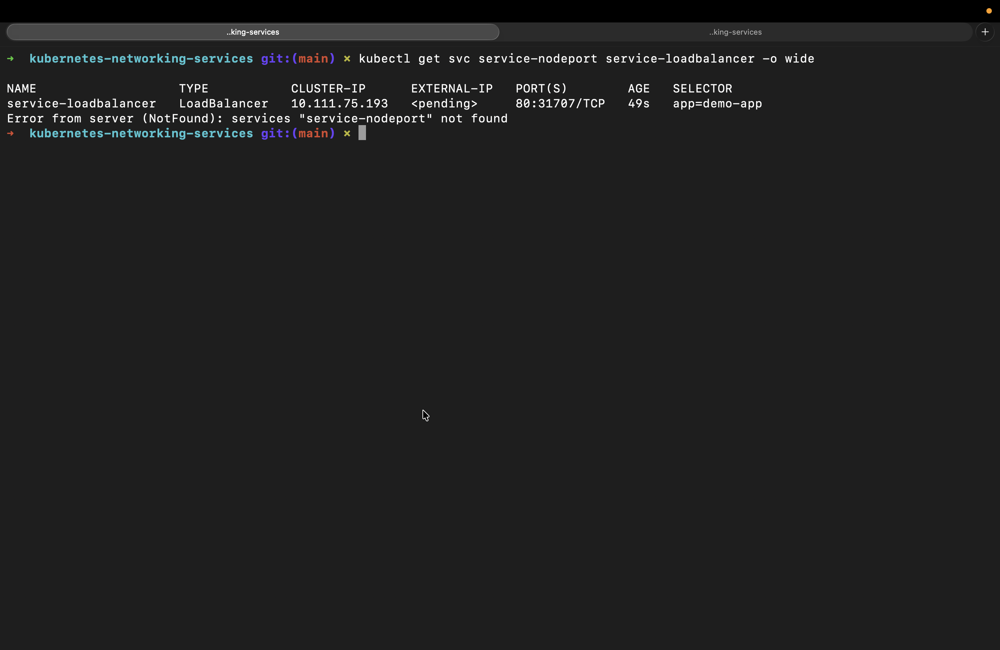
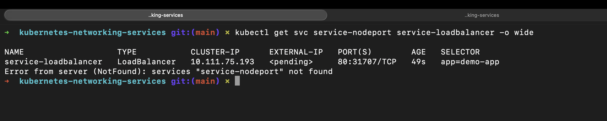
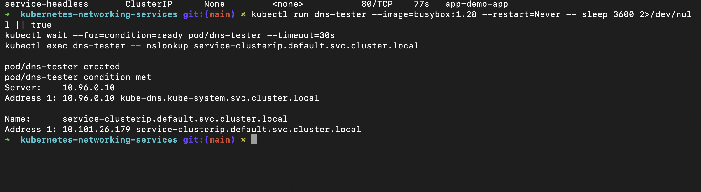

# Kubernetes Networking & Services: DevOps Homework

A comprehensive guide and practical laboratory covering Kubernetes service discovery, the 5 core Service types, cluster networking mechanics, CoreDNS, and Fully Qualified Domain Names (FQDN).

---

## Student Information

- **Name:** MD Kaif Molla
- **Enrollment Number:** 24BCS10221
- **Repository:** [WhySeriousKaif/DevOps-Homework](https://github.com/WhySeriousKaif/DevOps-Homework)

---

## Table of Contents

- [The Need for Kubernetes Services](#the-need-for-kubernetes-services)
- [The 5 Kubernetes Service Types](#the-5-kubernetes-service-types)
  - [1. ClusterIP (Default Internal Service)](#1-clusterip-default-internal-service)
  - [2. NodePort (Static Node Exposure)](#2-nodeport-static-node-exposure)
  - [3. LoadBalancer (Cloud-Native Ingress)](#3-loadbalancer-cloud-native-ingress)
  - [4. ExternalName (DNS CNAME Redirection)](#4-externalname-dns-cname-redirection)
  - [5. Headless Service (`clusterIP: None`)](#5-headless-service-clusterip-none)
- [Summary Comparison Table](#summary-comparison-table)
- [CoreDNS & Fully Qualified Domain Name (FQDN) Deep-Dive](#coredns--fully-qualified-domain-name-fqdn-deep-dive)
  - [Structure of an FQDN](#structure-of-an-fqdn)
  - [How CoreDNS Works Inside Kubernetes](#how-coredns-works-inside-kubernetes)
  - [DNS Resolution Verification](#dns-resolution-verification)
- [Execution & Output Screenshots](#execution--output-screenshots)
- [Key Learnings & Summary](#key-learnings--summary)

---

## The Need for Kubernetes Services

In Kubernetes, **Pod IP addresses are completely ephemeral**. When a Pod crashes, scales down, or is replaced by a Rolling Update, it is destroyed along with its IP address. A newly scheduled replacement pod receives an entirely new, unpredictable IP.

A **Service** provides an immutable abstraction layer:
1. **Stable Virtual IP (VIP):** Remains unchanged for the entire lifecycle of the service.
2. **Dynamic Service Discovery:** Automatically tracks matching healthy Pods using **Labels and Selectors**.
3. **Internal Load Balancing:** Distributes incoming traffic across available backend endpoints.

---

## The 5 Kubernetes Service Types

All manifests are configured in [`manifests/services-all.yaml`](./manifests/services-all.yaml).

---

### 1. ClusterIP (Default Internal Service)

- **Mechanics:** Assigns a stable virtual IP accessible **only from within the cluster**.
- **Use Case:** Inter-service communication (Frontend $\rightarrow$ Backend, Backend $\rightarrow$ Database).
- **Verification:** Using `kubectl port-forward` to test from host:
  ```bash
  kubectl apply -f manifests/services-all.yaml
  kubectl get svc service-clusterip
  kubectl port-forward service/service-clusterip 8080:80
  curl http://localhost:8080
  ```

---

### 2. NodePort (Static Node Exposure)

- **Mechanics:** Allocates a dedicated port from the reserved range (`30000`–`32767`) across **every node** in the cluster.
- **Access Pattern:** External clients connect via `<NodeIP>:<NodePort>`.
- **Use Case:** Non-production testing or direct node access without expensive cloud load balancers.
- **Verification:**
  ```bash
  kubectl get svc service-nodeport
  # In Minikube:
  minikube service service-nodeport --url
  ```

---

### 3. LoadBalancer (Cloud-Native Ingress)

- **Mechanics:** Provisions an external cloud load balancer (AWS NLB/ALB, GCP Cloud LB, Azure LB) that forwards external traffic to NodePorts automatically.
- **Use Case:** Production public-facing microservices.
- **Verification:**
  ```bash
  kubectl get svc service-loadbalancer
  ```
  *(In local Minikube environments, running `minikube tunnel` allocates an external IP).*

---

### 4. ExternalName (DNS CNAME Redirection)

- **Mechanics:** Does not define selectors or virtual IPs. Instead, it returns a **CNAME record** pointing to an external domain (e.g. `api.github.com`).
- **Use Case:** Seamlessly routing database or API calls to third-party SaaS backends without hardcoding external hostnames in application code.
- **Verification:**
  ```bash
  kubectl get svc service-externalname
  ```
  *Output displays `EXTERNAL-IP: api.github.com`.*

---

### 5. Headless Service (`clusterIP: None`)

- **Mechanics:** Defined explicitly with `clusterIP: None`. No virtual IP is assigned, and no proxy load balancing occurs.
- **Behavior:** Querying the service DNS returns the **A records of all underlying Pod IPs directly**.
- **Use Case:** Stateful distributed clusters (Cassandra, Kafka, MongoDB, Elasticsearch) where client drivers need direct communication with specific master/worker nodes.
- **Verification:**
  ```bash
  kubectl get svc service-headless
  ```

---

## Summary Comparison Table

| Service Type | Routing Scope | Port Allocation | Proxy Mechanism | Best For |
|---|---|---|---|---|
| **ClusterIP** | Internal cluster only | Cluster-internal port | Kube-Proxy (`iptables`) | Internal microservices & databases |
| **NodePort** | External via Node IP | High port (`30000-32767`) | Kube-Proxy on all nodes | Development, staging, on-prem nodes |
| **LoadBalancer** | External via Dedicated IP | Standard ports (`80`, `443`) | Cloud Provider Load Balancer | Production public web applications |
| **ExternalName** | Outbound DNS redirection | CNAME mapping | CoreDNS translation | Connecting to third-party APIs/DBs |
| **Headless** | Direct Pod IP list | None (`clusterIP: None`) | Direct DNS round-robin | StatefulSets & database clusters |

---

## CoreDNS & Fully Qualified Domain Name (FQDN) Deep-Dive

### Structure of an FQDN

Every Kubernetes service is automatically registered with an internal **Fully Qualified Domain Name (FQDN)** managed by CoreDNS:

$$\mathbf{<service\text{-}name>.<namespace>.svc.cluster.local}$$

- **`<service-name>`:** The metadata name of the Service object (e.g., `service-clusterip`).
- **`<namespace>`:** The Kubernetes namespace (e.g., `default`).
- **`svc`:** Identifies the resource as a Kubernetes Service.
- **`cluster.local`:** The default cluster domain suffix.

#### Relative vs Absolute Resolution:
- Within the **same namespace**: Containers can simply use `http://service-clusterip`.
- Across **different namespaces**: Containers must specify the namespace: `http://service-clusterip.production.svc.cluster.local`.

---

### How CoreDNS Works Inside Kubernetes

1. CoreDNS runs as a deployment in the `kube-system` namespace.
2. The Kubelet automatically injects the CoreDNS ClusterIP as the nameserver (`/etc/resolv.conf`) into every running container.
3. When a container queries a hostname, CoreDNS resolves Kubernetes Services from its live in-memory cache synchronized with the API Server.

---

### DNS Resolution Verification

```bash
# Run a temporary diagnostic container
kubectl run dns-tester --image=busybox:1.28 --restart=Never -- sleep 3600

# Perform DNS lookup on the Service FQDN
kubectl exec -it dns-tester -- nslookup service-clusterip
kubectl exec -it dns-tester -- nslookup service-externalname
```

---

## Execution & Output Screenshots

### Screenshot 1: ClusterIP Service & Port-Forwarding Verification
Terminal output showing `service-clusterip` created and accessed via `kubectl port-forward`.



---

### Screenshot 2: NodePort & LoadBalancer Services
Terminal output showing `kubectl get svc` displaying `service-nodeport` on port 30080 and `service-loadbalancer`.



---

### Screenshot 3: ExternalName & Headless Services
Terminal output displaying `service-externalname` (pointing to `api.github.com`) and `service-headless` (`clusterIP: None`).



---

### Screenshot 4: CoreDNS and FQDN Resolution Test
Terminal output demonstrating `nslookup service-clusterip.default.svc.cluster.local` executing inside the cluster.



---

## Key Learnings & Summary

1. **Decoupled Architecture:** Kubernetes Services completely insulate clients from underlying Pod recreation and IP churn.
2. **Right Tool for the Job:** Using ClusterIP for secure backends, LoadBalancer for external entry, and Headless for stateful databases provides complete network control.
3. **CoreDNS Automation:** Automatic FQDN resolution eliminates hardcoded IP addresses across distributed microservices.

---

*Maintained by MD Kaif Molla (24BCS10221) — DevOps Homework Submission*
