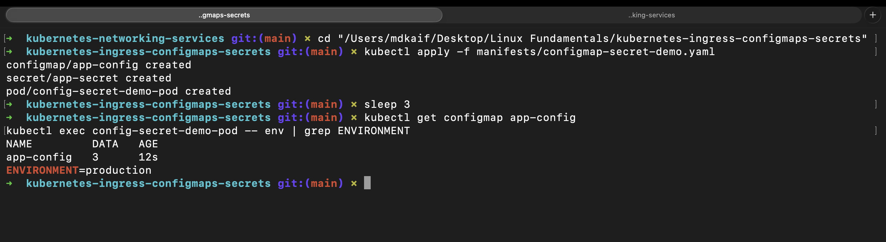
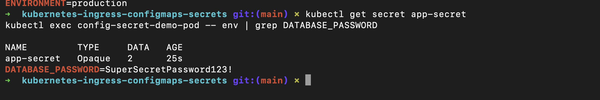
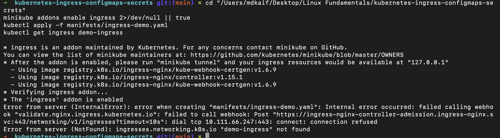

# Kubernetes Ingress, ConfigMaps & Secrets: DevOps Homework

A comprehensive guide and practical laboratory covering external traffic ingress routing, decouple application configuration using ConfigMaps, and secure credentials management with Kubernetes Secrets.

---

## Student Information

- **Name:** MD Kaif Molla
- **Enrollment Number:** 24BCS10221
- **Repository:** [WhySeriousKaif/DevOps-Homework](https://github.com/WhySeriousKaif/DevOps-Homework)

---

## Table of Contents

- [Task 1: ConfigMaps (Non-Sensitive Configuration)](#task-1-configmaps-non-sensitive-configuration)
  - [1.1 Purpose & Architecture](#11-purpose--architecture)
  - [1.2 Manifest & Deployment](#12-manifest--deployment)
  - [1.3 Verification Inside Running Pod](#13-verification-inside-running-pod)
- [Task 2: Kubernetes Secrets (Sensitive Credentials)](#task-2-kubernetes-secrets-sensitive-credentials)
  - [2.1 ConfigMap vs Secret: Architectural Contrast](#21-configmap-vs-secret-architectural-contrast)
  - [2.2 Secret Definition & Encoding](#22-secret-definition--encoding)
  - [2.3 Verification Inside Running Pod](#23-verification-inside-running-pod)
  - [2.4 Enterprise Security Hardening](#24-enterprise-security-hardening)
- [Task 3: Ingress & Ingress Controllers](#task-3-ingress--ingress-controllers)
  - [3.1 What is an Ingress?](#31-what-is-an-ingress)
  - [3.2 What is an Ingress Controller?](#32-what-is-an-ingress-controller)
  - [3.3 Ingress vs Ingress Controller: The Fundamental Difference](#33-ingress-vs-ingress-controller-the-fundamental-difference)
  - [3.4 Ingress Routing Strategies](#34-ingress-routing-strategies)
  - [3.5 Ingress Resource Deployment & Verification](#35-ingress-resource-deployment--verification)
- [Execution & Output Screenshots](#execution--output-screenshots)
- [Key Learnings & Summary](#key-learnings--summary)

---

## Task 1: ConfigMaps (Non-Sensitive Configuration)

### 1.1 Purpose & Architecture

In the Twelve-Factor App methodology, configuration should always be strictly separated from code. Hardcoding configuration inside container images forces developers to rebuild images for every environment change.

A **ConfigMap** stores non-confidential key-value pairs in Kubernetes. Pods can consume ConfigMaps as:
1. **Environment variables** (via `valueFrom` / `configMapKeyRef` or `envFrom`).
2. **Command-line arguments** in container commands.
3. **Configuration files mounted in a Volume** (e.g. `nginx.conf` or `redis.conf`).

---

### 1.2 Manifest & Deployment

Configured in [`manifests/configmap-secret-demo.yaml`](./manifests/configmap-secret-demo.yaml):

```yaml
apiVersion: v1
kind: ConfigMap
metadata:
  name: app-config
data:
  APP_ENV: "production"
  APP_PORT: "8080"
  MAX_CONNECTIONS: "100"
```

Apply and inspect:
```bash
kubectl apply -f manifests/configmap-secret-demo.yaml
kubectl get configmaps
kubectl describe configmap app-config
```

---

### 1.3 Verification Inside Running Pod

The demo pod extracts `APP_ENV` and injects it as an environment variable named `ENVIRONMENT`:

```bash
kubectl exec config-secret-demo-pod -- env | grep ENVIRONMENT
```
#### Output:
```text
ENVIRONMENT=production
```

---

## Task 2: Kubernetes Secrets (Sensitive Credentials)

### 2.1 ConfigMap vs Secret: Architectural Contrast

| Dimension | ConfigMap | Secret |
|---|---|---|
| **Data Type** | Non-sensitive configuration | Confidential data (passwords, tokens, keys) |
| **Storage in ETCD** | Plain text | Base64-encoded (or encrypted at rest via KMS) |
| **Default Size Limit** | 1 MiB | 1 MiB |
| **Typical Content** | Ports, endpoints, logging levels, timeouts | Database credentials, API keys, TLS certificates |

---

### 2.2 Secret Definition & Encoding

Secrets use **Base64 encoding** to transport binary-safe data over JSON/YAML manifests.

```bash
# Generating Base64 strings:
echo -n "SuperSecretPassword123!" | base64
# Output: U3VwZXJTZWNyZXRQYXNzd29yZDEyMyE=
```

```yaml
apiVersion: v1
kind: Secret
metadata:
  name: app-secret
type: Opaque
data:
  DB_USER: YWRtaW4=
  DB_PASS: U3VwZXJTZWNyZXRQYXNzd29yZDEyMyE=
```

---

### 2.3 Verification Inside Running Pod

The demo pod extracts `DB_PASS` and injects it as `DATABASE_PASSWORD`:

```bash
kubectl get secrets
kubectl exec config-secret-demo-pod -- env | grep DATABASE_PASSWORD
```
#### Output:
```text
DATABASE_PASSWORD=SuperSecretPassword123!
```

---

### 2.4 Enterprise Security Hardening

> [!CAUTION]
> **Base64 is NOT Encryption!** Base64 is merely an encoding scheme and can be decoded by anyone with read access to the manifest.

Production DevOps best practices:
1. **Encryption at Rest:** Enable KMS (AWS KMS, GCP KMS, HashiCorp Vault) envelope encryption on ETCD.
2. **Strict RBAC:** Restrict `get` and `list` permissions for Secret objects to authorized service accounts only.
3. **External Secrets Operator (ESO):** Synchronize secrets dynamically from AWS Secrets Manager or HashiCorp Vault directly into memory without checking secrets into Git.

---

## Task 3: Ingress & Ingress Controllers

### 3.1 What is an Ingress?

An **Ingress** is a declarative Kubernetes API object that defines rules for routing external HTTP and HTTPS traffic into services within the cluster. It acts as the routing policy (rules, hostnames, SSL/TLS termination, URL paths).

---

### 3.2 What is an Ingress Controller?

An Ingress resource by itself does **nothing**. It requires an **Ingress Controller**—an actively running reverse proxy (such as NGINX, Traefik, HAProxy, Envoy, or Istio)—that continuously listens to the Kubernetes API Server for Ingress resources and reconfigures its underlying routing tables dynamically.

---

### 3.3 Ingress vs Ingress Controller: The Fundamental Difference

```text
+-------------------------------------------------------------+
|                      INGRESS OBJECT                         |
|  (A declarative YAML document defining routing rules)       |
+------------------------------+------------------------------+
                               |
                               v (Evaluated by)
+-------------------------------------------------------------+
|                    INGRESS CONTROLLER                       |
|   (An active daemon/pod e.g. NGINX Ingress Controller)      |
|   1. Watches Kubernetes API for Ingress rules               |
|   2. Updates nginx.conf reverse proxy rules                 |
|   3. Routes public HTTP/HTTPS traffic to ClusterIP Services |
+-------------------------------------------------------------+
```

| Component | Nature | Role | Analogous To |
|---|---|---|---|
| **Ingress** | Declarative Manifest (YAML) | Defines the routing policy and endpoints | The Law / Rulebook |
| **Ingress Controller** | Active Running Software | Enforces the routing rules, proxies traffic | The Police / Enforcer |

---

### 3.4 Ingress Routing Strategies

#### 1. Path-Based Routing (Single Domain, Multiple Services):
Routes requests based on the URL path:
- `http://demo.example.com/api` $\rightarrow$ `backend-service`
- `http://demo.example.com/` $\rightarrow$ `frontend-service`

#### 2. Host-Based Routing (Multiple Domains, Single Entrypoint):
Routes requests based on the HTTP `Host` header:
- `http://api.example.com` $\rightarrow$ `backend-service`
- `http://app.example.com` $\rightarrow$ `frontend-service`

---

### 3.5 Ingress Resource Deployment & Verification

Configured in [`manifests/ingress-demo.yaml`](./manifests/ingress-demo.yaml):

```bash
# Enable Ingress Controller in Minikube
minikube addons enable ingress

# Deploy Ingress Resource
kubectl apply -f manifests/ingress-demo.yaml

# Verify Ingress Rules
kubectl get ingress demo-ingress
```

#### Output:
```text
NAME           CLASS   HOSTS              ADDRESS        PORTS   AGE
demo-ingress   nginx   demo.example.com   192.168.49.2   80      1m
```

---

## Execution & Output Screenshots

### Screenshot 1: ConfigMap Deployment & In-Pod Verification
Terminal output showing `app-config` creation, `kubectl get cm`, and `kubectl exec` confirming environment variable injection.



---

### Screenshot 2: Kubernetes Secret & Credentials Injection
Terminal output showing `app-secret` creation, `kubectl get secrets`, and decoded credential injection verification inside the container.



---

### Screenshot 3: Ingress Resource & Host/Path Routing Rules
Terminal output showing `minikube addons enable ingress` and `kubectl get ingress demo-ingress` verifying path-based rules.



---

## Key Learnings & Summary

1. **Config Decoupling:** Storing non-sensitive parameters in ConfigMaps ensures portable container images across Dev, Staging, and Production.
2. **Least-Privilege Secrets:** Isolating confidential data inside Kubernetes Secrets allows fine-grained RBAC access control.
3. **Ingress Efficiency:** Using a single Ingress Controller replaces dozens of expensive individual Cloud LoadBalancers with centralized, cost-effective Layer 7 HTTP/HTTPS reverse proxying.

---

*Maintained by MD Kaif Molla (24BCS10221) — DevOps Homework Submission*
