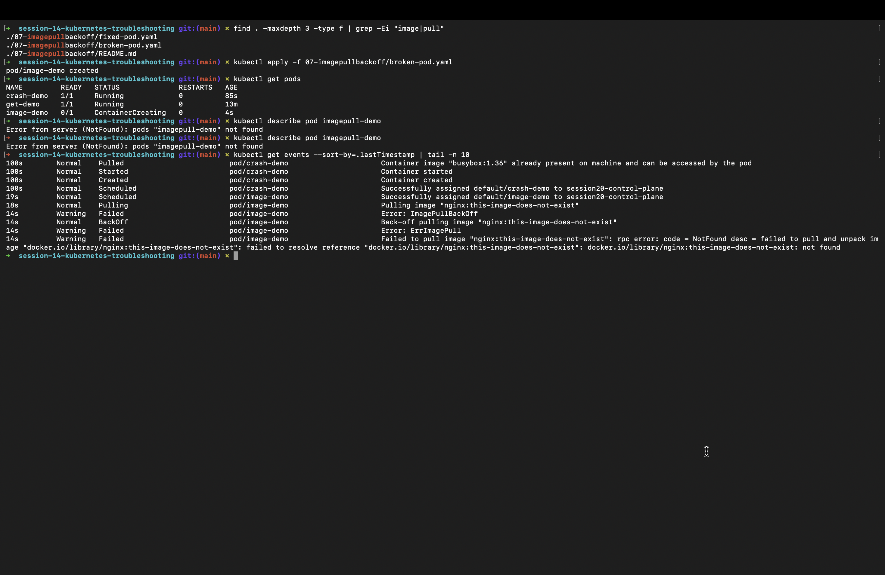
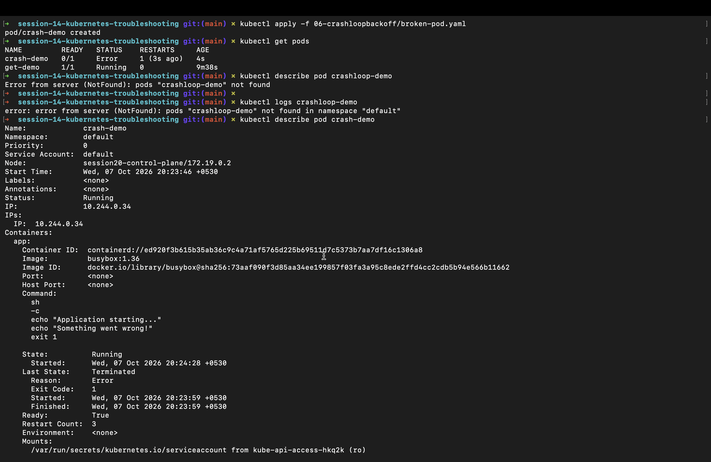
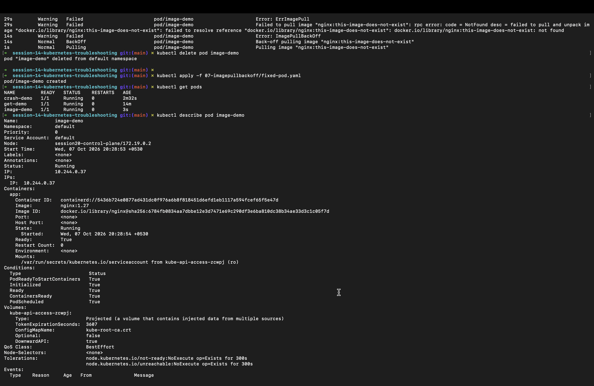
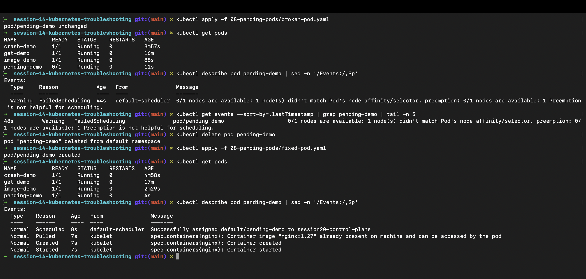
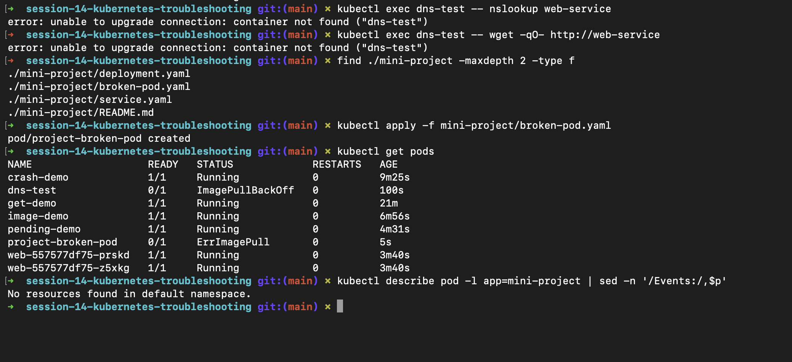

# Kubernetes Troubleshooting: DevOps Homework

> **Status:** Ready for submission. Screenshots are attached in `screenshots/` and embedded below.

---

## Student Information

- **Name:** MD Kaif Molla
- **Enrollment Number:** 24BCS10221
- **Repository:** [WhySeriousKaif/devops-heros](https://github.com/WhySeriousKaif/devops-heros)

---

## Folder Structure

```text
kubernetes-troubleshooting/
├── README.md
└── screenshots/
    ├── png1.png
    ├── png2.png
    ├── png3.png
    ├── png4.png
    ├── png5.png
    └── png6.png
```

---

## Screenshots

### png1.png — Task 1: kubectl command practice


### png2.png — Task 2: CrashLoopBackOff



### png3.png — Task 2: ImagePullBackOff / ErrImagePull



### png4.png — Task 2: Pending / ContainerCreating



### png5.png — Task 2: service / DNS / networking / config issues



### png6.png — Task 3: mini project



---

## Task 1: Kubernetes Troubleshooting Commands

Run these on a known-good workload so you have diagnostic output for the screenshot.

```bash
kubectl apply -f /session-14-kubernetes-troubleshooting/01-kubectl-get/sample-workload.yaml
kubectl get pods
kubectl get pods -o wide
kubectl get deployments
kubectl get services
kubectl get nodes
kubectl describe pod <pod-name>
kubectl logs <pod-name>
kubectl exec -it <pod-name> -- /bin/sh
kubectl exec <pod-name> -- env
kubectl exec <pod-name> -- cat /etc/resolv.conf
kubectl get events --sort-by=.lastTimestamp
kubectl explain pod.spec.containers.resources
kubectl top nodes
kubectl top pods
```

Replace `<pod-name>` with a real pod name from `kubectl get pods`.

Paste your terminal output into:

**`screenshots/png1.png`**

---

## Task 2: Troubleshoot Common Issues

Run the broken manifest, investigate it, fix it, then capture the before/after.

### 2.1 CrashLoopBackOff

```bash
kubectl apply -f /session-14-kubernetes-troubleshooting/06-crashloopbackoff/broken-pod.yaml
kubectl get pods
kubectl describe pod crash-loop-demo
kubectl logs crash-loop-demo
kubectl apply -f /session-14-kubernetes-troubleshooting/06-crashloopbackoff/fixed-pod.yaml
kubectl get pods
kubectl describe pod crash-loop-demo
```

### 2.2 ImagePullBackOff / ErrImagePull

```bash
kubectl apply -f /session-14-kubernetes-troubleshooting/07-imagepullbackoff/broken-pod.yaml
kubectl get pods
kubectl describe pod image-pull-demo
kubectl get events --sort-by=.lastTimestamp
kubectl apply -f /session-14-kubernetes-troubleshooting/07-imagepullbackoff/fixed-pod.yaml
kubectl get pods
kubectl describe pod image-pull-demo
```

### 2.3 Pending / ContainerCreating

```bash
kubectl apply -f /session-14-kubernetes-troubleshooting/08-pending-pods/broken-pod.yaml
kubectl get pods
kubectl describe pod pending-demo
kubectl get events --sort-by=.lastTimestamp
kubectl apply -f /session-14-kubernetes-troubleshooting/08-pending-pods/fixed-pod.yaml
kubectl get pods
kubectl describe pod pending-demo
```

For a pod stuck in `ContainerCreating`, use:

```bash
kubectl get pods
kubectl describe pod <pod-name>
kubectl get events --sort-by=.lastTimestamp
```

### 2.4 Service / DNS / networking / configuration issues

```bash
kubectl apply -f /session-14-kubernetes-troubleshooting/09-service-dns-troubleshooting/deployment.yaml
kubectl apply -f /session-14-kubernetes-troubleshooting/09-service-dns-troubleshooting/service.yaml
kubectl get pods
kubectl get svc
kubectl get endpoints <service-name>
kubectl describe svc <service-name>
kubectl apply -f /session-14-kubernetes-troubleshooting/09-service-dns-troubleshooting/dns-test-pod.yaml
kubectl exec dns-test -- nslookup <service-name>
kubectl exec dns-test -- cat /etc/resolv.conf
kubectl exec <pod-name> -- wget -qO- http://<service-name>
```

Fix any selector or image issue you find, then re-check:

```bash
kubectl get endpoints <service-name>
kubectl get pods
```

Paste the captures into:

**`screenshots/png2.png`** — CrashLoopBackOff  
**`screenshots/png3.png`** — ImagePullBackOff / ErrImagePull  
**`screenshots/png4.png`** — Pending / ContainerCreating  
**`screenshots/png5.png`** — service / DNS / networking / configuration issues

Each screenshot should show the problem, the investigation, and the fixed state where possible.

---

## Task 3: Mini Project

```bash
kubectl apply -f /session-14-kubernetes-troubleshooting/mini-project/deployment.yaml
kubectl apply -f /session-14-kubernetes-troubleshooting/mini-project/service.yaml
kubectl get pods
kubectl get svc
kubectl describe pod <pod-name>
kubectl logs <pod-name>
kubectl get events --sort-by=.lastTimestamp
```

For each problem you find, document:

- Problem statement
- Investigation steps
- Root cause
- Solution
- Before/after output

After fixing, verify with:

```bash
kubectl get pods
kubectl describe pod <pod-name>
kubectl logs <pod-name>
kubectl get svc
kubectl get endpoints <service-name>
```

Paste the before/after into:

**`screenshots/png6.png`**

---

## Deliverables

- [ ] `screenshots/png1.png` — Task 1 commands
- [ ] `screenshots/png2.png` — CrashLoopBackOff
- [ ] `screenshots/png3.png` — ImagePullBackOff / ErrImagePull
- [ ] `screenshots/png4.png` — Pending / ContainerCreating
- [ ] `screenshots/png5.png` — service / DNS / networking / config issues
- [ ] `screenshots/png6.png` — mini project
- [ ] README documents commands, problem statement, investigation, root cause, solution, before/after

---

*Maintained by MD Kaif Molla (24BCS10221) — DevOps Homework Submission*
