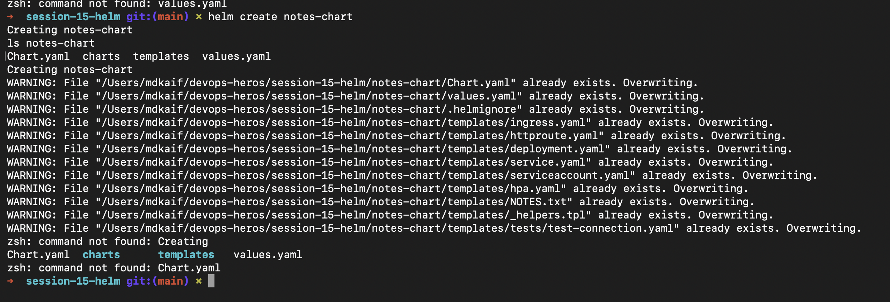
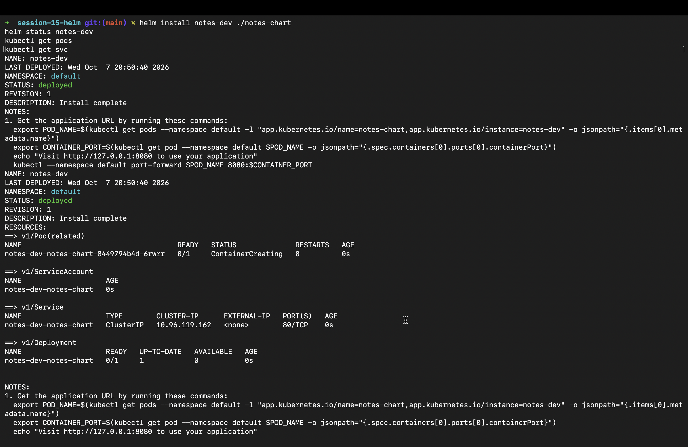
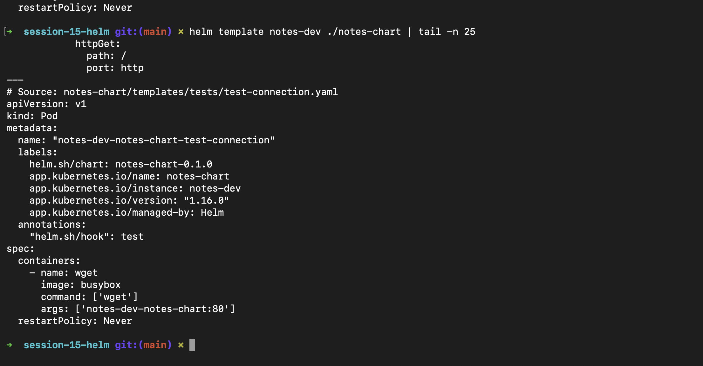
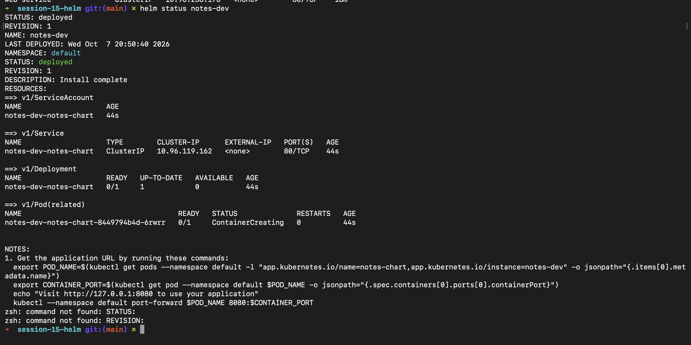
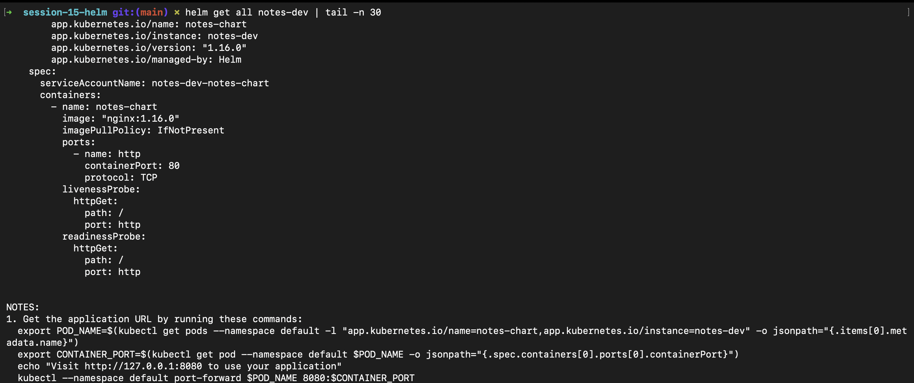
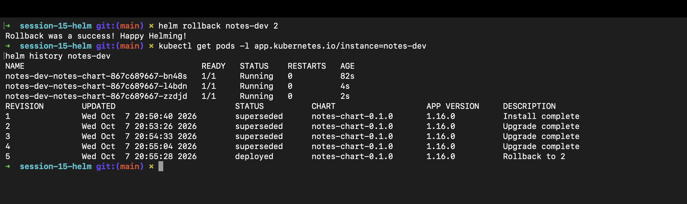
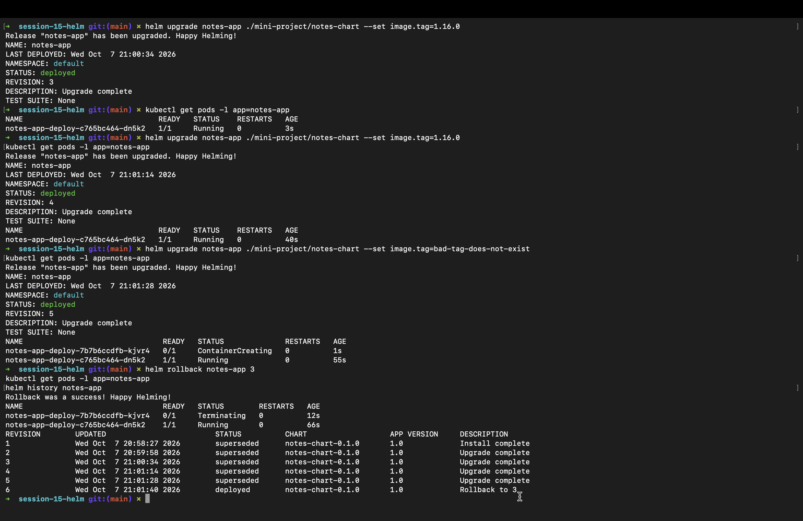

# Helm — Kubernetes Package Manager: DevOps Homework

> **Status:** Ready for submission. Screenshots are in `screenshots/` and embedded below.

---

## Student Information

- **Name:** MD Kaif Molla
- **Enrollment Number:** 24BCS10221
- **Repository:** [WhySeriousKaif/devops-heros](https://github.com/WhySeriousKaif/devops-heros)

---

## Folder Structure

```text
helm-package-manager/
├── README.md
├── notes-chart/
│   ├── Chart.yaml
│   ├── values.yaml
│   ├── values-prod.yaml
│   └── templates/
│       ├── deployment.yaml
│       ├── service.yaml
│       └── configmap.yaml
└── screenshots/
    ├── png1.png   # Task 1 - helm command practice
    ├── png2.png   # Task 1 - helm create / helm lint / helm template
    ├── png3.png   # Task 2 - install + status + list
    ├── png4.png   # Task 2 - upgrade + history
    ├── png5.png   # Task 2 - bad upgrade / ImagePullBackOff
    ├── png6.png   # Task 2 - rollback + verify
    └── png7.png   # Task 3 - mini project
```

---

## Screenshots















---

## Task 1: Helm Commands

Run these from the repo root in order. Replace `<namespace>` and names if your environment needs it.

```bash
cd session-15-helm/homework/helm-package-manager

helm version
helm repo list
helm search repo bitnami/nginx
helm create notes-chart
cd notes-chart
ls
cat Chart.yaml
cat values.yaml
cd ..

helm lint notes-chart
helm template test-render notes-chart
```

Useful commands covered:

- `helm create`
- `helm install`
- `helm list`
- `helm status`
- `helm get`
- `helm upgrade`
- `helm history`
- `helm rollback`
- `helm uninstall`
- `helm repo`
- `helm search`

---

## Task 2: Helm Rollback Workflow

Install, upgrade, verify, upgrade again, verify, rollback, verify.

```bash
helm install notes-dev ./notes-chart
kubectl get pods
helm list
helm status notes-dev
helm get values notes-dev
```

Upgrade once:

```bash
helm upgrade notes-dev ./notes-chart --set replicaCount=2
kubectl get pods
helm history notes-dev
```

Upgrade again and verify:

```bash
helm upgrade notes-dev ./notes-chart --set service.type=ClusterIP
kubectl get svc
helm history notes-dev
```

Simulate a bad upgrade:

```bash
helm upgrade notes-dev ./notes-chart --set image.tag=broken-tag-does-not-exist
kubectl get pods
kubectl describe pod <pod-name>
kubectl get events --sort-by=.lastTimestamp
```

Rollback:

```bash
helm rollback notes-dev 2
kubectl get pods
helm status notes-dev
helm history notes-dev
```

---

## Task 3: Mini Project

Use the mini-project chart in the session folder:

```bash
cd session-15-helm/mini-project/notes-chart

helm lint .
helm template notes-mini .
cd ../..

helm install notes-mini ./session-15-helm/mini-project/notes-chart
kubectl get pods
kubectl get svc
kubectl get configmap
```

Optional: install with production values:

```bash
helm upgrade notes-mini ./session-15-helm/mini-project/notes-chart -f ./session-15-helm/mini-project/notes-chart/values-prod.yaml
kubectl get pods
helm history notes-mini
```

Clean up when done:

```bash
helm uninstall notes-mini
kubectl get pods
helm list
```---

## Deliverables

- [ ] `screenshots/png1.png` — Task 1 command practice
- [ ] `screenshots/png2.png` — Task 1 chart create / lint / template
- [ ] `screenshots/png3.png` — Task 2 install / status / list
- [ ] `screenshots/png4.png` — Task 2 upgrade / history
- [ ] `screenshots/png5.png` — Task 2 bad upgrade
- [ ] `screenshots/png6.png` — Task 2 rollback / verify
- [ ] `screenshots/png7.png` — Task 3 mini project
- [ ] Helm chart, values, templates, install, upgrade, rollback, and README are all complete

---

*Maintained by MD Kaif Molla (24BCS10221) — DevOps Homework Submission*
