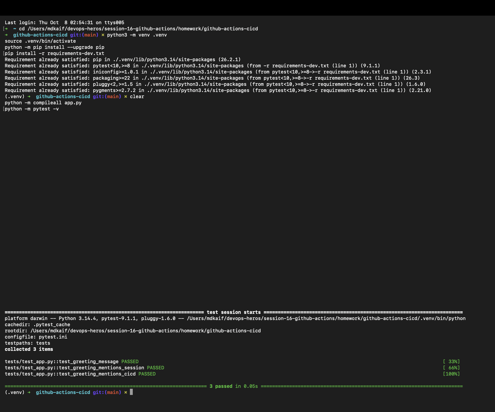
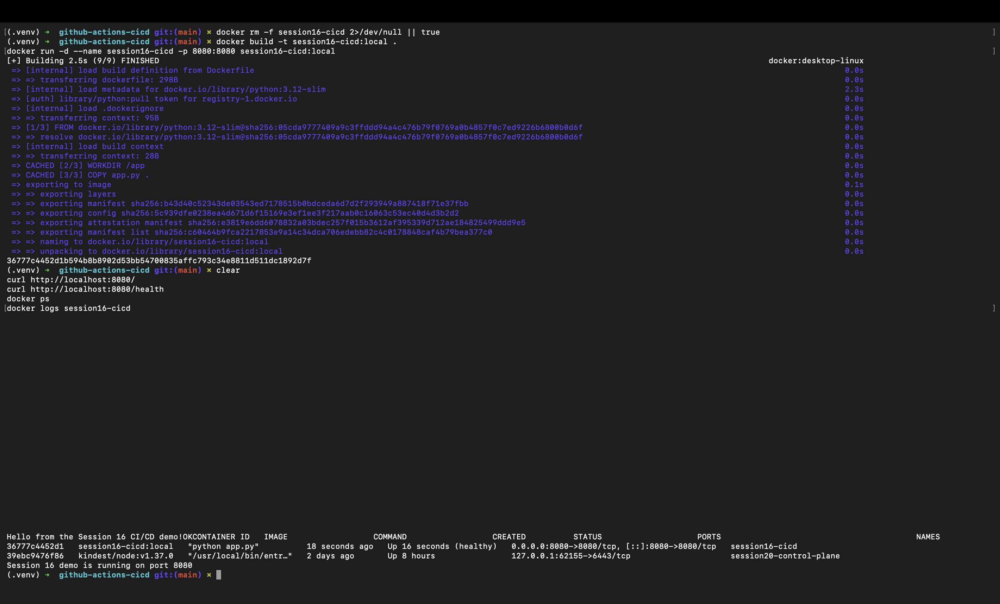
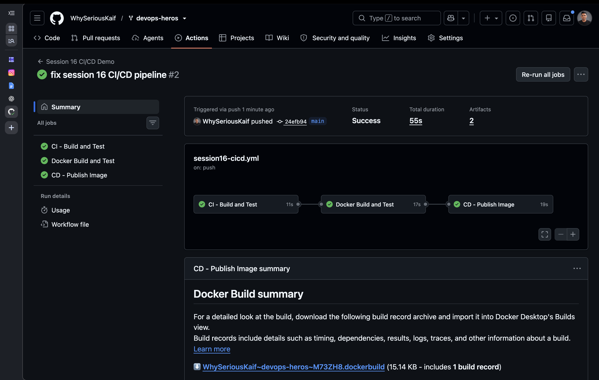
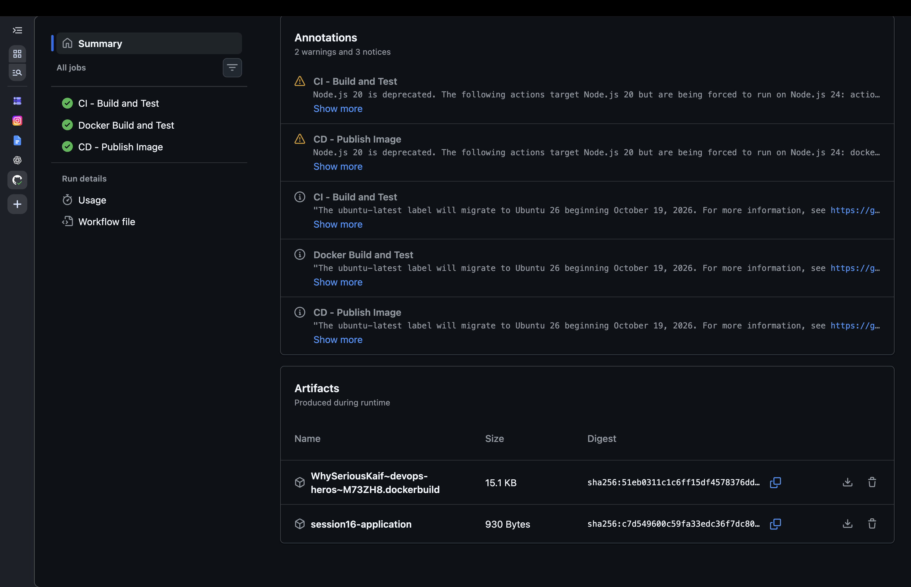

# Session 16: CI/CD and GitHub Actions — DevOps Homework

> **Status:** Work in progress — run the workflow and add the requested screenshots before submission.

## Student Information

- **Name:** MD Kaif Molla
- **Enrollment Number:** 24BCS10221
- **Repository:** [WhySeriousKaif/devops-heros](https://github.com/WhySeriousKaif/devops-heros)

## Objective

Create a GitHub Actions continuous integration pipeline that automatically checks out the code, installs dependencies, builds the application, runs linting and unit tests, and stores useful build/test artifacts.

## CI/CD Flow

```text
Developer push / pull request
            |
            v
      GitHub Actions
            |
      Checkout source
            |
    Install dependencies
            |
       Build and lint
            |
       Unit testing
            |
     Upload artifacts
            |
     Pass / fail result
```

## Folder Structure

```text
github-actions-cicd/
├── README.md
└── screenshots/
    ├── png1.png   # GitHub Actions workflow summary
    ├── png2.png   # Successful build and test steps
    ├── png3.png   # Uploaded workflow artifact
    └── png4.png   # Failed test and corrected rerun
```

The example application and workflow material are available in [`09-build-test-pipeline`](../../09-build-test-pipeline%2010-33-34-262/).

## Core Concepts

- **Continuous Integration (CI):** integrates small code changes frequently and verifies each change automatically.
- **Continuous Delivery:** keeps a verified release ready for a controlled deployment.
- **Continuous Deployment:** automatically deploys every change that passes all gates.
- **Workflow:** automation defined in `.github/workflows/*.yml`.
- **Job:** a collection of steps executed on one runner.
- **Step:** an action or shell command inside a job.
- **Runner:** the machine that executes a workflow job.
- **Artifact:** a file retained from a workflow, such as a test report or build package.

## Workflow Requirements

The CI workflow should:

1. Run for pushes and pull requests.
2. Check out the repository.
3. Set up the required runtime.
4. Install dependencies from the lock or requirements file.
5. Build or syntax-check the application.
6. Run unit tests.
7. Upload a test report or build artifact.
8. Stop immediately when a required quality check fails.

## Local Verification

From the example application directory:

```bash
cd "session-16-github-actions/09-build-test-pipeline 10-33-34-262"
python3 -m venv .venv
source .venv/bin/activate
python -m pip install --upgrade pip
pip install -r requirements.txt
pytest -v
```

## GitHub Actions Verification

After committing the workflow under `.github/workflows/`:

```bash
git add .
git commit -m "add session 16 CI workflow"
git push

gh workflow list
gh run list
gh run view <run-id>
gh run view <run-id> --log
```

Verify that every required step is green and that the artifact can be downloaded from the workflow run page.

## Failure Demonstration

Temporarily change a test expectation, push the change, and observe the failed test gate. Restore the correct expectation, push again, and confirm the pipeline succeeds. Do not merge the intentionally broken version.

## Screenshots

Add these files after running the lab:

- `screenshots/png1.png` — complete workflow summary.
- `screenshots/png2.png` — expanded build and unit-test output.
- `screenshots/png3.png` — uploaded artifact on the workflow page.
- `screenshots/png4.png` — failed run followed by the successful corrected run.

```markdown




```

## Deliverables Checklist

- [ ] Application builds locally.
- [ ] Unit tests pass locally.
- [ ] Workflow runs on push and pull request.
- [ ] Build, test, and artifact steps succeed.
- [ ] Failure blocks the workflow.
- [ ] Screenshots are added and embedded.
- [x] README documents the workflow and commands.

## Lessons Learned

- CI gives fast feedback before a change reaches deployment.
- Jobs can run in parallel unless an explicit `needs` dependency is defined.
- Repository secrets must never be printed in logs or committed to source control.
- Artifacts preserve build evidence independently of the runner.

---

*Maintained by MD Kaif Molla (24BCS10221) — DevOps Homework Submission*
