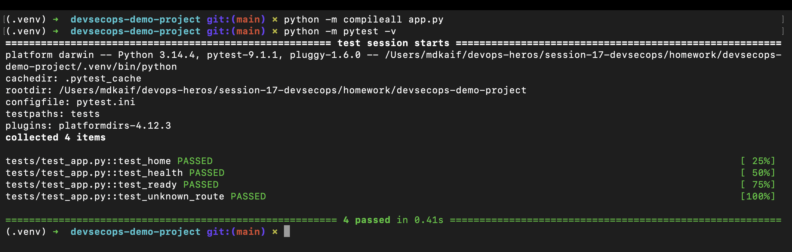
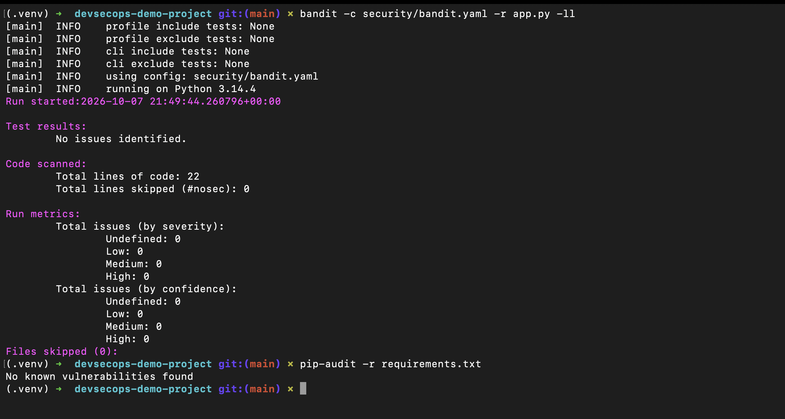
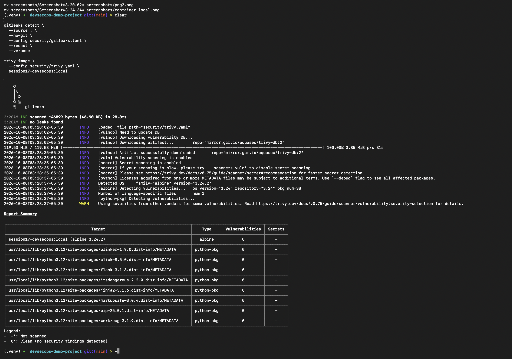
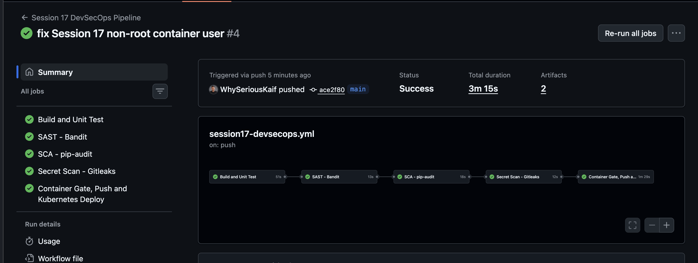
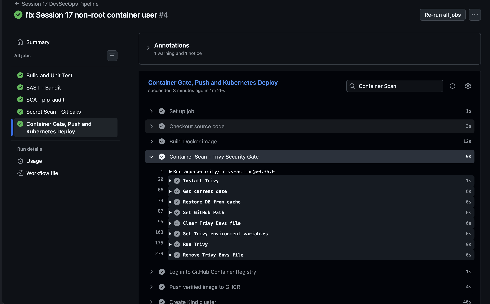
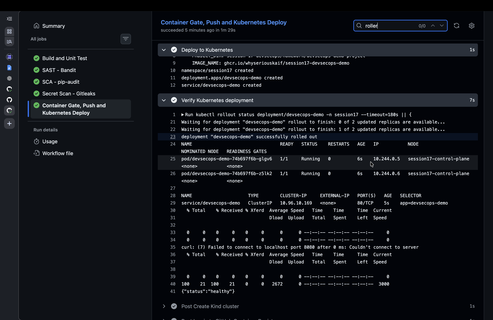

# Session 17: Complete CI/CD and DevSecOps

> **Status:** Run the commands below, capture the six screenshots, and add them to `screenshots/`.

## Student Information

- **Name:** MD Kaif Molla
- **Enrollment Number:** 24BCS10221
- **Repository:** [WhySeriousKaif/devops-heros](https://github.com/WhySeriousKaif/devops-heros)

## Project Overview

This is a small Flask application with a complete CI/CD and DevSecOps pipeline. Every quality and security check must pass before the image is pushed to GitHub Container Registry and deployed to Kubernetes.

## Pipeline Flow

```text
Code
  |
  v
Build
  |
  v
Unit Test
  |
  v
SAST (Bandit)
  |
  v
SCA (pip-audit)
  |
  v
Secret Scan (Gitleaks)
  |
  v
Docker Build
  |
  v
Container Scan (Trivy)
  |
  v
Security Gate
  |
  v
Push Image to GHCR
  |
  v
Deploy to Kubernetes (Kind)
```

If build, tests, or any security gate fails, the later stages do not run.

## Tools

| Requirement | Tool |
|---|---|
| Application build | Python compile check |
| Unit testing | Pytest |
| SAST | Bandit |
| SCA | pip-audit |
| Secret scanning | Gitleaks |
| Container build | Docker |
| Container scanning | Trivy |
| Container registry | GitHub Container Registry |
| Kubernetes deployment | Kind, kubectl, manifests |
| Automation | GitHub Actions |

## Folder Structure

```text
devops-heros/
├── .github/
│   └── workflows/
│       └── session17-devsecops.yml
└── session-17-devsecops/
    └── homework/
        └── devsecops-demo-project/
            ├── app.py
            ├── Dockerfile
            ├── requirements.txt
            ├── requirements-dev.txt
            ├── pytest.ini
            ├── tests/
            │   └── test_app.py
            ├── security/
            │   ├── bandit.yaml
            │   ├── gitleaks.toml
            │   └── trivy.yaml
            ├── kubernetes/
            │   ├── namespace.yaml
            │   ├── deployment.yaml
            │   └── service.yaml
            ├── screenshots/
            │   ├── png1.png
            │   ├── png2.png
            │   ├── png3.png
            │   ├── png4.png
            │   ├── png5.png
            │   └── png6.png
            └── README.md
```

## Application Endpoints

- `/` — application information.
- `/health` — liveness response.
- `/ready` — readiness response.

## Commands to Run

### 1. Open the Project

```bash
cd /Users/mdkaif/devops-heros/session-17-devsecops/homework/devsecops-demo-project
```

### 2. Create the Python Environment

```bash
python3 -m venv .venv
source .venv/bin/activate
python -m pip install --upgrade pip
pip install -r requirements.txt -r requirements-dev.txt
```

### 3. Build and Unit Test

```bash
clear
python -m compileall app.py
python -m pytest -v
```

Expected result:

```text
4 passed
```

**Take Screenshot 1 now.** Save it as `screenshots/png1.png`.

### 4. Run SAST and SCA

```bash
clear
bandit -c security/bandit.yaml -r app.py -ll
pip-audit -r requirements.txt
```

Expected results include:

```text
No issues identified.
No known vulnerabilities found
```

**Take Screenshot 2 now.** Save it as `screenshots/png2.png`.

### 5. Run Secret Scanning

Install Gitleaks once if it is unavailable:

```bash
brew install gitleaks
```

Run the scan:

```bash
clear
gitleaks detect \
  --source . \
  --no-git \
  --config security/gitleaks.toml \
  --redact \
  --verbose
```

The command must finish without detecting a secret.

### 6. Build and Scan the Container

Install Trivy once if it is unavailable:

```bash
brew install trivy
```

Build and scan:

```bash
docker build -t session17-devsecops:local .
trivy image --config security/trivy.yaml session17-devsecops:local
```

The scan is the container security gate. A critical vulnerability causes a non-zero exit code and stops the pipeline.

**Take Screenshot 3 now.** Capture the successful Gitleaks and Trivy results and save it as `screenshots/png3.png`.

### 7. Test the Container Locally

```bash
docker rm -f session17-devsecops 2>/dev/null || true
docker run -d --name session17-devsecops -p 8080:8080 session17-devsecops:local

until curl --fail http://localhost:8080/health; do
  sleep 1
done

curl http://localhost:8080/
curl http://localhost:8080/ready
docker ps
docker logs session17-devsecops
docker rm -f session17-devsecops
```

### 8. Commit and Trigger the Pipeline

```bash
cd /Users/mdkaif/devops-heros

git add .github/workflows/session17-devsecops.yml
git add session-17-devsecops/homework/devsecops-demo-project
git commit -m "complete session 17 DevSecOps project"
git push origin main
```

Open the workflow page:

```text
https://github.com/WhySeriousKaif/devops-heros/actions/workflows/session17-devsecops.yml
```

Wait until every job is green.

**Take Screenshot 4 now.** Capture the complete successful workflow graph and save it as `screenshots/png4.png`.

### 9. Capture Security Gate Evidence

Open the successful workflow run and expand these jobs or steps:

- `SAST - Bandit`
- `SCA - pip-audit`
- `Secret Scan - Gitleaks`
- `Container Scan - Trivy Security Gate`

**Take Screenshot 5 now.** Save it as `screenshots/png5.png`.

### 10. Capture Registry and Kubernetes Evidence

In the delivery job, expand the following steps:

- `Push verified image to GHCR`
- `Deploy to Kubernetes`
- `Verify Kubernetes deployment`

The verification output should show two ready application pods and the service.

The package is also available from the repository's **Packages** section after a successful `main` run.

**Take Screenshot 6 now.** Save it as `screenshots/png6.png`.

## Security Gates

| Gate | Failure condition | Result |
|---|---|---|
| Unit test | Any failed test | Pipeline stops |
| SAST | Medium/high-confidence code issue | Pipeline stops |
| SCA | Known vulnerable Python dependency | Pipeline stops |
| Secret scan | Credential or token pattern detected | Pipeline stops |
| Image scan | Fixable critical vulnerability detected | Pipeline stops |

Do not add real credentials to test secret scanning. A deliberately fake test value should be removed before the final successful run.

## Kubernetes Deployment

The workflow creates an ephemeral Kind cluster, loads the verified local image, applies the manifests, checks rollout status, verifies the health endpoint, and removes the runner automatically when the job finishes.

This provides a repeatable Kubernetes deployment without requiring cloud credentials.

## Screenshots

### Build and Unit Tests



### SAST and SCA



### Secret and Container Scanning



### Successful Pipeline



### Security Gates



### Registry and Kubernetes Deployment



## Push the Screenshots

After saving all six files:

```bash
cd /Users/mdkaif/devops-heros
git add session-17-devsecops/homework/devsecops-demo-project/screenshots
git commit -m "add session 17 DevSecOps screenshots"
git push origin main
```

## Deliverables Checklist

- [x] Application source code
- [x] Dockerfile
- [x] GitHub Actions workflow
- [x] Unit tests
- [x] SAST, SCA, secret, and image scanning
- [x] Security gates
- [x] GHCR image publishing
- [x] Kubernetes manifests and deployment job
- [x] Security tool configuration
- [ ] Successful pipeline screenshots
- [x] Complete README

---

*Maintained by MD Kaif Molla (24BCS10221) — DevOps Homework Submission*
