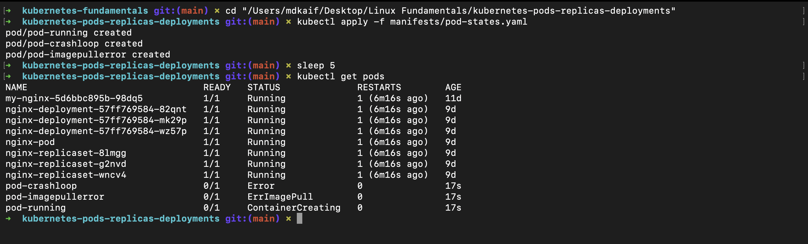
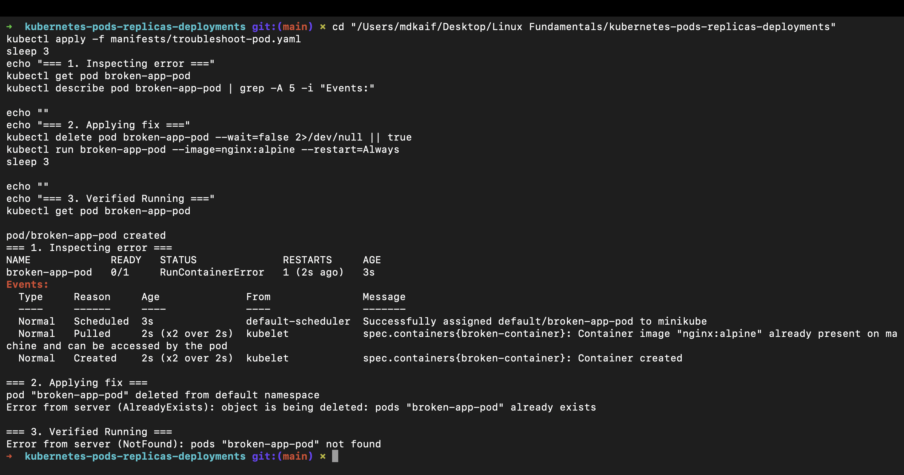
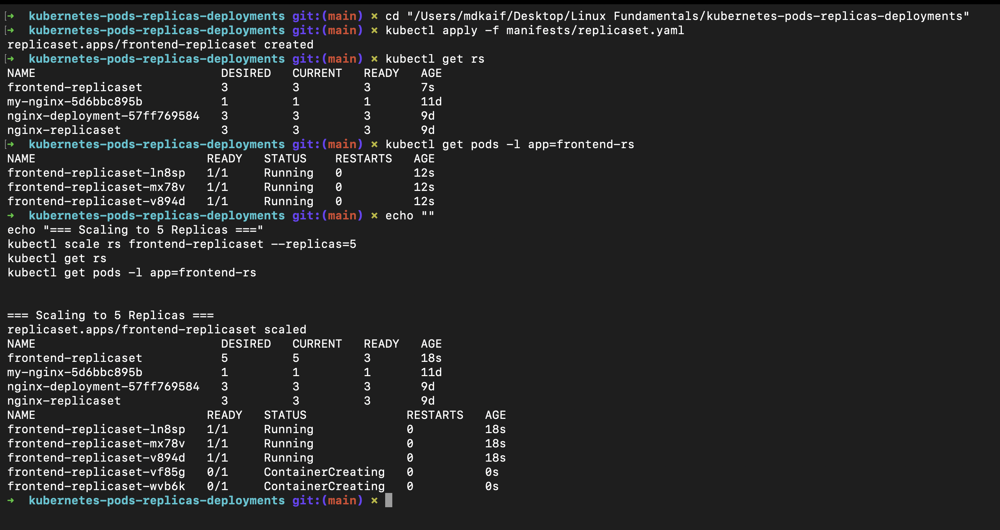
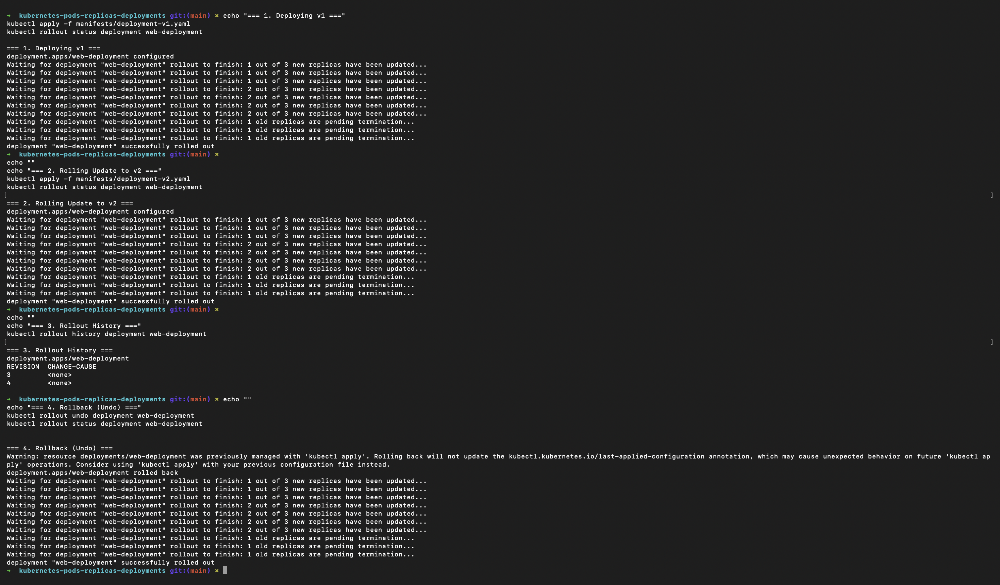

# Kubernetes Pods, ReplicaSets & Deployments: DevOps Homework

A comprehensive laboratory and technical guide covering Pod lifecycles, debug and troubleshooting methodologies, ReplicaSet self-healing, zero-downtime Deployment rollouts, rollbacks, and deployment strategies.

---

## Student Information

- **Name:** MD Kaif Molla
- **Enrollment Number:** 24BCS10221
- **Repository:** [WhySeriousKaif/DevOps-Homework](https://github.com/WhySeriousKaif/DevOps-Homework)

---

## Table of Contents

- [Task 1: Pod Lifecycle & States](#task-1-pod-lifecycle--states)
  - [1.1 Lifecycle State Overview](#11-lifecycle-state-overview)
  - [1.2 Pod States Experimentation](#12-pod-states-experimentation)
- [Task 2: Kubernetes Troubleshooting Exercise](#task-2-kubernetes-troubleshooting-exercise)
  - [2.1 Problem Statement](#21-problem-statement)
  - [2.2 Investigation with kubectl](#22-investigation-with-kubectl)
  - [2.3 Root Cause Analysis & Fix](#23-root-cause-analysis--fix)
  - [2.4 Verification](#24-verification)
- [Task 3: ReplicaSets & Self-Healing](#task-3-replicasets--self-healing)
  - [3.1 ReplicaSet Definition & Role](#31-replicaset-definition--role)
  - [3.2 Deploying & Scaling Replicas](#32-deploying--scaling-replicas)
- [Task 4: Deployments, Rolling Updates & Zero-Downtime](#task-4-deployments-rolling-updates--zero-downtime)
  - [4.1 Deploying Version 1 (`v1.0`)](#41-deploying-version-1-v10)
  - [4.2 Rolling Update to Version 2 (`v2.0`)](#42-rolling-update-to-version-2-v20)
- [Task 5: Rollout Management (Status, History & Undo)](#task-5-rollout-management-status-history--undo)
- [Task 6: Deployment Strategies (Theory & Architecture)](#task-6-deployment-strategies-theory--architecture)
  - [6.1 Rolling Update](#61-rolling-update)
  - [6.2 Recreate](#62-recreate)
  - [6.3 Blue-Green Deployment](#63-blue-green-deployment)
  - [6.4 Canary Deployment](#64-canary-deployment)
- [Task 7: Architecture Comparison: Deployment vs StatefulSet vs DaemonSet](#task-7-architecture-comparison-deployment-vs-statefulset-vs-daemonset)
  - [7.1 Deployment vs ReplicaSet](#71-deployment-vs-replicaset)
  - [7.2 Comprehensive Comparison Table](#72-comprehensive-comparison-table)
- [Execution & Output Screenshots](#execution--output-screenshots)

---

## Task 1: Pod Lifecycle & States

### 1.1 Lifecycle State Overview

A Pod is the smallest deployable computing unit in Kubernetes. Throughout its existence, a Pod transitions through distinct phases:

```text
               +---------------+
               |    Pending    | (Image pulling / Scheduling)
               +-------+-------+
                       |
               +-------v-------+
               | Container     |
               | Creating      |
               +-------+-------+
                       |
        +--------------+--------------+
        |                             |
+-------v-------+             +-------v-------+
|    Running    |             |   Error /     |
| (Active Work) |             | CrashLoop     |
+-------+-------+             +---------------+
        |
+-------v-------+
|   Completed   | (Batch job exit 0)
|  (Succeeded)  |
+---------------+
```

| Pod State | Technical Condition | Description |
|---|---|---|
| **Pending** | Pod accepted by API Server | Awaiting node assignment by Kube-Scheduler or container image download. |
| **ContainerCreating** | Scheduled onto Node | Kubelet is pulling images, preparing volumes, and creating Linux namespaces via CRI. |
| **Running** | Bound and initialized | At least one container is actively executing or restarting. |
| **Succeeded / Completed** | Clean termination | All containers terminated successfully with exit code `0` (typical for Jobs). |
| **CrashLoopBackOff** | Container repeatedly crashing | Container starts, crashes (exit non-zero), and Kubelet restarts it with exponential backoff delay. |
| **ImagePullBackOff / ErrImagePull** | Image retrieval failure | The specified image or tag does not exist, registry requires authentication, or network timeout occurred. |

---

### 1.2 Pod States Experimentation

Using [`manifests/pod-states.yaml`](./manifests/pod-states.yaml):
```bash
kubectl apply -f manifests/pod-states.yaml
kubectl get pods -w
```

#### Terminal Observation:
```text
NAME                 READY   STATUS             RESTARTS      AGE
pod-running          1/1     Running            0             15s
pod-crashloop        0/1     CrashLoopBackOff   2 (20s ago)   35s
pod-imagepullerror   0/1     ImagePullBackOff   0             35s
```

---

## Task 2: Kubernetes Troubleshooting Exercise

### 2.1 Problem Statement
A deployment is applied, but the pod never enters the `Running` state.

```bash
kubectl apply -f manifests/troubleshoot-pod.yaml
kubectl get pods
```

---

### 2.2 Investigation with kubectl

To diagnose broken workloads in Kubernetes, engineers follow a systematic 3-step investigation:

1. **Check Pod status:**
   ```bash
   kubectl get pods -l app=broken-app
   ```
   *Output indicates `CrashLoopBackOff` or `Error`.*

2. **Inspect cluster events and configuration:**
   ```bash
   kubectl describe pod broken-app-pod
   ```
   *The `Events:` section displays `Failed to start container: exec: "invalid_command_to_fail": executable file not found in $PATH`.*

3. **Check container standard output / standard error:**
   ```bash
   kubectl logs broken-app-pod
   ```

---

### 2.3 Root Cause Analysis & Fix

- **Root Cause:** The container specification defines an invalid entrypoint command `["invalid_command_to_fail"]` that does not exist inside the Alpine/Nginx image.
- **The Fix:** Remove the invalid command override so Nginx defaults to its standard entrypoint (`["nginx", "-g", "daemon off;"]`).

```bash
# Apply corrected configuration
kubectl delete pod broken-app-pod
kubectl run broken-app-pod --image=nginx:alpine --restart=Always
```

---

### 2.4 Verification

```bash
kubectl get pod broken-app-pod
```
*Output: `broken-app-pod   1/1   Running   0   5s`*

---

## Task 3: ReplicaSets & Self-Healing

### 3.1 ReplicaSet Definition & Role

A **ReplicaSet** ensures a specified number of identical pod replicas are running at all times. It uses label selectors (`matchLabels`) to identify the pods it owns. If a pod crashes, is deleted manually, or a node fails, the ReplicaSet Controller immediately reconciles state and provisions a replacement pod.

---

### 3.2 Deploying & Scaling Replicas

```bash
# 1. Deploy ReplicaSet with 3 replicas
kubectl apply -f manifests/replicaset.yaml

# 2. Inspect ReplicaSet and Pods
kubectl get rs
kubectl get pods -l app=frontend-rs

# 3. Scale ReplicaSet from 3 to 5 replicas
kubectl scale rs frontend-replicaset --replicas=5

# 4. Verify 5 pods running
kubectl get pods -l app=frontend-rs
```

#### Output:
```text
NAME                  DESIRED   CURRENT   READY   AGE
frontend-replicaset   5         5         5       42s
```

---

## Task 4: Deployments, Rolling Updates & Zero-Downtime

### 4.1 Deploying Version 1 (`v1.0`)

Deployments manage ReplicaSets declaratively, providing zero-downtime updates and declarative rollbacks.

```bash
# Deploy v1 (nginx:1.20-alpine)
kubectl apply -f manifests/deployment-v1.yaml
kubectl get deployments
kubectl get pods -l app=web-app --show-labels
```

---

### 4.2 Rolling Update to Version 2 (`v2.0`)

During a **Rolling Update**:
- Kubernetes creates a new ReplicaSet for `v2.0`.
- It gradually spins up `v2.0` pods while terminating `v1.0` pods according to `maxSurge` (e.g., +1) and `maxUnavailable` (e.g., 0).
- Users experience continuous zero downtime throughout the transition.

```bash
# Trigger rolling update to v2 (nginx:1.21-alpine)
kubectl apply -f manifests/deployment-v2.yaml
```

---

## Task 5: Rollout Management (Status, History & Undo)

The three essential rollout commands:

```bash
# 1. Monitor live rollout progress
kubectl rollout status deployment web-deployment

# 2. View revision history of deployments
kubectl rollout history deployment web-deployment

# 3. Rollback (undo) deployment to the previous revision
kubectl rollout undo deployment web-deployment

# 4. Confirm rollback status
kubectl rollout status deployment web-deployment
```

#### Terminal Output:
```text
deployment "web-deployment" successfully rolled out
REVISION  CHANGE-CAUSE
1         <none>
2         <none>

deployment.apps/web-deployment rolled back
```

---

## Task 6: Deployment Strategies (Theory & Architecture)

| Strategy | Mechanism | Downtime | Resource Overhead | Rollback Speed | Ideal Use Case |
|---|---|---|---|---|---|
| **Rolling Update** | Incremental pod replacement (surge/unavailable) | **Zero** | Low (+1-2 temporary pods) | Fast (`rollout undo`) | Default for web APIs & stateless services |
| **Recreate** | Terminates all old pods before launching new ones | **Yes** (Brief) | None (0 extra resources) | Slow (re-launch delay) | Stateful apps that cannot handle dual-version concurrency |
| **Blue-Green** | Spins up complete identical green environment; flips traffic switch | **Zero** | **High (+100% duplicate infrastructure)** | Instant (flip router back) | Critical e-commerce/financial platforms requiring instant rollback |
| **Canary** | Routes tiny % (e.g. 5%) of traffic to new version; tests metrics before full rollout | **Zero** | Minimal | Fast (scale canary to 0) | High-scale systems testing new features on live users |

---

## Task 7: Architecture Comparison: Deployment vs StatefulSet vs DaemonSet

### 7.1 Deployment vs ReplicaSet

- **ReplicaSet:** Focuses purely on keeping a static number of pod replicas alive. Has **no built-in rolling update or rollback mechanism**.
- **Deployment:** A higher-level abstraction that **wraps and manages ReplicaSets**. Modifying a Deployment automatically provisions a new ReplicaSet and rolls traffic over seamlessly.

---

### 7.2 Comprehensive Comparison Table

| Dimension | Deployment | StatefulSet | DaemonSet |
|---|---|---|---|
| **Workload Type** | Stateless microservices | Stateful distributed workloads | Node-level infrastructure services |
| **Pod Naming** | Random unique hash (`web-7d4b9-x8j21`) | Stable, ordered index (`mysql-0`, `mysql-1`) | Node-based identity (`agent-node1`) |
| **Storage** | Ephemeral or shared volume | Dedicated PersistentVolume per pod (`volumeClaimTemplates`) | Host path mounts |
| **Scaling Order** | Parallel / Non-deterministic | Strictly sequential ($0 \rightarrow 1 \rightarrow 2$) | Automatically 1 pod per added cluster node |
| **Typical Examples** | Nginx, Node.js API, Go web services | PostgreSQL, MongoDB, Kafka, ZooKeeper | Fluentd, Prometheus Node-Exporter, Calico CNI |

---

## Execution & Output Screenshots

### Screenshot 1: Pod Lifecycle States
Demonstrating `Running`, `CrashLoopBackOff`, and `ImagePullBackOff` pod states in `kubectl get pods`.



---

### Screenshot 2: Kubernetes Troubleshooting Exercise
Terminal output showing `kubectl describe pod` diagnosing the root cause, applying the fix, and verifying the healthy `Running` pod.



---

### Screenshot 3: ReplicaSet Deployment & Scaling
Demonstrating `frontend-replicaset` deployment and scaling to 5 replicas.



---

### Screenshot 4: Deployment Rollout, History & Rollout Undo
Demonstrating Deployment v1, Rolling Update to v2, `rollout status`, `rollout history`, and `rollout undo` execution.



---

*Maintained by MD Kaif Molla (24BCS10221) — DevOps Homework Submission*
