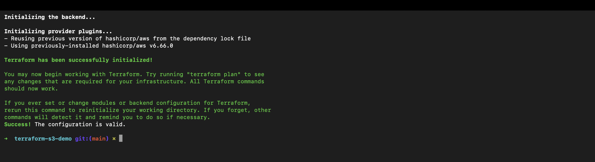
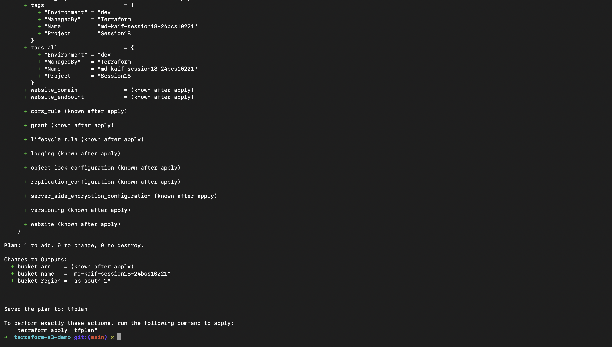
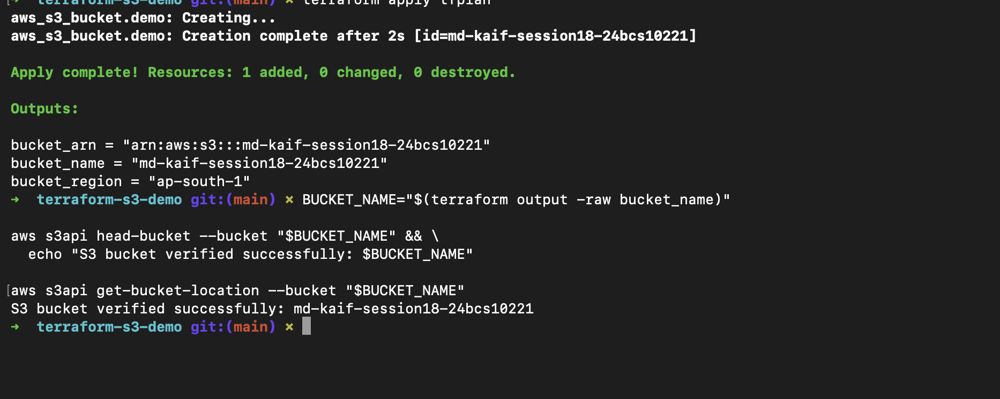
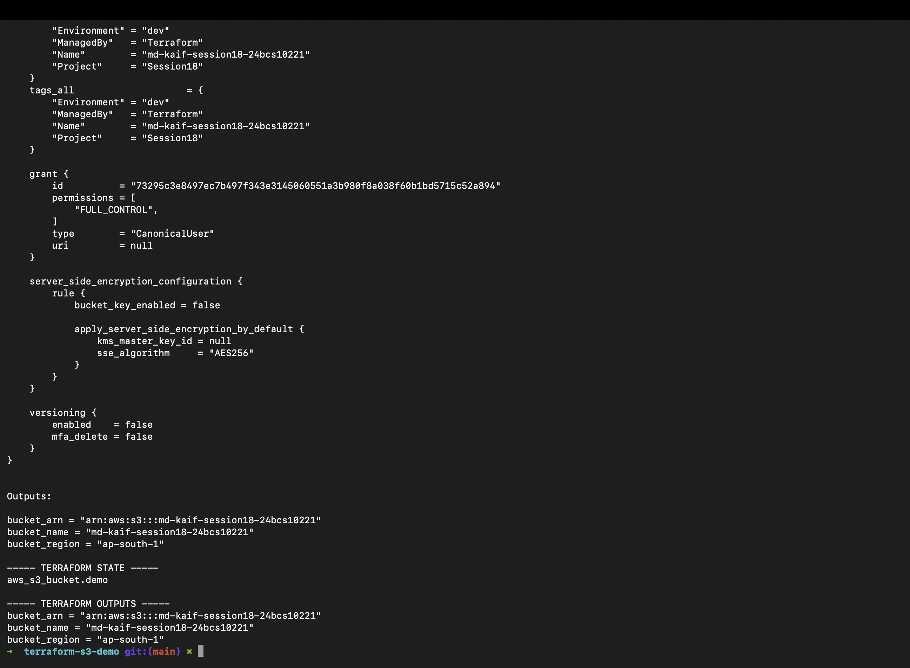
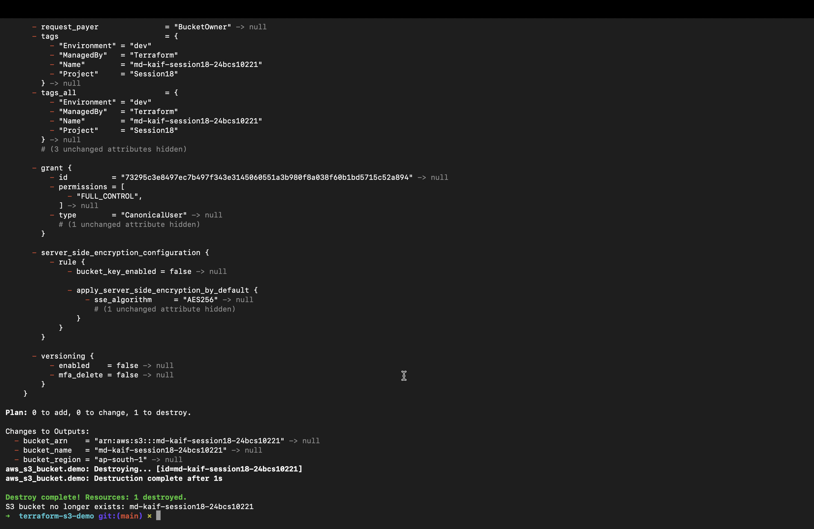

# Session 18: Terraform and Infrastructure as Code — Homework

> **Status:** Work in progress — AWS execution and screenshots are pending. Always run `terraform destroy` after the demonstration to avoid charges.

## Student Information

- **Name:** MD Kaif Molla
- **Enrollment Number:** 24BCS10221
- **Repository:** [WhySeriousKaif/devops-heros](https://github.com/WhySeriousKaif/devops-heros)

## Objectives

1. Provision an Amazon S3 bucket with Terraform.
2. Practise the full Terraform lifecycle: init, format, validate, plan, apply, inspect, output, and destroy.
3. Document IAM, EC2, S3, VPC, DynamoDB, and RDS.

## Submission Structure

```text
terraform-and-aws-services/
├── README.md
├── aws-services/
│   ├── 01-iam/README.md
│   ├── 02-ec2/README.md
│   ├── 03-s3/README.md
│   ├── 04-vpc/README.md
│   └── 05-dynamodb-rds/README.md
└── screenshots/
    ├── png1.png   # init, fmt, and validate
    ├── png2.png   # terraform plan
    ├── png3.png   # terraform apply and AWS S3 verification
    ├── png4.png   # terraform show and output
    └── png5.png   # terraform destroy
```

The working Terraform configuration is in [`terraform-s3-demo`](../../terraform-s3-demo/).

## Terraform S3 Architecture

```text
Terraform configuration
        |
        v
AWS provider (ap-south-1)
        |
        v
Amazon S3 bucket
        |
        +--> bucket name output
        +--> bucket ARN output
        `--> bucket region output
```

## Prerequisites

- Terraform installed.
- AWS CLI installed.
- An AWS identity with permission to create, inspect, and delete the demonstration bucket.
- A globally unique bucket name.

Verify the tools and active identity:

```bash
terraform version
aws --version
aws sts get-caller-identity
```

Do not commit AWS access keys, `.tfstate` files, or a real `terraform.tfvars` containing sensitive values.

## Complete Terraform Workflow

```bash
cd session18-terraform-iac/terraform-s3-demo

terraform init
terraform fmt -check
terraform validate
terraform plan -out=tfplan
terraform apply tfplan
terraform show
terraform state list
terraform output

aws s3api head-bucket --bucket <bucket-name>

terraform plan -destroy
terraform destroy
```

Type `yes` when Terraform asks for approval during an interactive destroy. Confirm cleanup:

```bash
aws s3api head-bucket --bucket <bucket-name>
```

After deletion, the verification command should report that the bucket is unavailable. The bucket must be empty before deletion.

## Terraform Files

- `terraform.tf` defines Terraform and provider version requirements.
- `providers.tf` configures the AWS provider.
- `variables.tf` defines configurable input values.
- `terraform.tfvars` supplies local values and should not hold secrets.
- `main.tf` declares the S3 resource.
- `outputs.tf` exposes useful resource attributes.
- `.terraform.lock.hcl` records provider selections for repeatable initialization.

## State

Terraform state maps resource addresses in the configuration to real infrastructure. It may contain sensitive data and must not be edited manually. Team environments should use an encrypted remote backend with locking and tightly controlled access.

Useful inspection commands:

```bash
terraform state list
terraform state show aws_s3_bucket.demo
terraform show
terraform output
```

## AWS Research Documents

- [IAM — Governance](aws-services/01-iam/README.md)
- [EC2 — Compute](aws-services/02-ec2/README.md)
- [S3 — Storage](aws-services/03-s3/README.md)
- [VPC — Networking](aws-services/04-vpc/README.md)
- [DynamoDB and RDS — Databases](aws-services/05-dynamodb-rds/README.md)

## Screenshots

```markdown





```

## Deliverables Checklist

- [ ] `terraform init`, `fmt`, and `validate` succeed.
- [ ] Saved plan shows the intended S3 change.
- [ ] Apply creates the bucket and AWS CLI verifies it.
- [ ] State and outputs are inspected.
- [ ] Destroy removes all demonstration resources.
- [x] Separate AWS service research READMEs are included.
- [ ] Screenshots are added and embedded.

## References

- [Terraform CLI commands](https://developer.hashicorp.com/terraform/cli/commands)
- [Terraform provisioning workflow](https://developer.hashicorp.com/terraform/cli/run)

---

*Maintained by MD Kaif Molla (24BCS10221) — DevOps Homework Submission*
