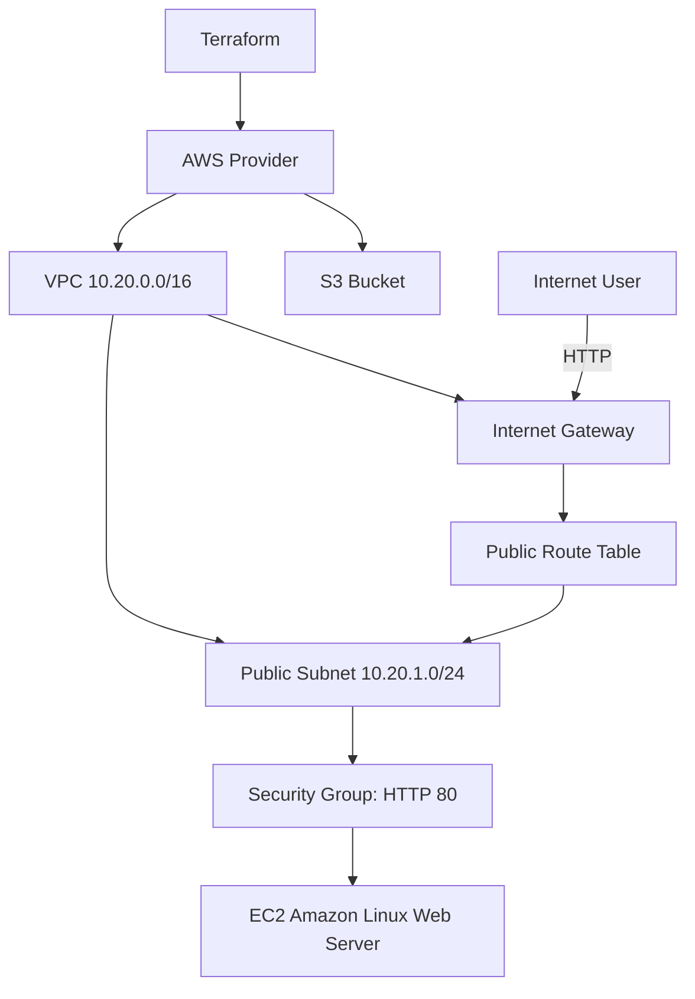
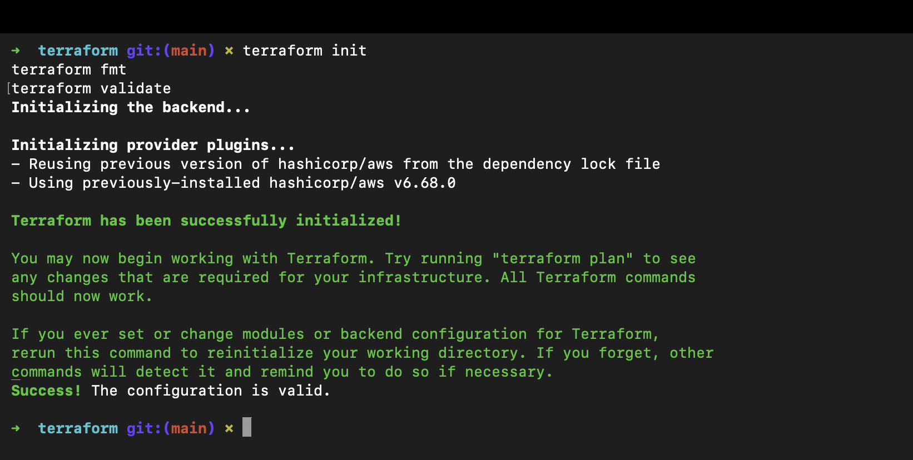
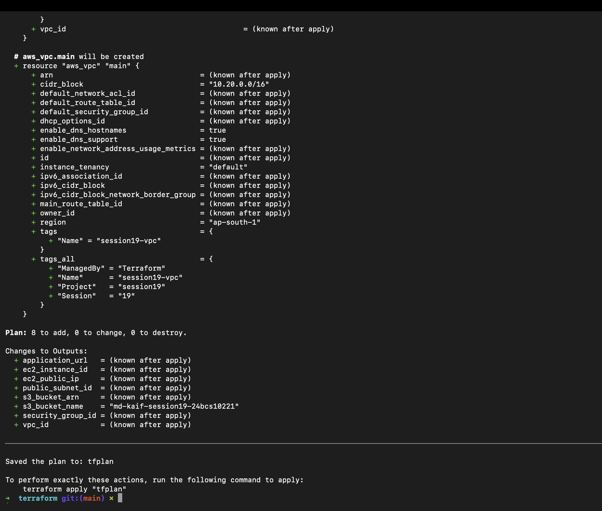
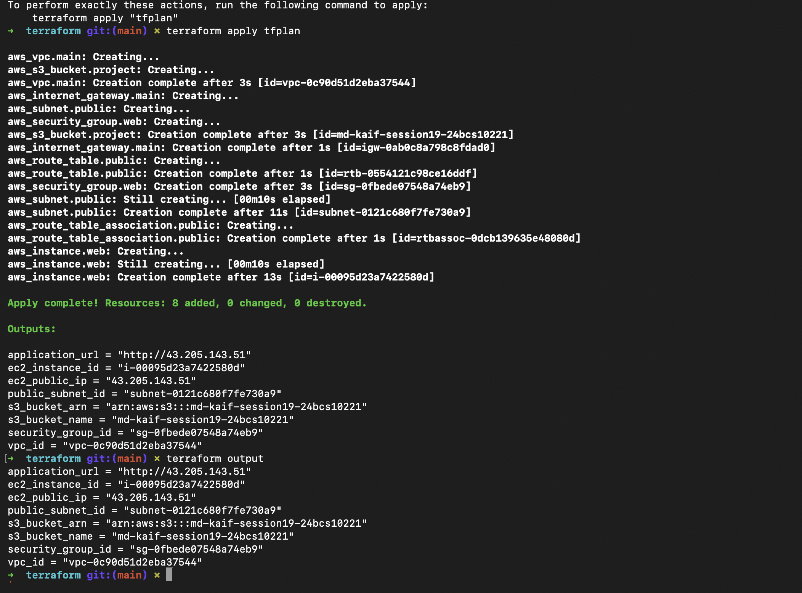
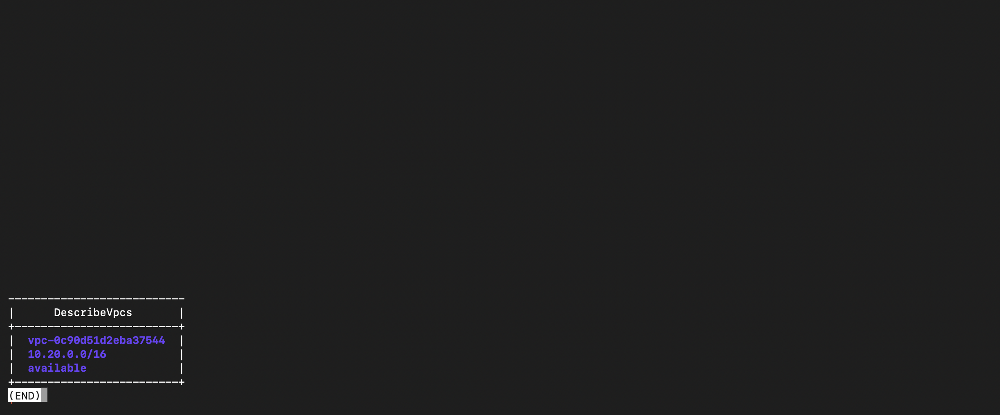
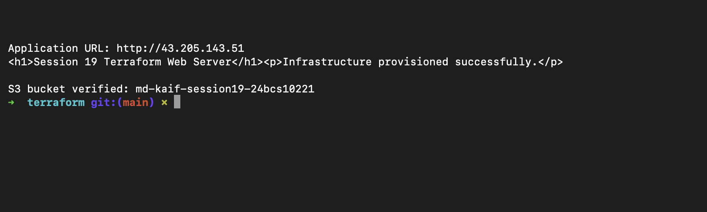
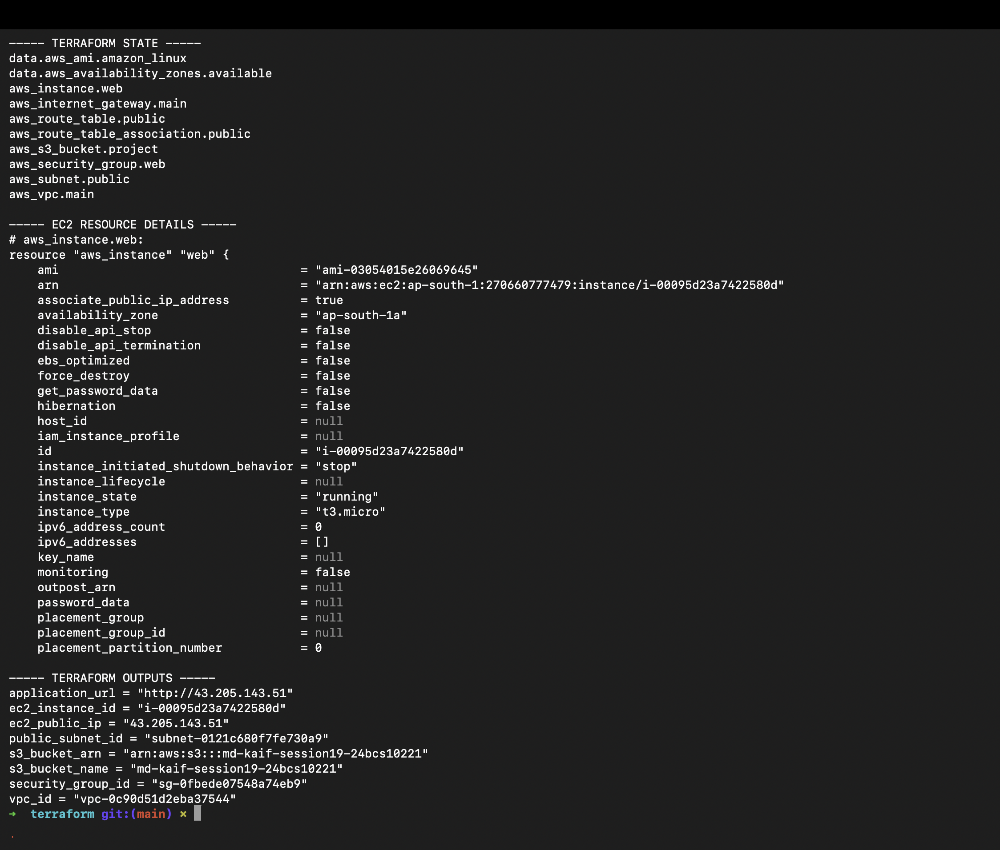
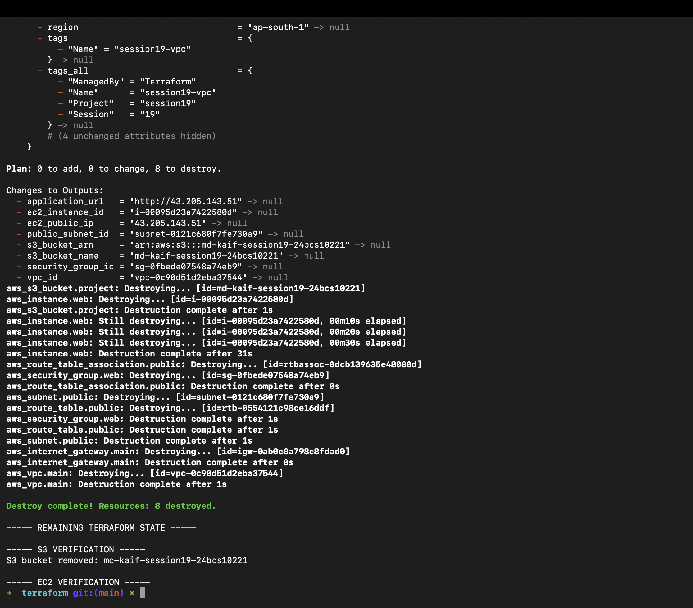

# Session 19: Cloud and Terraform in Action

> **Status:** Complete — the AWS infrastructure was planned, created, verified, documented, and destroyed successfully.

## Student Information

- **Name:** MD Kaif Molla
- **Enrollment Number:** 24BCS10221
- **Repository:** [WhySeriousKaif/devops-heros](https://github.com/WhySeriousKaif/devops-heros)

## Project Overview

This project uses Terraform to provision an end-to-end AWS environment containing a VPC, public subnet, Internet Gateway, route table, security group, EC2 web server, and S3 bucket. It demonstrates providers, variables, resources, outputs, dependencies, state, planning, application, verification, and destruction.

## Architecture Diagram



```text
                              AWS Region
                                  |
              +-------------------+-------------------+
              |                                       |
              v                                       v
       VPC 10.20.0.0/16                         S3 Bucket
              |
       Internet Gateway
              |
       Public Route Table
              |
       Public Subnet 10.20.1.0/24
              |
       Security Group: HTTP 80
              |
       EC2 Amazon Linux Web Server
```

## Dependency Flow

Terraform infers dependencies from references such as `vpc_id = aws_vpc.main.id`. The EC2 instance also uses an explicit `depends_on` for the public route-table association so its startup package installation begins only after internet routing is connected.

```text
aws_vpc.main
├── aws_internet_gateway.main
├── aws_subnet.public
│   ├── aws_route_table_association.public
│   └── aws_instance.web
├── aws_route_table.public
│   └── aws_route_table_association.public
└── aws_security_group.web
    └── aws_instance.web

aws_s3_bucket.project
```

## Project Structure

```text
cloud-terraform-project/
├── terraform/
│   ├── versions.tf
│   ├── provider.tf
│   ├── variables.tf
│   ├── terraform.tfvars
│   ├── main.tf
│   ├── outputs.tf
│   ├── .gitignore
│   └── README.md
├── screenshots/
│   ├── png1.png
│   ├── png2.png
│   ├── png3.png
│   ├── png4.png
│   ├── png5.png
│   ├── png6.png
│   └── png7.png
└── README.md
```

## Prerequisites and Permissions

The `terraform-session18` IAM user from the previous exercise can be reused temporarily. It needs both of these policies during this lab:

- `AmazonS3FullAccess`
- `AmazonEC2FullAccess`

Attach `AmazonEC2FullAccess` from IAM → Users → `terraform-session18` → Permissions → Add permissions. Remove both policies and delete the access key after cleanup.

Verify the tools and active identity:

```bash
terraform version
aws --version
aws sts get-caller-identity
```

This lab can incur AWS charges. Run the destroy step during the same session. Never commit AWS credentials, Terraform state, or saved plan files.

## Commands and Screenshot Guide

### Screenshot 1 — Initialize, Format, and Validate

```bash
cd /Users/mdkaif/devops-heros/session19-cloud-terraform/homework/cloud-terraform-project/terraform

clear
terraform init
terraform fmt
terraform validate
```

Capture successful initialization and `Success! The configuration is valid.` Save it as `screenshots/png1.png`.

### Screenshot 2 — Terraform Plan

```bash
clear
terraform plan -out=tfplan
```

Review every resource. The expected summary is `Plan: 8 to add, 0 to change, 0 to destroy.` Save the plan summary as `screenshots/png2.png`.

### Screenshot 3 — Apply and Outputs

```bash
clear
terraform apply tfplan
terraform output
```

Capture `Apply complete!`, the resource count, VPC ID, EC2 ID and IP, application URL, and S3 outputs. Save it as `screenshots/png3.png`.

### Screenshot 4 — Verify AWS Infrastructure

```bash
VPC_ID="$(terraform output -raw vpc_id)"
SUBNET_ID="$(terraform output -raw public_subnet_id)"
SG_ID="$(terraform output -raw security_group_id)"
INSTANCE_ID="$(terraform output -raw ec2_instance_id)"

clear
aws ec2 describe-vpcs --vpc-ids "$VPC_ID" --query 'Vpcs[0].[VpcId,CidrBlock,State]' --output table
aws ec2 describe-subnets --subnet-ids "$SUBNET_ID" --query 'Subnets[0].[SubnetId,CidrBlock,AvailabilityZone,MapPublicIpOnLaunch]' --output table
aws ec2 describe-security-groups --group-ids "$SG_ID" --query 'SecurityGroups[0].[GroupId,GroupName,VpcId]' --output table
aws ec2 describe-instances --instance-ids "$INSTANCE_ID" --query 'Reservations[0].Instances[0].[InstanceId,State.Name,PublicIpAddress,InstanceType]' --output table
```

Capture the tables showing the VPC, subnet, security group, and running EC2 instance. Save it as `screenshots/png4.png`.

### Screenshot 5 — Verify Application and S3

The EC2 startup script may take approximately one minute to install Apache. Run:

```bash
APP_URL="$(terraform output -raw application_url)"
BUCKET_NAME="$(terraform output -raw s3_bucket_name)"

for attempt in 1 2 3 4 5 6 7 8 9 10; do
  if curl --fail "$APP_URL"; then
    break
  fi
  sleep 10
done

echo
aws s3api head-bucket --bucket "$BUCKET_NAME" && echo "S3 bucket verified: $BUCKET_NAME"
```

Capture the Session 19 web-page HTML and S3 verification. Save it as `screenshots/png5.png`.

### Screenshot 6 — Terraform State and Show

```bash
clear
echo "----- TERRAFORM STATE -----"
terraform state list

echo
echo "----- SELECTED RESOURCE -----"
terraform state show aws_instance.web

echo
echo "----- OUTPUTS -----"
terraform output
```

Capture the resource addresses, selected EC2 state, and outputs. Save it as `screenshots/png6.png`.

### Screenshot 7 — Destroy and Verify Cleanup

Store identifiers before Terraform removes the outputs:

```bash
INSTANCE_ID="$(terraform output -raw ec2_instance_id)"
BUCKET_NAME="$(terraform output -raw s3_bucket_name)"
```

Preview destruction:

```bash
terraform plan -destroy
```

Destroy without an interactive prompt:

```bash
clear
terraform destroy -auto-approve

echo "Remaining Terraform resources:"
terraform state list

if aws s3api head-bucket --bucket "$BUCKET_NAME" 2>/dev/null; then echo "WARNING: S3 bucket still exists"; else echo "S3 bucket removed: $BUCKET_NAME"; fi

aws ec2 describe-instances --instance-ids "$INSTANCE_ID" --query 'Reservations[0].Instances[0].State.Name' --output text
```

Capture `Destroy complete`, an empty state list, removed S3 bucket, and `terminated` EC2 state. Save it as `screenshots/png7.png`.

## Terraform State

State maps Terraform resource addresses to real AWS resource IDs and attributes. This individual lab uses local state, but state and saved plans are ignored by Git. Team environments should use an encrypted remote backend with locking and least-privilege access.

## Screenshots

### Initialization and Validation



### Terraform Plan



### Apply and Outputs



### AWS Infrastructure



### Application and S3



### Terraform State



### Destroy and Cleanup



## Checklist

- [x] Provider and configurable variables
- [x] VPC, public subnet, Internet Gateway, and route table
- [x] HTTP security group and EC2 web server
- [x] S3 bucket
- [x] Outputs and dependencies
- [x] Terraform state documentation
- [x] Successful plan, apply, verification, and destroy screenshots
- [x] All AWS resources destroyed

## Push the Completed Work

After all seven screenshots are present and verified:

```bash
cd /Users/mdkaif/devops-heros
git add session19-cloud-terraform/homework/cloud-terraform-project
git commit -m "complete Session 19 cloud Terraform project"
git push origin main
```

---

*Maintained by MD Kaif Molla (24BCS10221) — DevOps Homework Submission*
