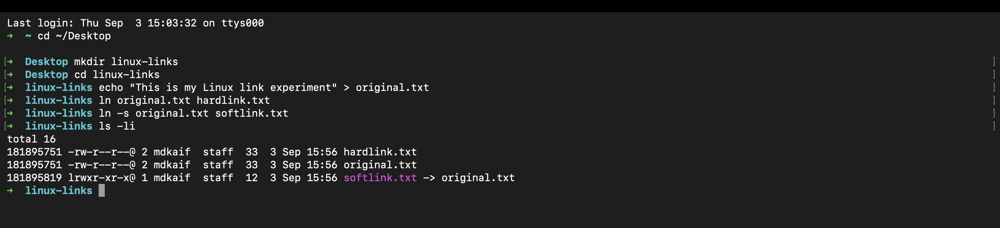
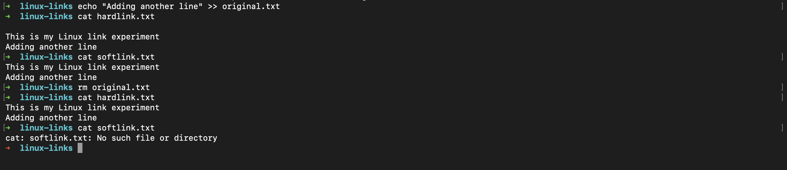
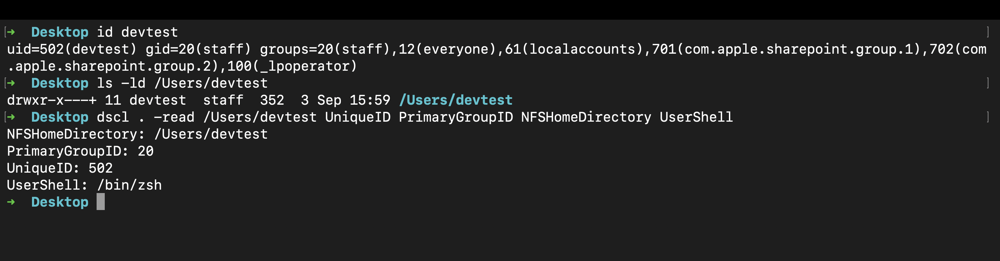
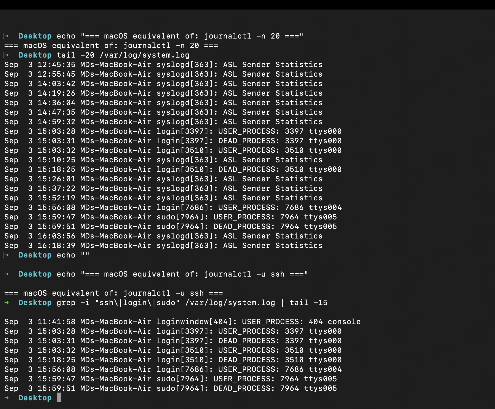
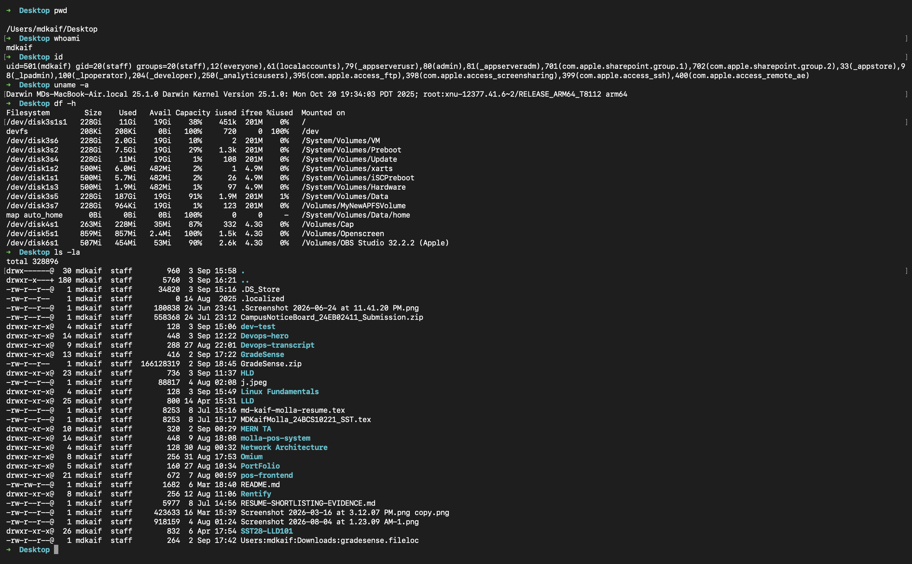

# Linux Fundamentals

A hands-on exploration of core Linux concepts including file links, user management, system logging, and essential commands.

---

## Table of Contents

- [Task 1: Soft Link & Hard Link](#task-1-soft-link--hard-link)
- [Task 2: adduser vs useradd](#task-2-adduser-vs-useradd)
- [Task 3: journalctl](#task-3-journalctl)
- [Task 4: Linux Command Cheat Sheet](#task-4-linux-command-cheat-sheet)

---

## Task 1: Soft Link & Hard Link

### What is a Link?

In Linux, every file is internally identified by an **inode** — a data structure that stores metadata about the file (permissions, timestamps, location on disk). A filename is simply a label that points to an inode.

Linux provides two types of links:
- **Hard Link** — another directory entry pointing to the *same inode*
- **Soft Link (Symbolic Link)** — a separate file that stores the *path* to another file

---

### Hard Link

A hard link creates an additional directory entry that references the **same inode** as the original file. Both filenames literally refer to the same underlying data.

#### Command

```bash
ln original.txt hardlink.txt
```

#### Properties
- Same inode number as the original file
- Both files reflect changes to each other instantly
- Deleting the original does **not** destroy the data — data persists as long as at least one hard link exists
- Cannot span across different filesystems
- Generally cannot link to directories

---

### Soft Link (Symbolic Link)

A symbolic link is a special file that contains a **path reference** to another file. It has its own inode and acts like a pointer or shortcut.

#### Command

```bash
ln -s original.txt softlink.txt
```

#### Properties
- Has a **different inode** from the target file
- Points to the path (not the inode) of the target
- If the original file is deleted, the soft link becomes **broken**
- Can span across filesystems
- Can link to directories

---

### Practical Experiment

I ran the following commands to create and inspect both link types:

```bash
mkdir linux-links
cd linux-links
echo "This is my Linux link experiment" > original.txt
ln original.txt hardlink.txt
ln -s original.txt softlink.txt
ls -li
```

#### Output of `ls -li`

```
total 16
181895751 -rw-r--r--@ 2 mdkaif  staff  33 Sep  3 15:56 hardlink.txt
181895751 -rw-r--r--@ 2 mdkaif  staff  33 Sep  3 15:56 original.txt
181895819 lrwxr-xr-x@ 1 mdkaif  staff  12 Sep  3 15:56 softlink.txt -> original.txt
```

> **Key observation:** `original.txt` and `hardlink.txt` share **inode 181895751** (same underlying file). `softlink.txt` has its own **inode 181895819** and shows `-> original.txt` indicating it is a path reference.



---

### Deletion Experiment

I then appended a new line to the original, verified both links could read it, and deleted the original:

```bash
echo "Adding another line" >> original.txt
cat hardlink.txt     # shows both lines
cat softlink.txt     # shows both lines
rm original.txt
cat hardlink.txt     # still works
cat softlink.txt     # BROKEN
```

#### Output After Deleting `original.txt`

```
$ cat hardlink.txt
This is my Linux link experiment
Adding another line

$ cat softlink.txt
This is my Linux link experiment
Adding another line

$ rm original.txt
$ cat hardlink.txt
This is my Linux link experiment
Adding another line

$ cat softlink.txt
cat: softlink.txt: No such file or directory
```



#### Observation

- The **hard link continued to work** because it directly references inode `181895751`. The actual file data still exists on disk; only the original filename entry was removed.
- The **soft link broke immediately** because it stored the path `original.txt`, which no longer exists. The pointer now leads nowhere — confirmed by `cat: softlink.txt: No such file or directory`.

---

### Hard Link vs Soft Link — Comparison Table

| Feature | Hard Link | Soft Link |
|---|---|---|
| Points to | Same inode | Target file path |
| Inode number | Same as original | Different (own inode) |
| Works after original is deleted | Yes | No (becomes broken) |
| Can link to directories | Generally No | Yes |
| Can cross filesystems | No | Yes |
| Can become broken | No (data survives) | Yes |
| Visible as link in `ls -l` | No (`-` regular file) | Yes (`l` prefix + `->`) |

### Key Learning

The fundamental difference is **what the link stores**:
- A hard link stores a reference to the **inode** (the actual data)
- A soft link stores a reference to the **path** (a name that may or may not exist)

This is why deleting the original file breaks a soft link but not a hard link.

---

## Task 2: adduser vs useradd

### What is a Linux User?

In Linux, every user account is associated with:

```
Username  →  UID (User ID)  →  Primary Group (GID)  →  Home Directory  →  Login Shell
```

This information is stored in `/etc/passwd`. User accounts control who can log in, what files they can access, and what commands they can run.

---

### `adduser`

`adduser` is a **high-level, user-friendly** utility available on Debian/Ubuntu-based systems. It provides an interactive workflow that handles:
- Creating the user account
- Assigning UID and GID automatically
- Creating the home directory (`/home/username`)
- Setting up default shell
- Prompting for password interactively

#### Command

```bash
sudo adduser devtest
```

#### Example Session

```
Adding user `devtest' ...
Adding new group `devtest' (1001) ...
Adding new user `devtest' (1001) with group `devtest' ...
Creating home directory `/home/devtest' ...
Copying files from `/etc/skel' ...
New password:
Retype new password:
passwd: password updated successfully
Full Name []: DevTest User
Is the information correct? [Y/n] Y
```

---

### `useradd`

`useradd` is a **low-level** Linux utility that creates user accounts with explicit control via command-line flags. It does **not** create a home directory or set a password automatically unless you specify the right flags.

#### Command

```bash
sudo useradd -m -s /bin/bash devtest
sudo passwd devtest
```

| Flag | Meaning |
|---|---|
| `-m` | Create home directory |
| `-s /bin/bash` | Set login shell |
| `-u 1001` | Specify UID manually |
| `-G sudo` | Add to supplementary group |

---

### Practical Experiment

Since this experiment was performed on **macOS**, the equivalent command is `sysadminctl -addUser` (on Linux/Ubuntu the command is `sudo adduser devtest`). The account was then verified using:

```bash
id devtest
ls -ld /Users/devtest
dscl . -read /Users/devtest UniqueID PrimaryGroupID NFSHomeDirectory UserShell
```

#### Actual Output

```bash
$ id devtest
uid=502(devtest) gid=20(staff) groups=20(staff),12(everyone),61(localaccounts),...

$ ls -ld /Users/devtest
drwxr-x---+ 11 devtest  staff  352  3 Sep 15:59 /Users/devtest

$ dscl . -read /Users/devtest UniqueID PrimaryGroupID NFSHomeDirectory UserShell
NFSHomeDirectory: /Users/devtest
PrimaryGroupID: 20
UniqueID: 502
UserShell: /bin/zsh
```

> **Key observations from the output:**
> - **UID 502** was automatically assigned (next available ID)
> - **Home directory** `/Users/devtest` was created automatically
> - **Shell** set to `/bin/zsh` (macOS default; on Linux this would be `/bin/bash`)
> - On Linux, the equivalent info lives in `/etc/passwd` as: `devtest:x:502:20::/home/devtest:/bin/bash`



The test user was removed after the experiment:

```bash
# macOS
sudo sysadminctl -deleteUser devtest

# Linux equivalent
sudo deluser --remove-home devtest
```

#### Observation

On macOS, `sysadminctl -addUser` handled the same responsibilities as Linux's `adduser` — it automatically assigned a UID (502), created the home directory (`/Users/devtest`), and configured the login shell. The underlying Unix concepts are identical across both systems.

On Linux, `useradd` requires explicitly specifying every option via flags. Without `-m`, no home directory is created. Without running `passwd`, no password is set. This makes it ideal for scripting and automation.

---

### adduser vs useradd — Comparison Table

| Feature | `adduser` | `useradd` |
|---|---|---|
| Type | High-level wrapper | Low-level binary |
| Interaction | Interactive by default | Non-interactive |
| Home directory | Created automatically | Requires `-m` flag |
| Password | Prompted interactively | Requires separate `passwd` |
| Available on | Debian/Ubuntu mainly | All Linux distributions |
| Best for | Manual user creation | Scripts and automation |

### Key Learning

`adduser` and `useradd` are **not** just two names for the same command. `adduser` is a convenience wrapper that makes user creation user-friendly. `useradd` is the raw low-level tool giving you precise control — exactly what you need in automation and shell scripts.

---

## Task 3: journalctl

### What is `journalctl`?

`journalctl` is the command-line tool for querying logs collected by **systemd-journald** — the logging component of systemd.

Unlike older systems that wrote logs as plain text files in `/var/log/`, the systemd journal stores logs in a **structured binary format**, enabling powerful filtering by time, priority, service, and more.

Logs are important for:
- Diagnosing failed services
- Investigating system crashes or reboots
- Monitoring application behavior
- Security auditing

---

### Essential `journalctl` Commands

#### View Recent Logs

```bash
# View the last 20 journal entries
journalctl -n 20

# View the last 50 entries
journalctl -n 50
```

#### Filter by Time

```bash
# Logs from the last hour
journalctl --since "1 hour ago"

# Logs between two times
journalctl --since "2024-01-01 10:00:00" --until "2024-01-01 11:00:00"

# Logs from today
journalctl --since today
```

#### Filter by Priority (Severity)

```bash
# Show only error-level and above
journalctl -p err

# Priority levels: emerg(0) alert(1) crit(2) err(3) warning(4) notice(5) info(6) debug(7)
journalctl -p warning

# Only errors from the last hour
journalctl -p err --since "1 hour ago" -n 20
```

#### Follow Logs in Real Time

```bash
# Like 'tail -f' but for the systemd journal
journalctl -f
```

Press `Ctrl+C` to stop following.

#### View Logs for a Specific Service

```bash
# General syntax
journalctl -u <service-name>

# Examples
journalctl -u ssh
journalctl -u cron
journalctl -u nginx
journalctl -u docker

# Latest 20 entries for a service
journalctl -u ssh -n 20

# Real-time logs for a service
journalctl -u nginx -f
```

#### Other Useful Options

```bash
# Show logs from current boot only
journalctl -b

# Show logs from previous boot
journalctl -b -1

# Show disk space used by journal
journalctl --disk-usage

# Output in JSON format
journalctl -u ssh -n 5 -o json-pretty
```

---

### Practical Experiment

> **Note:** `journalctl` is a Linux/systemd-specific tool and is not available on macOS. On macOS, the equivalent system log commands are used. On a Linux server, you would run `journalctl` directly.

#### Step 1 — View Recent System Logs

**Linux command:**
```bash
journalctl -n 20
```

**macOS equivalent used in this experiment:**
```bash
tail -20 /var/log/system.log
```

This displays recent system log entries showing timestamps, hostnames, process names, and PIDs — the same information `journalctl` provides on Linux.



#### Step 2 — Filter Logs by Service/Process

**Linux command:**
```bash
journalctl -u ssh -n 20
```

**macOS equivalent used:**
```bash
grep -i "ssh|login|sudo" /var/log/system.log | tail -15
```

This filters log entries for login and authentication events — equivalent to filtering by service in `journalctl`.

#### Step 3 — View Logs by Priority

**Linux command:**
```bash
journalctl -p err -n 20
```

This filters to error-level and above — useful when diagnosing problems.

#### Step 3 — Identify a Running Service

```bash
systemctl list-units --type=service --state=running
```

Then inspect its logs:

```bash
journalctl -u ssh -n 20
```

#### Actual Output (from macOS system.log)

```
Sep  3 15:56:08 MDs-MacBook-Air login[7686]: USER_PROCESS: 7686 ttys004
Sep  3 15:59:47 MDs-MacBook-Air sudo[7964]: USER_PROCESS: 7964 ttys005
Sep  3 15:59:51 MDs-MacBook-Air sudo[7964]: DEAD_PROCESS: 7964 ttys005
Sep  3 16:03:56 MDs-MacBook-Air syslogd[363]: ASL Sender Statistics
Sep  3 16:18:39 MDs-MacBook-Air syslogd[363]: ASL Sender Statistics
```

> Each entry shows: `timestamp → hostname → process[PID] → log message` — the same structured format as `journalctl` output on Linux.

#### Step 4 — Follow Logs in Real Time

```bash
journalctl -f
```

New log entries appear in real time. Press `Ctrl+C` to exit.

---

### Observation

`journalctl` is significantly more powerful than reading log files in `/var/log/` manually. The ability to filter by service, time range, and priority makes it the primary tool for investigating Linux system and service behavior.

The `-u` option is especially valuable — it scopes log output to a single service, making it immediately clear what a specific daemon was doing at any given time.

When a Linux service fails or behaves unexpectedly, checking its journal logs is one of the **first troubleshooting steps** to perform:

```bash
journalctl -u <service-name> -n 50
```

### Key Learning

`journalctl` replaces the need to manually search through individual log files like `/var/log/syslog`. The structured journal allows fast, precise queries. In DevOps and system administration, reading logs is not optional — it is the primary method of understanding what a system is doing.

---

## Task 4: Linux Command Cheat Sheet

A practical reference of the most important Linux commands, organized by category.

---

### Navigation

| Command | Purpose | Syntax | Example |
|---|---|---|---|
| `pwd` | Print current working directory | `pwd` | `pwd` → `/home/mdkaif` |
| `ls` | List directory contents | `ls [options] [path]` | `ls -la /etc` |
| `cd` | Change directory | `cd [path]` | `cd /var/log` |
| `tree` | Show directory tree | `tree [path]` | `tree /home` |

**Common `ls` flags:**

```bash
ls -l     # long format (permissions, size, date)
ls -a     # include hidden files (dotfiles)
ls -la    # combine both
ls -li    # include inode numbers
ls -lh    # human-readable file sizes
```

---

### Files and Directories

| Command | Purpose | Syntax | Example |
|---|---|---|---|
| `touch` | Create empty file / update timestamp | `touch <file>` | `touch notes.txt` |
| `mkdir` | Create directory | `mkdir [options] <dir>` | `mkdir -p a/b/c` |
| `cp` | Copy files or directories | `cp [options] <src> <dest>` | `cp file.txt backup.txt` |
| `mv` | Move or rename files | `mv <src> <dest>` | `mv old.txt new.txt` |
| `rm` | Remove files or directories | `rm [options] <file>` | `rm -rf tempdir/` |
| `ln` | Create hard or soft links | `ln [-s] <target> <link>` | `ln -s /etc/hosts hosts_link` |

---

### File Viewing

| Command | Purpose | Syntax | Example |
|---|---|---|---|
| `cat` | Display entire file | `cat <file>` | `cat /etc/hosts` |
| `less` | View file page by page | `less <file>` | `less /var/log/syslog` |
| `head` | Show first N lines | `head [-n N] <file>` | `head -n 10 file.txt` |
| `tail` | Show last N lines | `tail [-n N] <file>` | `tail -n 20 syslog` |
| `tail -f` | Follow file in real time | `tail -f <file>` | `tail -f /var/log/auth.log` |

---

### Searching

| Command | Purpose | Syntax | Example |
|---|---|---|---|
| `grep` | Search text in files | `grep [options] <pattern> <file>` | `grep "error" app.log` |
| `find` | Find files/directories | `find <path> [options]` | `find /home -name "*.conf"` |
| `locate` | Fast file search (index-based) | `locate <name>` | `locate nginx.conf` |
| `which` | Find executable path | `which <command>` | `which python3` |

**Useful `grep` flags:**

```bash
grep -i "error" file.txt    # case-insensitive
grep -r "TODO" ./src/       # recursive search
grep -n "fail" log.txt      # show line numbers
grep -v "debug" log.txt     # exclude matching lines
```

---

### Permissions and Ownership

| Command | Purpose | Syntax | Example |
|---|---|---|---|
| `chmod` | Change file permissions | `chmod <mode> <file>` | `chmod 644 file.txt` |
| `chown` | Change file owner | `chown <user>:<group> <file>` | `sudo chown www-data file.txt` |
| `ls -l` | View permissions | `ls -l <file>` | `ls -l script.sh` |

**Permission notation:**

```
-rw-r--r--
 │   │   └── others: r=read
 │   └─────── group:  r=read
 └─────────── owner:  rw=read+write
```

**Common permission values:**

```bash
chmod 644 file.txt    # owner: rw, group: r, others: r  (typical file)
chmod 755 script.sh   # owner: rwx, group: rx, others: rx (executable)
chmod 600 private.key # owner: rw only (SSH keys)
```

---

### Processes

| Command | Purpose | Syntax | Example |
|---|---|---|---|
| `ps` | Show current processes | `ps [options]` | `ps aux` |
| `top` | Interactive process viewer | `top` | `top` |
| `htop` | Enhanced process viewer | `htop` | `htop` |
| `kill` | Send signal to process | `kill [signal] <PID>` | `kill -9 1234` |
| `pkill` | Kill process by name | `pkill <name>` | `pkill nginx` |

**Common `kill` signals:**

```bash
kill -15 PID   # SIGTERM - graceful shutdown (default)
kill -9 PID    # SIGKILL - force kill (cannot be ignored)
kill -1 PID    # SIGHUP  - reload configuration
```

---

### Disk Usage

| Command | Purpose | Syntax | Example |
|---|---|---|---|
| `df` | Show filesystem disk usage | `df [options]` | `df -h` |
| `du` | Show directory/file size | `du [options] <path>` | `du -sh /var/log` |

---

### Networking

| Command | Purpose | Syntax | Example |
|---|---|---|---|
| `ip addr` | Show network interfaces and IPs | `ip addr` | `ip addr show eth0` |
| `ip route` | Show routing table | `ip route` | `ip route` |
| `ss` | Show network sockets | `ss [options]` | `ss -tuln` |
| `ping` | Test network reachability | `ping [-c N] <host>` | `ping -c 4 google.com` |
| `curl` | Transfer data via HTTP/HTTPS | `curl [options] <url>` | `curl -I https://example.com` |
| `wget` | Download files | `wget <url>` | `wget https://example.com/file.zip` |

**`ss -tuln` flag breakdown:**

```
-t  TCP sockets
-u  UDP sockets
-l  listening sockets only
-n  show port numbers (not service names)
```

---

### Users and System Information

| Command | Purpose | Syntax | Example |
|---|---|---|---|
| `whoami` | Show current username | `whoami` | `whoami` |
| `id` | Show UID, GID, and groups | `id [user]` | `id mdkaif` |
| `who` | Show logged-in users | `who` | `who` |
| `uname` | Show system/kernel information | `uname [options]` | `uname -a` |
| `hostname` | Show system hostname | `hostname` | `hostname` |
| `uptime` | Show system uptime | `uptime` | `uptime` |



---

### Services and Logs

| Command | Purpose | Syntax | Example |
|---|---|---|---|
| `systemctl status` | Check service status | `systemctl status <service>` | `systemctl status nginx` |
| `systemctl start` | Start a service | `sudo systemctl start <service>` | `sudo systemctl start nginx` |
| `systemctl stop` | Stop a service | `sudo systemctl stop <service>` | `sudo systemctl stop nginx` |
| `systemctl enable` | Enable service at boot | `sudo systemctl enable <service>` | `sudo systemctl enable nginx` |
| `systemctl restart` | Restart a service | `sudo systemctl restart <service>` | `sudo systemctl restart ssh` |
| `journalctl` | Query systemd journal logs | `journalctl [options]` | `journalctl -u ssh -n 20` |

---

### Key Learning

Linux commands become significantly easier to remember and apply when understood **by category and purpose** rather than memorized in isolation.

The most important habit to develop is combining commands:

```bash
# Find large files consuming disk space
du -sh /var/log/* | sort -rh | head -10

# Watch logs of a failing service in real time
journalctl -u nginx -f

# Find all config files modified in the last day
find /etc -name "*.conf" -mtime -1

# Search for error messages in log
grep -i "error\|fail\|critical" /var/log/syslog | tail -20
```

Knowing individual commands is the foundation. Combining them is the skill.

---

## Summary

| Task | Topic | Key Takeaway |
|---|---|---|
| Task 1 | Hard & Soft Links | Hard links share an inode; soft links store a path. Deleting the original breaks soft links but not hard links. |
| Task 2 | adduser vs useradd | `adduser` is an interactive wrapper; `useradd` is the low-level binary preferred in automation. |
| Task 3 | journalctl | Structured log querying for systemd. Use `-u` for service logs, `-p err` for errors, `-f` to follow live. |
| Task 4 | Command Cheat Sheet | Core Linux commands organized by navigation, files, searching, permissions, processes, networking, and system info. |

---

*Maintained by mdkaif — Linux Fundamentals DevOps Homework*
