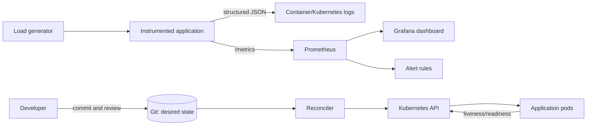
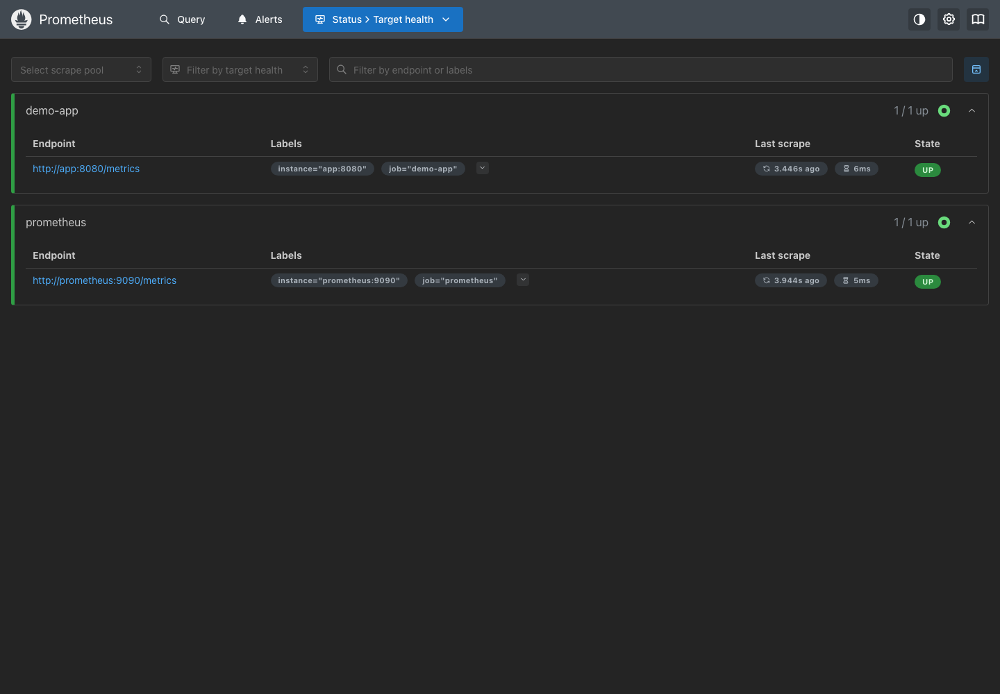
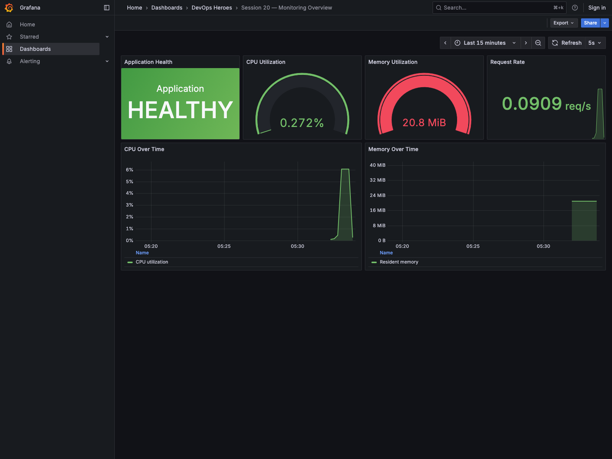
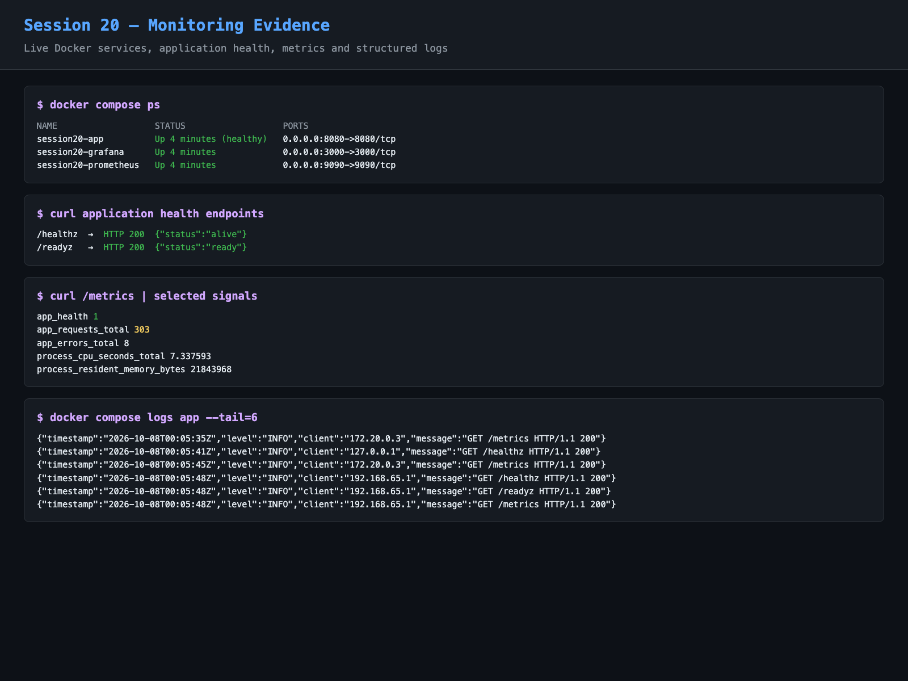
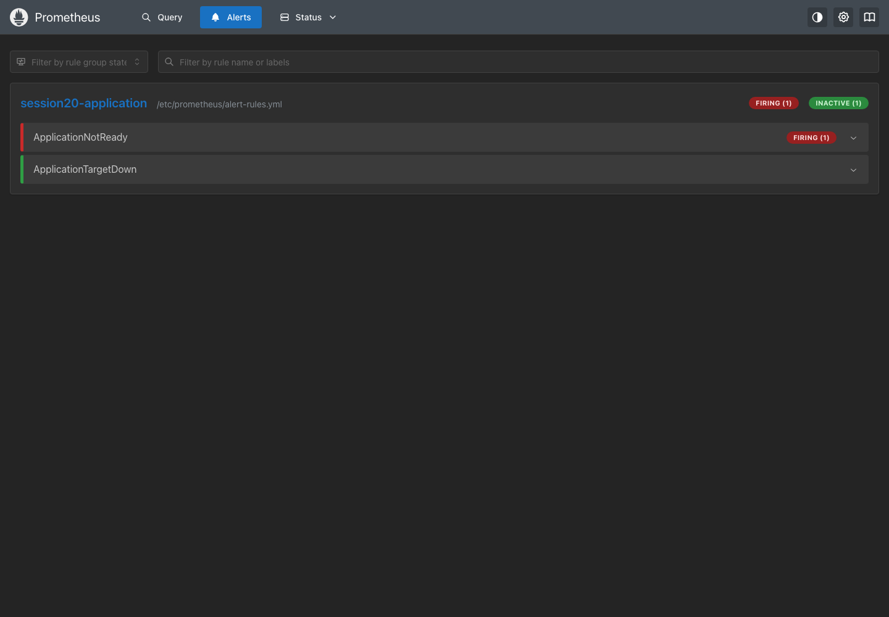
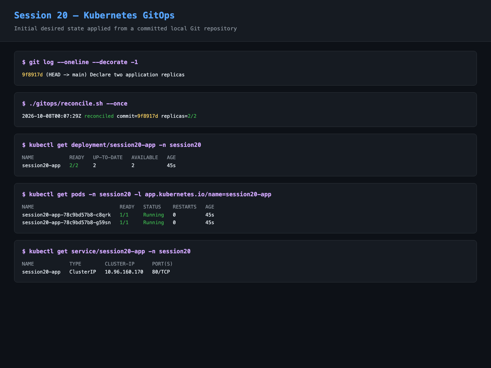
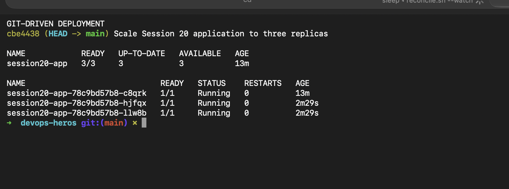
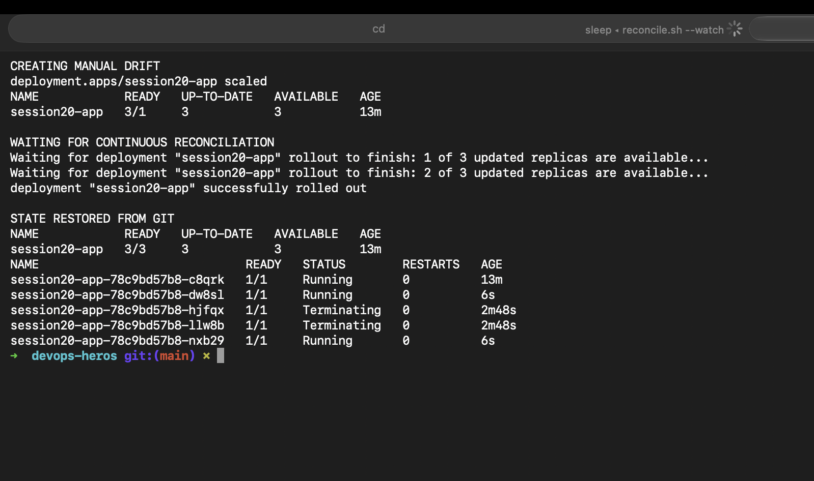

# Session 20: Monitoring, Observability and GitOps

> **Status:** Implementation complete and statically validated. Run the two demos and capture the seven listed screenshots before submission.

## Student Information

- **Name:** MD Kaif Molla
- **Enrollment Number:** 24BCS10221
- **Repository:** [WhySeriousKaif/devops-heros](https://github.com/WhySeriousKaif/devops-heros)

## Project Overview

This project demonstrates monitoring and GitOps using a small instrumented Python service. Prometheus scrapes application metrics, Grafana displays a provisioned dashboard, and Prometheus evaluates a readiness alert. The same application is deployed to a local Kubernetes cluster with health probes and resource controls. A reconciliation process repeatedly applies the declarative state stored in Git and repairs manual drift.

## Architecture



## Repository Structure

```text
monitoring-observability-gitops/
├── app/
│   ├── app.py                         # App, health endpoints, metrics and JSON logs
│   └── Dockerfile
├── monitoring/
│   ├── prometheus.yml                 # Scrape configuration
│   ├── alert-rules.yml                # Readiness and target alerts
│   └── grafana/
│       ├── dashboards/session20.json  # CPU, memory, traffic and health dashboard
│       └── provisioning/              # Automatic dashboard/data-source setup
├── gitops/
│   ├── manifests/                     # Declarative Kubernetes desired state
│   └── reconcile.sh                   # Continuous reconciliation loop
├── scripts/
│   ├── demo-monitoring.sh
│   ├── generate-load.sh
│   ├── trigger-alert.sh
│   ├── demo-gitops.sh
│   └── cleanup.sh
├── screenshots/
├── docker-compose.yml
└── README.md
```

## Prerequisites

- Docker Desktop with at least 3 GiB free disk space
- Docker Compose v2
- `curl`, Git, `kubectl`, and Kind

Check them before starting:

```bash
docker version
docker compose version
kubectl version --client
kind version
git --version
```

## Task 1 — Monitoring Demo

Monitoring answers known questions about system behavior. It collects measurements, presents current and historical state, and notifies operators when defined conditions become abnormal.

| Signal | Meaning | Demonstration in this project |
|---|---|---|
| Metrics | Numeric measurements recorded over time | `/metrics`, Prometheus queries and Grafana panels |
| Logs | Timestamped event records | Structured JSON on stdout and `docker compose logs` |
| Alerts | Rules that identify actionable abnormal states | `ApplicationNotReady` and `ApplicationTargetDown` |
| CPU utilization | Processor time consumed per unit of time | Rate of `process_cpu_seconds_total` |
| Memory utilization | Memory currently used by a process/workload | `process_resident_memory_bytes` |
| Application health | Whether a process is alive and ready for traffic | `/healthz`, `/readyz`, `app_health`, K8s probes |

### Start and Verify

```bash
cd session20-monitoring-observability-gitops/homework/monitoring-observability-gitops
./scripts/demo-monitoring.sh
```

The script builds and starts all services, waits for readiness, generates requests and displays target status. No Grafana setup is required.

Open:

- Application: <http://localhost:8080>
- Prometheus targets: <http://localhost:9090/targets>
- Prometheus alerts: <http://localhost:9090/alerts>
- Grafana dashboard: <http://localhost:3000/d/session20-overview>

Useful PromQL queries:

```promql
up{job="demo-app"}
rate(process_cpu_seconds_total{job="demo-app"}[1m])
process_resident_memory_bytes{job="demo-app"}
rate(app_requests_total{job="demo-app"}[1m])
rate(app_errors_total{job="demo-app"}[1m])
app_health{job="demo-app"}
```

Generate more traffic and inspect structured logs:

```bash
./scripts/generate-load.sh
docker compose logs app --tail=20
curl --fail http://localhost:8080/healthz
curl --fail http://localhost:8080/readyz
```

### Fire and Recover an Alert

```bash
./scripts/trigger-alert.sh fire
```

The app immediately reports `app_health 0`. After two scrapes and 10 seconds in the pending state, `ApplicationNotReady` becomes `Firing`. Capture it at the Prometheus alerts page, then recover:

```bash
./scripts/trigger-alert.sh recover
```

The next Prometheus evaluation resolves the alert and Grafana returns to `HEALTHY`.

### Health Semantics

- **Liveness** (`/healthz`) answers “should this process be restarted?”
- **Readiness** (`/readyz`) answers “should this instance receive traffic?”
- A readiness failure removes a Kubernetes pod from Service endpoints without unnecessarily restarting it.
- Metrics are for trends and alerting; logs retain event context. Neither replaces the other.

## Task 2 — Observability Documentation

Observability is the ability to infer a system's internal state from the telemetry it emits. Monitoring checks known failure modes; observability also helps investigate unexpected failure modes by letting engineers ask new questions without first changing the application.

### The Three Pillars

| Pillar | What it means | Best suited for | Common tools |
|---|---|---|---|
| **Metrics** | Aggregated numeric time series with labels | Trends, dashboards, SLOs, capacity and alerts | Prometheus, Grafana, CloudWatch, Datadog |
| **Logs** | Discrete timestamped event records with context | Error details, audits, debugging and event history | Loki, Elasticsearch/OpenSearch, Fluent Bit, CloudWatch Logs |
| **Traces** | The end-to-end path and timing of one request across services | Finding latency bottlenecks and failed dependencies | OpenTelemetry, Jaeger, Tempo, AWS X-Ray |

Correlation makes the pillars substantially more useful. A high-latency metric can identify when a problem began, a trace ID can identify the slow request and service, and logs carrying the same trace ID can explain the error.

### Why Observability Is Required

- Distributed systems have many dependencies and failure combinations.
- Faster diagnosis lowers mean time to detect (MTTD) and mean time to recover (MTTR).
- Release and version labels expose regressions after deployment.
- Capacity trends guide scaling and cost decisions.
- Service-level indicators and objectives connect telemetry to user experience.
- Evidence from production replaces guesses during incident response.

### Kubernetes Observability

Kubernetes requires visibility at several layers:

| Layer | Useful telemetry |
|---|---|
| Application | Request rate, errors, duration, business metrics, logs and traces |
| Pod/container | Restarts, CPU throttling, working-set memory, OOM kills and probe failures |
| Workload | Desired/available replicas, rollout status and autoscaling |
| Node | CPU, memory, disk, network and node conditions |
| Control plane | API server latency/errors, scheduler and controller health |
| Cluster activity | Kubernetes events, audit logs and configuration changes |

Typical Kubernetes tools are Metrics Server (`kubectl top`), kube-state-metrics, node-exporter, Prometheus Operator, Grafana, Loki/Fluent Bit and OpenTelemetry Collector. Resource requests and limits, structured logs, health probes, stable labels and trace-context propagation should be designed into each workload.

Useful checks after the GitOps demo starts:

```bash
kubectl get nodes
kubectl get pods -n session20 -o wide
kubectl top nodes
kubectl top pods -n session20
kubectl logs deployment/session20-app -n session20 --tail=20
kubectl describe deployment/session20-app -n session20
kubectl get events -n session20 --sort-by=.lastTimestamp
```

`kubectl top` requires Metrics Server; the remaining checks work without it.

## Task 3 — GitOps Demo

GitOps is an operating model in which declarative configuration in Git defines the desired system state. Changes use the normal Git workflow—branch, review, merge and audit history—while a controller continuously compares desired and live state and reconciles differences.

### Four Core Principles

1. **Git is the source of truth:** the committed version records what should run and who changed it.
2. **Configuration is declarative:** manifests describe the desired result, not an imperative sequence of UI actions.
3. **Changes are automated:** a reconciler applies approved Git changes to the target environment.
4. **Reconciliation is continuous:** drift is detected and corrected instead of being allowed to accumulate.

### Workflow

```text
Edit manifest -> Commit -> Pull request/review -> Merge
      -> Reconciler detects desired state -> Apply to Kubernetes
      -> Observe health -> Repeat or roll back with Git
```

### Deploy the Git-Declared State

```bash
./scripts/demo-gitops.sh
```

This creates a Kind cluster named `session20`, builds and loads the local image, applies the namespace/deployment/service, and waits for two ready replicas.

In Terminal 1, start continuous reconciliation:

```bash
./gitops/reconcile.sh --watch
```

The reconciler intentionally requires these manifests to be committed and pauses whenever they contain staged or unstaged edits. This preserves Git—not the working directory—as the approved source of truth.

In Terminal 2, create live-state drift:

```bash
kubectl scale deployment/session20-app -n session20 --replicas=1
kubectl get deployment/session20-app -n session20 -w
```

Within five seconds, reconciliation restores `replicas: 2`, proving that the declarative repository state wins over an out-of-band cluster change.

To demonstrate a legitimate Git-driven change, edit `gitops/manifests/deployment.yaml` from two to three replicas, review the diff, commit it, and let the reconciler apply it:

```bash
git diff -- gitops/manifests/deployment.yaml
git add gitops/manifests/deployment.yaml
git commit -m "Scale Session 20 application to three replicas"
kubectl get deployment/session20-app -n session20 -w
```

Production teams normally use a dedicated controller such as Argo CD or Flux. Those controllers add repository polling/webhooks, health assessment, pruning, multi-cluster support, access controls and a richer audit trail. This small controller keeps the same reconciliation behavior visible for learning.

## Screenshot Guide

Save each image with the exact name shown below.

| File | What to capture | Proof provided |
|---|---|---|
| `png1.png` | Prometheus **Status → Targets** with both targets `UP` | Metrics collection |
| `png2.png` | Provisioned Grafana dashboard after load generation | CPU, memory, traffic and health |
| `png3.png` | Terminal showing health curls and structured app logs | Logs and application health |
| `png4.png` | Prometheus alert page with `ApplicationNotReady` firing | Alert evaluation |
| `png5.png` | Initial Kind workload with deployment `2/2` and two pods | Kubernetes deployment |
| `png6.png` | Committed replica change and workload reaching `3/3` | Git-driven change |
| `png7.png` | Manual scale to one followed by automatic return to Git value | Continuous reconciliation/self-healing |

Embed the captured proof here:

### Prometheus Targets



### Grafana Monitoring Dashboard



### Logs and Health Endpoints



### Firing Alert



### Kubernetes Workload



### Git-Driven Deployment



### GitOps Self-Healing



## Cleanup

```bash
./scripts/cleanup.sh
```

This stops the Compose stack and deletes only the Kind cluster named `session20`.

## Deliverables Checklist

- [x] Monitoring demo code for metrics, logs, alerts, CPU, memory and health
- [x] Pre-provisioned Prometheus and Grafana configuration
- [x] Observability documentation covering metrics, logs and traces
- [x] Common observability tools and Kubernetes practices documented
- [x] GitOps principles, workflow and Kubernetes integration documented
- [x] Runnable continuous reconciliation and self-healing demo
- [x] Reproducible commands and cleanup script
- [ ] Seven runtime screenshots captured and embedded

---

*Maintained by MD Kaif Molla (24BCS10221) — DevOps Homework Submission*
