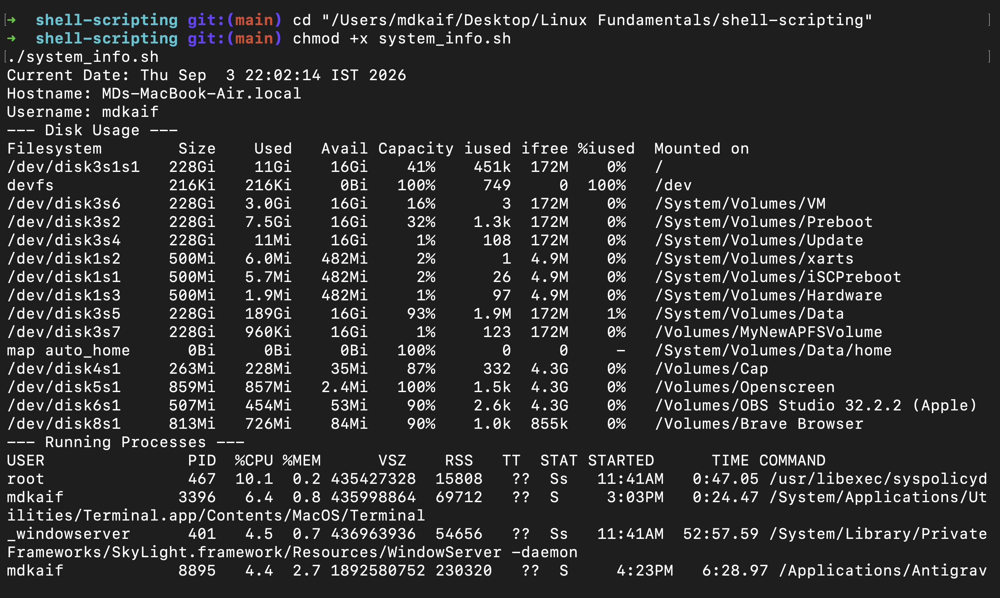
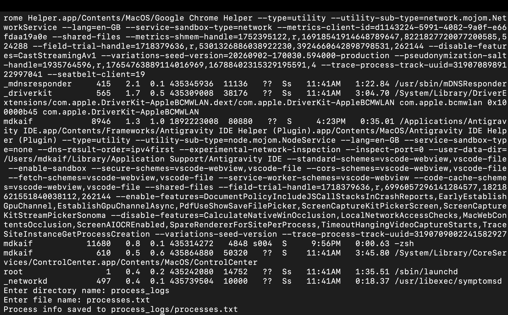
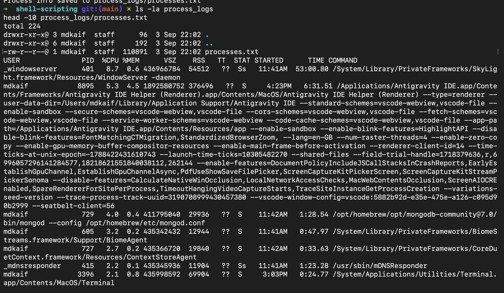

# Shell Scripting: System Information Script

## Task Requirement
Create a shell script that:
- Prints the current date
- Prints the hostname
- Prints the username
- Prints the disk usage
- Prints the running processes
- Uses variables to store and use data
- Takes user input using `read -p`
- Creates a directory using `mkdir`
- Creates a file using `touch`
- Stores the running processes information in the file using `> output redirection`

---

## Commands Used

| Command | Purpose |
|---|---|
| `echo` | Print text to terminal |
| `date`, `hostname`, `whoami` | Retrieve system information |
| Variables | Store data (`CURRENT_DATE`, `MY_HOSTNAME`, `MY_USER`) |
| `df -h` | Display disk usage |
| `ps aux` | Display running processes |
| `read -p` | Prompt user for input |
| `mkdir -p` | Create directory |
| `touch` | Create file |
| `>` | Redirect and save output to file |

---

## Shell Script (`system_info.sh`)

```bash
#!/bin/bash

# 1. Variables storing system data
CURRENT_DATE=$(date)
MY_HOSTNAME=$(hostname)
MY_USER=$(whoami)

# 2. Print system information
echo "Current Date: $CURRENT_DATE"
echo "Hostname: $MY_HOSTNAME"
echo "Username: $MY_USER"

# 3. Print disk usage
echo "--- Disk Usage ---"
df -h

# 4. Print running processes
echo "--- Running Processes ---"
ps aux | head -15

# 5. User input using read -p
read -p "Enter directory name: " DIR_NAME
read -p "Enter file name: " FILE_NAME

# 6. Create directory using mkdir
mkdir -p "$DIR_NAME"

# 7. Create file using touch
touch "$DIR_NAME/$FILE_NAME"

# 8. Store running processes using > output redirection
ps aux > "$DIR_NAME/$FILE_NAME"

echo "Process info saved to $DIR_NAME/$FILE_NAME"
```

---

## Execution & Output Screenshots

### 1. Script Execution
Running `./system_info.sh` displaying system date, hostname, username, disk usage, and running processes:



Interactive input (`read -p`) asking for directory name (`process_logs`) and file name (`processes.txt`), creating them, and redirecting process output:



---

### 2. Output File Verification
Verifying the created directory and redirected log file using `ls -la` and inspecting the content with `head -10`:



