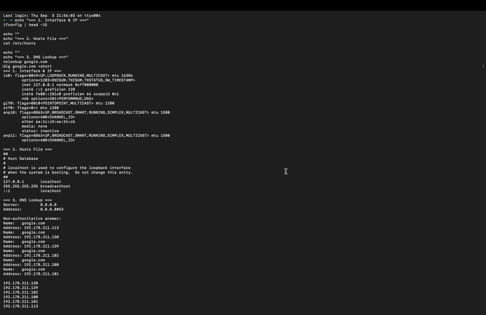
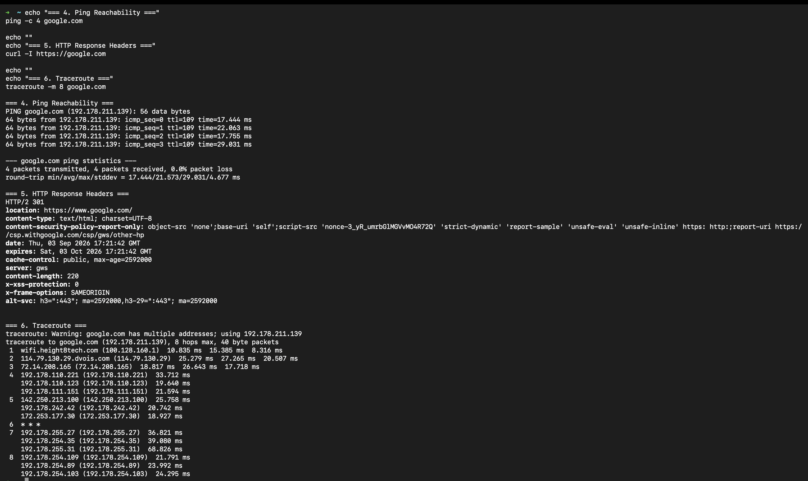
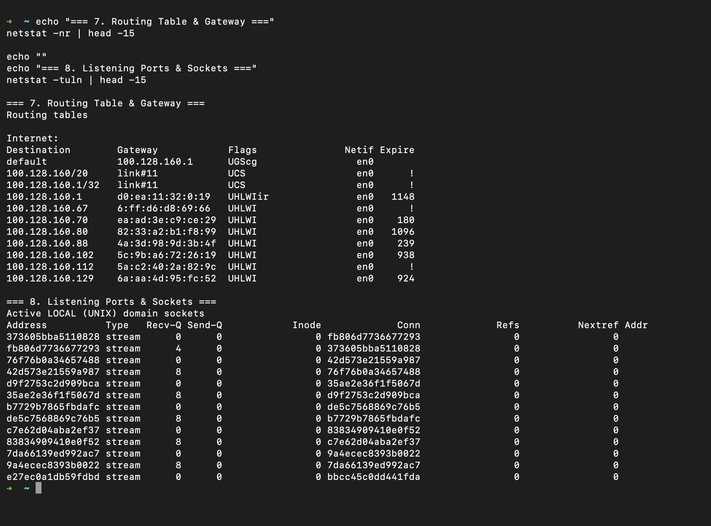

# Networking Fundamentals: DevOps Homework

A hands-on exploration of core Linux/Unix networking commands, connectivity diagnostic tools, DNS resolution, and port/socket inspection.

---

## Table of Contents

- [Overview](#overview)
- [Summary of Networking Commands](#summary-of-networking-commands)
- [Detailed Command Explanations](#detailed-command-explanations)
  - [1. Network Interfaces & IP Configuration (`ifconfig` / `ip a`)](#1-network-interfaces--ip-configuration-ifconfig--ip-a)
  - [2. Local DNS & Host Resolution (`/etc/hosts`)](#2-local-dns--host-resolution-etchosts)
  - [3. Domain Name Resolution (`nslookup` & `dig`)](#3-domain-name-resolution-nslookup--dig)
  - [4. Host Reachability & Latency (`ping`)](#4-host-reachability--latency-ping)
  - [5. Application Layer / HTTP Inspection (`curl -I`)](#5-application-layer--http-inspection-curl--i)
  - [6. Network Routing & Gateway (`netstat -nr` / `ip route`)](#6-network-routing--gateway-netstat--nr--ip-route)
  - [7. Listening Sockets & Ports (`netstat -tuln` / `ss -tuln`)](#7-listening-sockets--ports-netstat--tuln--ss--tuln)
  - [8. Tracing Network Hops (`traceroute`)](#8-tracing-network-hops-traceroute)
- [Troubleshooting Flow in DevOps](#troubleshooting-flow-in-devops)
- [Execution & Output Screenshots](#execution--output-screenshots)

---

## Overview

Networking is the backbone of modern cloud and DevOps infrastructure. Whether configuring cloud virtual networks (VPCs), deploying containerized microservices, or debugging unreachable servers, knowing how to inspect network interfaces, test connectivity, resolve domain names, and monitor listening ports is essential.

---

## Summary of Networking Commands

| Command | Purpose | Linux Equivalent | What It Proves |
|---|---|---|---|
| `ifconfig` | Inspect active network interfaces, IP addresses, MAC addresses, and netmasks | `ip addr` / `ip a` | Shows interface status (`UP`), assigned IPv4/IPv6 address, and MTU |
| `cat /etc/hosts` | View local static hostname-to-IP address mapping table | `cat /etc/hosts` | Resolves hostnames locally before querying external DNS servers |
| `nslookup <domain>` | Query DNS server to resolve domain name to an IP address | `nslookup` | Confirms DNS server reachable and translates name to IP |
| `dig <domain>` | Detailed DNS lookup utility for querying DNS record types | `dig` | Shows query time, TTL, and authoritative DNS response records |
| `ping -c 4 <host>` | Send ICMP Echo Request packets to test destination reachability | `ping -c 4` | Verifies end-to-end IP reachability and measures latency/packet loss |
| `curl -I <url>` | Fetch HTTP response status code and headers without downloading body | `curl -I` | Validates web server availability, redirects (301/302), and HTTP headers |
| `netstat -nr` | Display the kernel IP routing table and default gateway | `ip route` | Identifies which gateway routes traffic out to the internet |
| `netstat -tuln` | Display active listening TCP/UDP network sockets and open ports | `ss -tuln` | Confirms if target service (e.g., port 80, 443, 22) is listening |
| `traceroute <host>` | Trace packet transit path and list all intermediate router hops | `traceroute` | Pinpoints where packets are dropped or encountering latency |

---

## Detailed Command Explanations

### 1. Network Interfaces & IP Configuration (`ifconfig` / `ip a`)
- **Syntax:**
  ```bash
  ifconfig
  ```
  *(On Linux: `ip addr` or `ip a`)*
- **Explanation:**
  Displays all active network interface cards (NICs) on the system. Common interfaces include:
  - `lo0` / `lo`: The loopback interface (`127.0.0.1`), used for intra-machine communications.
  - `en0` / `eth0`: Primary network interface (Wi-Fi or Ethernet) carrying local and internet traffic.
  - Shows the assigned IPv4 address (`inet`), subnet mask (`netmask`), and physical hardware MAC address (`ether`).

---

### 2. Local DNS & Host Resolution (`/etc/hosts`)
- **Syntax:**
  ```bash
  cat /etc/hosts
  ```
- **Explanation:**
  A local text file that maps IP addresses to hostnames. Operating systems consult `/etc/hosts` *before* querying external DNS servers.
  - Default entry `127.0.0.1 localhost` ensures local services map to the loopback address.
  - In DevOps, custom entries are often added here for local development and private testing environments.

---

### 3. Domain Name Resolution (`nslookup` & `dig`)
- **Syntax:**
  ```bash
  nslookup google.com
  dig google.com +short
  ```
- **Explanation:**
  - `nslookup`: Queries the configured DNS resolver (e.g., `8.8.8.8`) to translate human-friendly domain names like `google.com` into machine-routable IP addresses (e.g., `142.251.221.238`).
  - `dig`: Domain Information Groper provides DNS responses including TTL (Time to Live) and query time.

---

### 4. Host Reachability & Latency (`ping`)
- **Syntax:**
  ```bash
  ping -c 4 google.com
  ```
- **Explanation:**
  Uses the **ICMP** (Internet Control Message Protocol) to send Echo Requests to a remote host.
  - `-c 4`: Sends exactly 4 packets and automatically terminates.
  - Reports Round Trip Time (min/avg/max latency) and packet loss percentage.
  - If packets return with 0% loss, network path and target host are operational.

---

### 5. Application Layer / HTTP Inspection (`curl -I`)
- **Syntax:**
  ```bash
  curl -I https://google.com
  ```
- **Explanation:**
  Sends an HTTP `HEAD` request to retrieve web server response headers without downloading the full webpage body.
  - Returns the HTTP status code (e.g., `200 OK`, `301 Moved Permanently`).
  - Shows response headers such as `content-type`, `server`, and caching headers.

---

### 6. Network Routing & Gateway (`netstat -nr` / `ip route`)
- **Syntax:**
  ```bash
  netstat -nr
  ```
  *(On Linux: `ip route`)*
- **Explanation:**
  Displays the kernel routing table.
  - The `default` destination route identifies the **default gateway** (e.g., your local router `100.128.160.1` on interface `en0`).
  - All packets destined for external IP addresses outside the local subnet are forwarded to this gateway.

---

### 7. Listening Sockets & Ports (`netstat -tuln` / `ss -tuln`)
- **Syntax:**
  ```bash
  netstat -tuln
  ```
  *(On Linux: `ss -tuln`)*
- **Flag Breakdown:**
  - `-t`: Filter TCP sockets
  - `-u`: Filter UDP sockets
  - `-l`: Show listening sockets only (services actively waiting for connections)
  - `-n`: Show numeric port numbers instead of resolving protocol names
- **Explanation:**
  Crucial for verifying that backend services (like web servers, databases, and microservices) are actively listening on their expected port numbers before accepting client connections.

---

### 8. Tracing Network Hops (`traceroute`)
- **Syntax:**
  ```bash
  traceroute -m 10 google.com
  ```
- **Explanation:**
  Traces the packet path from source to destination by incrementing the IP packet **TTL** (Time To Live). Each intermediate router decrements TTL, returning an ICMP Time Exceeded message, which maps each network hop along the journey.

---

## Troubleshooting Flow in DevOps

When an application or server is unreachable, engineers follow this systematic diagnosis sequence:

```text
1. IP Verification     👉  ifconfig / ip a       (Does the machine have an IP address?)
2. Gateway Check       👉  netstat -nr / ip route (Is the default gateway configured?)
3. ICMP Ping           👉  ping <gateway_ip>      (Can the machine reach the local router?)
4. External Ping       👉  ping 8.8.8.8           (Can the machine reach the internet via IP?)
5. DNS Lookup          👉  nslookup google.com    (Is DNS translating domain names properly?)
6. Port / Service      👉  netstat -tuln / ss     (Is the application listening on the port?)
7. Application HTTP    👉  curl -I <url>          (Is the web service responding with 200 OK?)
```

---

## Execution & Output Screenshots

### Screenshot 1: Network Configuration & DNS Lookup
Displays `ifconfig` (or `ip a`), `/etc/hosts` inspection, `nslookup`, and `dig`.



---

### Screenshot 2: Connectivity, Latency & HTTP Headers
Displays `ping -c 4` reachability check and `curl -I` HTTP response headers.



---

### Screenshot 3: Routing Table & Listening Sockets
Displays `netstat -nr` (routing table/gateway) and `netstat -tuln` (listening sockets/ports).



---

*Maintained by mdkaif — DevOps Homework Submission*
