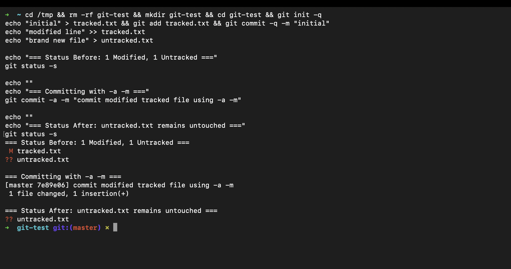
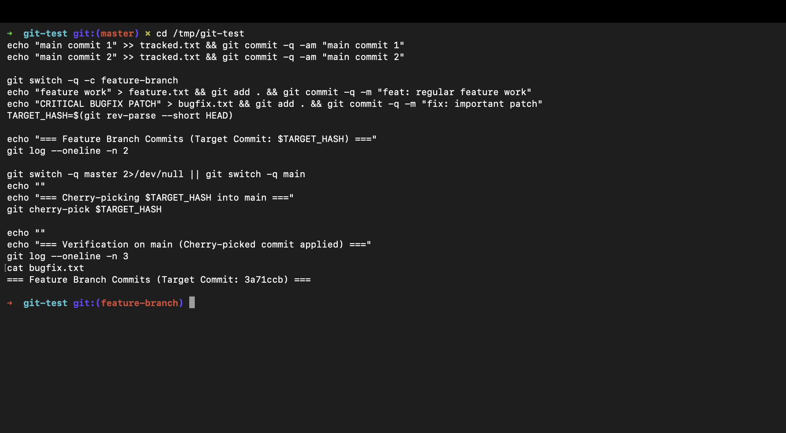

# Git & GitHub: DevOps Homework

A practical laboratory covering Git commit mechanics (`git commit -a -m` vs `git commit -m`), branch management, and selective commit integration using `git cherry-pick`.

---

## Student Information

- **Name:** MD Kaif Molla
- **Enrollment Number:** 24BCS10221
- **Repository:** [WhySeriousKaif/DevOps-Homework](https://github.com/WhySeriousKaif/DevOps-Homework)

---

## Table of Contents

- [Task 1: git commit -a -m vs git commit -m](#task-1-git-commit--a--m-vs-git-commit--m)
  - [1.1 Conceptual Difference](#11-conceptual-difference)
  - [1.2 Comparison Table](#12-comparison-table)
  - [1.3 Hands-On Experiment & Terminal Output](#13-hands-on-experiment--terminal-output)
  - [1.4 Key Takeaway](#14-key-takeaway)
- [Task 2: Git Cherry-Pick](#task-2-git-cherry-pick)
  - [2.1 What is Cherry-Pick?](#21-what-is-cherry-pick)
  - [2.2 Step-by-Step Hands-On Workflow](#22-step-by-step-hands-on-workflow)
  - [2.3 Terminal Execution & Output](#23-terminal-execution--output)
  - [2.4 Verification of Cherry-Picked Changes](#24-verification-of-cherry-picked-changes)
- [Execution & Output Screenshots](#execution--output-screenshots)
- [Key Learnings & DevOps Best Practices](#key-learnings--devops-best-practices)

---

## Task 1: git commit -a -m vs git commit -m

### 1.1 Conceptual Difference

When saving changes in Git, files move through the **Working Tree** $\rightarrow$ **Staging Area (Index)** $\rightarrow$ **Repository History**.

- **`git commit -m "message"`**:
  - Commits **only changes that have been explicitly staged** using `git add <file>`.
  - If you edit a tracked file but do not run `git add`, `git commit -m` will report nothing to commit or ignore unstaged changes.
  
- **`git commit -a -m "message"`** (or `git commit -am "message"`):
  - The `-a` (all) flag **automatically stages all modified and deleted tracked files** before committing.
  - **Crucial limitation:** It **ignores newly created (untracked) files**. Untracked files must still be introduced using `git add`.

---

### 1.2 Comparison Table

| Feature | `git commit -m` | `git commit -a -m` |
|---|---|---|
| **Modified tracked files** | Requires prior `git add` | Automatically staged & committed |
| **Deleted tracked files** | Requires prior `git add` | Automatically staged & committed |
| **New (untracked) files** | Ignored unless staged with `git add` | **Ignored** (never auto-staged) |
| **Workflow speed** | Two-step: `git add` then `git commit` | Single-step shortcut for edits |
| **Staging granularity** | High (choose exact files to stage) | Low (commits all modified tracked files) |

---

### 1.3 Hands-On Experiment & Terminal Output

```bash
# 1. Setup tracked file and untracked file
echo "initial" > file1.txt
git add file1.txt
git commit -m "initial commit"

# 2. Modify tracked file and create untracked file
echo "modified line" >> file1.txt
echo "brand new file" > untracked.txt

# 3. Check status
git status -s
# Output:
#  M file1.txt
# ?? untracked.txt

# 4. Commit using -a -m
git commit -a -m "update tracked file using -a -m"

# 5. Check status after commit
git status -s
# Output:
# ?? untracked.txt
```

#### Actual Terminal Result:
```text
[master 9953b76] update tracked file using -a -m
 1 file changed, 1 insertion(+)

$ git status -s
?? untracked.txt
```

---

### 1.4 Key Takeaway

`git commit -a -m` bypassed the need to run `git add file1.txt` for the existing file, but safely left `untracked.txt` untouched because newly created files are not yet tracked by Git.

---

## Task 2: Git Cherry-Pick

### 2.1 What is Cherry-Pick?

`git cherry-pick <commit-hash>` applies the exact changes introduced by a specific commit from another branch onto your current active branch, creating a new commit with a new SHA hash.

#### Why is this crucial in DevOps?
- **Hotfixes:** When a bug fix is developed on a long-running feature branch or staging branch, cherry-picking pulls **only that bug fix** into `main` or `production` without pulling incomplete feature code.
- **Backporting:** Porting critical security patches from newer release branches back to older supported versions.

---

### 2.2 Step-by-Step Hands-On Workflow

1. Create 2–4 commits in `main`.
2. Inspect commits with `git log --oneline`.
3. Create and switch to a new branch: `git switch -c feature-branch`.
4. Create 2–3 commits on `feature-branch`.
5. Identify the specific target commit to cherry-pick.
6. Switch back to `main`: `git switch main`.
7. Cherry-pick the target commit: `git cherry-pick <target-hash>`.
8. Verify the commit appears in `main` history and files are present.

---

### 2.3 Terminal Execution & Output

```bash
# 1. Create commits on main
echo "main change 1" >> file1.txt && git commit -am "main commit 1"
echo "main change 2" >> file1.txt && git commit -am "main commit 2"

# 2. View main commits
git log --oneline -n 3
# 04e12e4 main commit 2
# 2e24fc0 main commit 1
# 9953b76 update tracked file using -a -m

# 3. Create feature branch and make 3 commits
git switch -c feature-branch
echo "feature work 1" > feature.txt && git add . && git commit -m "feat: feature work 1"
echo "HOTFIX CODE" > hotfix.txt && git add . && git commit -m "fix: important patch to cherry-pick"
echo "feature work 2" >> feature.txt && git commit -am "feat: feature work 2"

# 4. View feature branch commits to locate target hash
git log --oneline -n 3
# 05e8281 feat: feature work 2
# c167c6f fix: important patch to cherry-pick   <-- TARGET COMMIT
# c9c43cc feat: feature work 1

# 5. Switch back to main and cherry-pick the fix
git switch main
git cherry-pick c167c6f
```

---

### 2.4 Verification of Cherry-Picked Changes

```bash
# Verify commit history on main
git log --oneline -n 4

# Verify the file is present in main
cat hotfix.txt
```

#### Actual Terminal Output:
```text
[main b4cb2f1] fix: important patch to cherry-pick
 1 file changed, 1 insertion(+)
 create mode 100644 hotfix.txt

$ git log --oneline -n 4
b4cb2f1 fix: important patch to cherry-pick
04e12e4 main commit 2
2e24fc0 main commit 1
9953b76 update tracked file using -a -m

$ cat hotfix.txt
HOTFIX CODE
```

**Result:** The patch `b4cb2f1` is now seamlessly integrated into `main` without merging any unfinished feature code (`feature.txt`).

---

## Execution & Output Screenshots

### Screenshot 1: Task 1 — `git commit -a -m` vs `git commit -m` Experiment
Demonstrating modified tracked file committed automatically with `-a -m` while untracked file remains in working tree.



---

### Screenshot 2: Task 2 — Git Cherry-Pick Execution & Verification
Demonstrating commit history on feature branch, cherry-picking specific commit hash into `main`, and verifying `git log` and `cat hotfix.txt`.



---

## Key Learnings & DevOps Best Practices

1. **Selective Integration:** Cherry-picking prevents "all-or-nothing" merge dilemmas when deploying urgent production hotfixes.
2. **Commit Atomicity:** Keep commits small and focused so they can be cherry-picked cleanly without causing merge conflicts.
3. **Safety First:** Avoid using `git commit -a` blindly on repositories with sensitive untracked files or local debug configuration.

---

*Maintained by MD Kaif Molla (24BCS10221) — DevOps Homework Submission*
