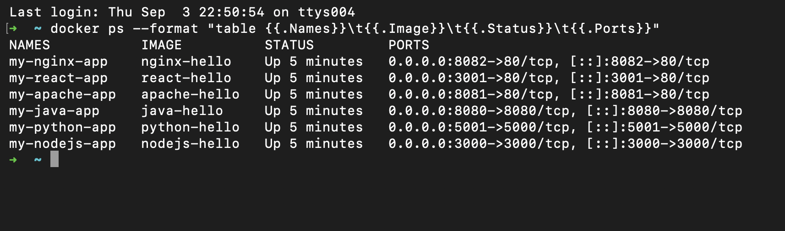
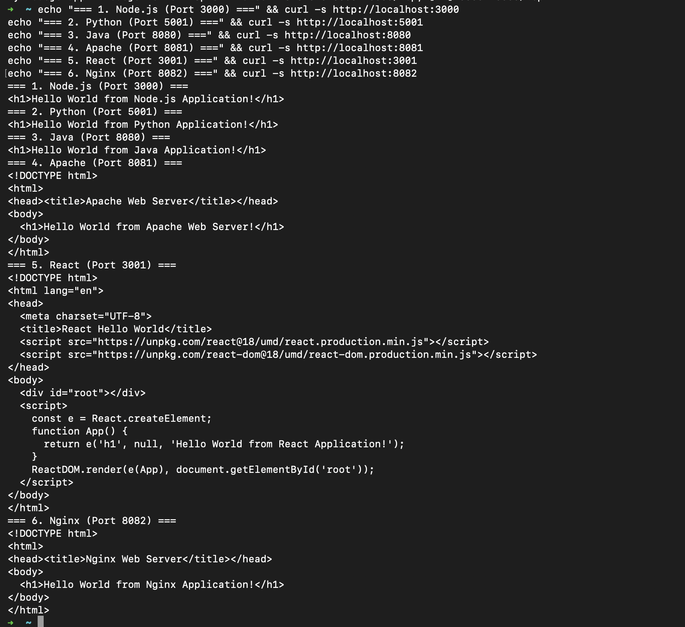

# Docker Fundamentals: Hello World Applications

A hands-on DevOps project building and containerizing six different web applications using Docker, covering multiple programming runtimes and web servers.

---

## Table of Contents

- [Overview & Requirements](#overview--requirements)
- [Folder Structure](#folder-structure)
- [Applications Breakdown](#applications-breakdown)
  - [1. Node.js Application (`nodejs-app`)](#1-nodejs-application-nodejs-app)
  - [2. Python Application (`python-app`)](#2-python-application-python-app)
  - [3. Java Application (`java-app`)](#3-java-application-java-app)
  - [4. Apache Web Server (`Apache-app`)](#4-apache-web-server-apache-app)
  - [5. React Application (`React-app`)](#5-react-application-react-app)
  - [6. Nginx Application (`nginx-app`)](#6-nginx-application-nginx-app)
- [Port Mapping Summary](#port-mapping-summary)
- [Build & Run Commands](#build--run-commands)
- [Verification & Screenshots](#verification--screenshots)
- [Key Learnings](#key-learnings)

---

## Overview & Requirements

The objective is to create and run containerized Hello World web applications for 6 different runtimes/servers:
1. **Node.js**
2. **Python**
3. **Java**
4. **Apache HTTP Server**
5. **React**
6. **Nginx**

For each application:
- Maintain its own isolated directory.
- Include the application source code.
- Provide a dedicated `Dockerfile`.
- Build the Docker image and run it as an isolated container.
- Expose and map the container port so "Hello World" is accessible on a webpage.

---

## Folder Structure

```text
docker-fundamentals/
│
├── nodejs-app/
│   ├── server.js                      # Native Node.js HTTP server
│   └── Dockerfile                     # node:18-alpine base image
│
├── python-app/
│   ├── app.py                         # Native Python HTTP server
│   └── Dockerfile                     # python:3.9-alpine base image
│
├── java-app/
│   ├── SimpleWebServer.java           # Java built-in HTTPServer
│   └── Dockerfile                     # openjdk:17-alpine base image
│
├── Apache-app/
│   ├── index.html                     # Web page
│   └── Dockerfile                     # httpd:alpine base image
│
├── React-app/
│   ├── index.html                     # React single-page app
│   └── Dockerfile                     # nginx:alpine static server
│
├── nginx-app/
│   ├── index.html                     # Web page
│   └── Dockerfile                     # nginx:alpine base image
│
├── README.md                          # Comprehensive documentation
└── screenshots/                       # Execution & verification proofs
    ├── png1.png                       # docker ps running containers
    └── png2.png                       # Webpage / curl verification outputs
```

---

## Applications Breakdown

### 1. Node.js Application (`nodejs-app`)
- **File:** `server.js`
- **Port:** `3000`
- **Dockerfile:**
  ```dockerfile
  FROM node:18-alpine
  WORKDIR /app
  COPY server.js .
  EXPOSE 3000
  CMD ["node", "server.js"]
  ```

### 2. Python Application (`python-app`)
- **File:** `app.py`
- **Port:** `5000`
- **Dockerfile:**
  ```dockerfile
  FROM python:3.9-alpine
  WORKDIR /app
  COPY app.py .
  EXPOSE 5000
  CMD ["python", "app.py"]
  ```

### 3. Java Application (`java-app`)
- **File:** `SimpleWebServer.java`
- **Port:** `8080`
- **Dockerfile:**
  ```dockerfile
  FROM amazoncorretto:17-alpine
  WORKDIR /app
  COPY SimpleWebServer.java .
  RUN javac SimpleWebServer.java
  EXPOSE 8080
  CMD ["java", "SimpleWebServer"]
  ```

### 4. Apache Web Server (`Apache-app`)
- **File:** `index.html`
- **Port:** `8081` (Host) $\rightarrow$ `80` (Container)
- **Dockerfile:**
  ```dockerfile
  FROM httpd:alpine
  COPY index.html /usr/local/apache2/htdocs/
  EXPOSE 80
  ```

### 5. React Application (`React-app`)
- **File:** `index.html`
- **Port:** `3001` (Host) $\rightarrow$ `80` (Container)
- **Dockerfile:**
  ```dockerfile
  FROM nginx:alpine
  COPY index.html /usr/share/nginx/html/index.html
  EXPOSE 80
  ```

### 6. Nginx Application (`nginx-app`)
- **File:** `index.html`
- **Port:** `8082` (Host) $\rightarrow$ `80` (Container)
- **Dockerfile:**
  ```dockerfile
  FROM nginx:alpine
  COPY index.html /usr/share/nginx/html/index.html
  EXPOSE 80
  ```

---

## Port Mapping Summary

| Application | Container Port | Host Port | Web Access URL |
|---|---|---|---|
| **Node.js** | 3000 | 3000 | `http://localhost:3000` |
| **Python** | 5000 | 5001 | `http://localhost:5001` |
| **Java** | 8080 | 8080 | `http://localhost:8080` |
| **Apache** | 80 | 8081 | `http://localhost:8081` |
| **React** | 80 | 3001 | `http://localhost:3001` |
| **Nginx** | 80 | 8082 | `http://localhost:8082` |

> *Note: Port 5001 is mapped to Python's internal port 5000 to prevent conflicts with native macOS AirPlay services on host port 5000.*

---

## Build & Run Commands

### 1. Build All Images
```bash
cd docker-fundamentals
docker build -t nodejs-hello ./nodejs-app
docker build -t python-hello ./python-app
docker build -t java-hello ./java-app
docker build -t apache-hello ./Apache-app
docker build -t react-hello ./React-app
docker build -t nginx-hello ./nginx-app
```

### 2. Run All Containers
```bash
docker run -d --name my-nodejs-app -p 3000:3000 nodejs-hello
docker run -d --name my-python-app -p 5001:5000 python-hello
docker run -d --name my-java-app -p 8080:8080 java-hello
docker run -d --name my-apache-app -p 8081:80 apache-hello
docker run -d --name my-react-app -p 3001:80 react-hello
docker run -d --name my-nginx-app -p 8082:80 nginx-hello
```

### 3. Verify Containers with `docker ps`
```bash
docker ps --format "table {{.Names}}\t{{.Image}}\t{{.Status}}\t{{.Ports}}"
```

### 4. Verify Hello World Responses
```bash
curl http://localhost:3000
curl http://localhost:5001
curl http://localhost:8080
curl http://localhost:8081
curl http://localhost:3001
curl http://localhost:8082
```

---

## Verification & Screenshots

### Screenshot 1: Running Containers (`docker ps`)
Active Docker containers running concurrently with their respective port bindings.



---

### Screenshot 2: Multi-Service Terminal Verification
Curl verification showing "Hello World" responses returned from all six running applications.



---

### Screenshot 3: Browser Verification — Node.js Application (Port 3000)
Webpage displaying Hello World from the Node.js application running on port 3000.


---

### Screenshot 4: Browser Verification — Apache Web Server (Port 8081)
Webpage displaying Hello World from the Apache HTTP server running on port 8081.


---

## Key Learnings

1. **Environment Isolation:** Each application runs in its own self-contained environment with its own runtime and dependencies without conflicting with others.
2. **Port Forwarding (`-p`):** Bridges external host requests to internal container ports, allowing multiple web services to run simultaneously on different host ports.
3. **Alpine-based Images:** Using minimalist Alpine bases (`node:18-alpine`, `python:3.9-alpine`, `httpd:alpine`, `nginx:alpine`) drastically reduces image size, accelerates build times, and enhances security.

---

*Maintained by mdkaif — DevOps Homework Submission*
