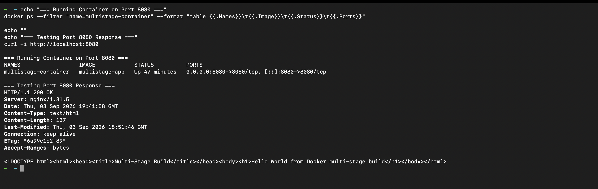
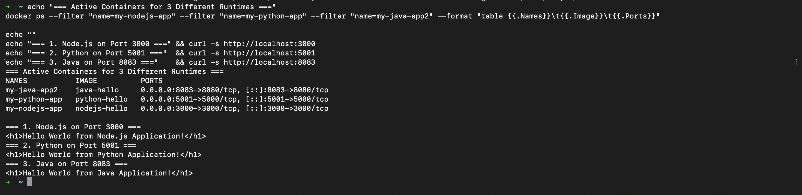

# Docker Multi-Stage Build Homework

A hands-on laboratory focusing on Docker multi-stage build optimization, container execution on designated ports, and multi-runtime application deployment (Node.js, Python, Java).

---

## Student Information

- **Name:** MD Kaif Molla
- **Enrollment Number:** 24BCS10221
- **Repository:** [WhySeriousKaif/DevOps-Homework](https://github.com/WhySeriousKaif/DevOps-Homework)

---

## Table of Contents

- [Task 1: Run Multi-Stage Dockerfile](#task-1-run-multi-stage-dockerfile)
  - [1.1 Multi-Stage Architecture](#11-multi-stage-architecture)
  - [1.2 Dockerfile Source Code](#12-dockerfile-source-code)
  - [1.3 Build and Run on Port 8080](#13-build-and-run-on-port-8080)
  - [1.4 Output Verification](#14-output-verification)
- [Task 2: Container Verification & Process Proof](#task-2-container-verification--process-proof)
- [Task 3: Multi-Application Deployment (Node.js, Python, Java)](#task-3-multi-application-deployment-nodejs-python-java)
- [Execution & Output Screenshots](#execution--output-screenshots)
- [Key Learnings on Multi-Stage Builds](#key-learnings-on-multi-stage-builds)

---

## Task 1: Run Multi-Stage Dockerfile

### 1.1 Multi-Stage Architecture

In a standard Dockerfile, all compilation tools, intermediate cache files, and build utilities end up inside the final image, bloating its size and increasing security attack surfaces. 

A **multi-stage build** separates concerns:
1. **Build Stage (`builder`):** Compiles code or builds assets using a complete development environment (`node:18-alpine`).
2. **Runtime Stage:** Starts from a lean production runtime (`nginx:alpine`) and copies **only** the compiled artifact (`COPY --from=builder`).

---

### 1.2 Dockerfile Source Code

Located at [`multi-stage-app/Dockerfile`](./multi-stage-app/Dockerfile):

```dockerfile
# Stage 1: Build stage
FROM node:18-alpine AS builder
WORKDIR /build
RUN echo '<!DOCTYPE html><html><head><title>Multi-Stage Build</title></head><body><h1>Hello World from Docker multi-stage build</h1></body></html>' > index.html

# Stage 2: Minimal production runtime stage
FROM nginx:alpine
COPY --from=builder /build/index.html /usr/share/nginx/html/index.html
RUN sed -i 's/listen       80;/listen       8080;/g' /etc/nginx/conf.d/default.conf 2>/dev/null || sed -i 's/80;/8080;/g' /etc/nginx/conf.d/default.conf
EXPOSE 8080
CMD ["nginx", "-g", "daemon off;"]
```

---

### 1.3 Build and Run on Port 8080

1. **Build the image:**
   ```bash
   cd docker-images
   docker build -t multistage-app ./multi-stage-app
   ```

2. **Run the container on port 8080:**
   ```bash
   docker run -d --name multistage-container -p 8080:8080 multistage-app
   ```

3. **Verify the running container via `docker ps`:**
   ```bash
   docker ps | grep multistage-container
   ```

---

### 1.4 Output Verification

Test the running application on port 8080:

```bash
curl -i http://localhost:8080
```

#### Actual Terminal Response:

```text
HTTP/1.1 200 OK
Server: nginx/1.31.5
Content-Type: text/html
Content-Length: 137
Connection: keep-alive

<!DOCTYPE html><html><head><title>Multi-Stage Build</title></head><body><h1>Hello World from Docker multi-stage build</h1></body></html>
```

The application successfully serves the requested message:
> **`Hello World from Docker multi-stage build`** on **port 8080**.

---

## Task 2: Container Verification & Process Proof

Checking running containers using `docker ps --format`:

```bash
docker ps --format "table {{.Names}}\t{{.Image}}\t{{.Status}}\t{{.Ports}}"
```

#### Output:
```text
NAMES                  IMAGE            STATUS          PORTS
multistage-container   multistage-app   Up 5 minutes    0.0.0.0:8080->8080/tcp, [::]:8080->8080/tcp
```

---

## Task 3: Multi-Application Deployment (Node.js, Python, Java)

As required by Task 3, three different application types were containerized and deployed concurrently:

| Application | Technology | Docker Base Image | Host Port | Verification Command | Expected Output |
|---|---|---|---|---|---|
| **1. Node.js** | Native HTTP Service | `node:18-alpine` | `3000` | `curl http://localhost:3000` | `<h1>Hello World from Node.js Application!</h1>` |
| **2. Python** | `http.server` Module | `python:3.9-alpine` | `5001` | `curl http://localhost:5001` | `<h1>Hello World from Python Application!</h1>` |
| **3. Java** | `com.sun.net.httpserver` | `amazoncorretto:17-alpine` | `8083` | `curl http://localhost:8083` | `<h1>Hello World from Java Application!</h1>` |

#### Commands to deploy and test all 3:
```bash
# 1. Node.js Application
docker run -d --name my-nodejs-app -p 3000:3000 nodejs-hello
curl http://localhost:3000

# 2. Python Application
docker run -d --name my-python-app -p 5001:5000 python-hello
curl http://localhost:5001

# 3. Java Application
docker run -d --name my-java-app2 -p 8083:8080 java-hello
curl http://localhost:8083
```

---

## Execution & Output Screenshots

### Screenshot 1: Multi-Stage Container on Port 8080 & Terminal Verification
Demonstrating `docker ps` showing `multistage-container` running on port 8080 and curl verifying `Hello World from Docker multi-stage build`.



---

### Screenshot 2: Three Distinct Application Deployments (Node.js, Python, Java)
Demonstrating concurrent deployment and successful HTTP responses from Node.js, Python, and Java containers.



---

### Screenshot 3: Browser Verification — Python Application (Port 5001)
Browser view displaying Hello World from the Python application running on port 5001.


---

### Screenshot 4: Browser Verification — Multi-Stage Build Application (Port 8080)
Browser view displaying Hello World from Docker multi-stage build running on port 8080.


---

## Key Learnings on Multi-Stage Builds

1. **Drastic Image Reduction:** Compilers and build dependencies are discarded after stage 1, producing minimal images.
2. **Security Hardening:** Production containers contain zero SDKs, debuggers, or build tools, drastically shrinking vulnerability surfaces.
3. **Port Binding Determinism:** Using `-p 8080:8080` allows standardizing microservice exposure ports across hosts and orchestrators.

---

*Maintained by MD Kaif Molla (24BCS10221) — DevOps Homework Submission*
