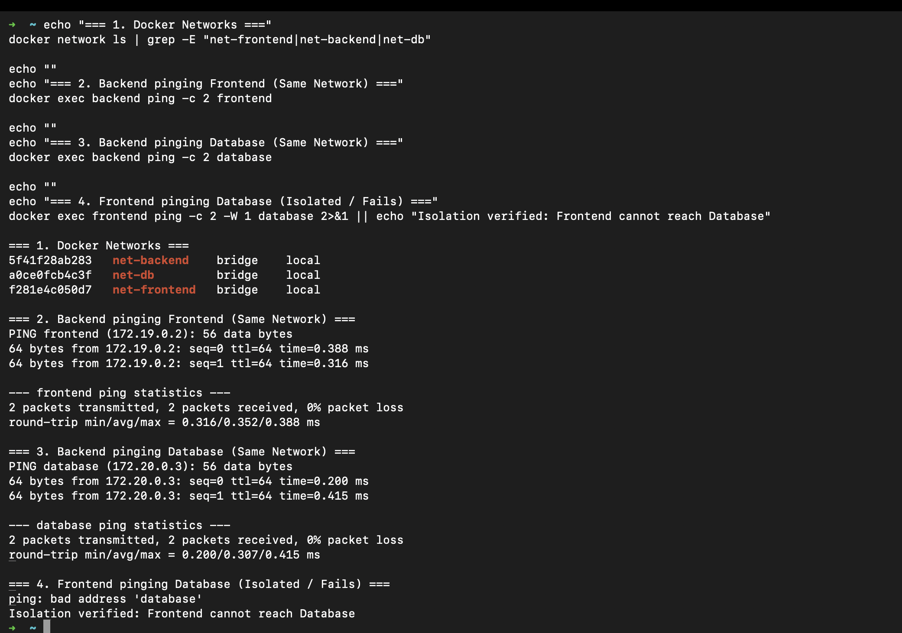
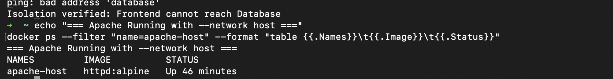
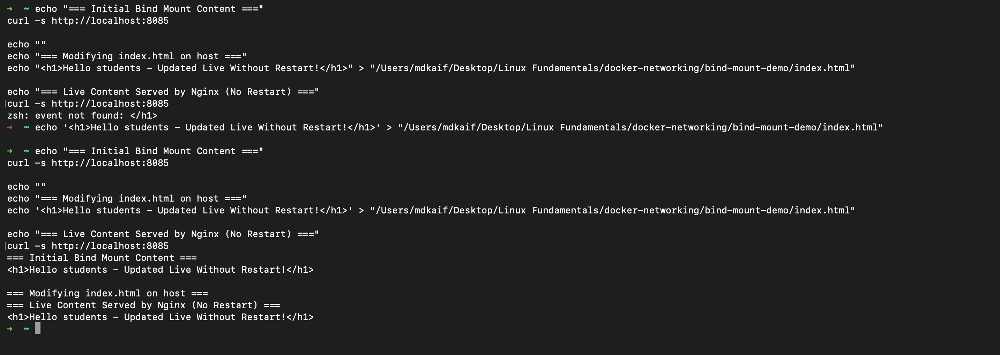

# Docker Networking & Volumes: DevOps Homework

A comprehensive, hands-on laboratory exploring multi-network container topologies, host networking, dynamic filesystem bind mounts, and overlay network architecture.

---

## Student Information

- **Name:** MD Kaif Molla
- **Enrollment Number:** 24BCS10221
- **Repository:** [WhySeriousKaif/DevOps-Homework](https://github.com/WhySeriousKaif/DevOps-Homework)

---

## Table of Contents

- [Task 1: Docker Container Networking (Multi-Tier Topology)](#task-1-docker-container-networking-multi-tier-topology)
  - [1.1 Architecture & Network Setup](#11-architecture--network-setup)
  - [1.2 Execution Commands](#12-execution-commands)
  - [1.3 Connectivity & Isolation Verification](#13-connectivity--isolation-verification)
- [Task 2: Host Network (`--network host`)](#task-2-host-network---network-host)
  - [2.1 Concept & Mechanics](#21-concept--mechanics)
  - [2.2 Execution Commands & Access](#22-execution-commands--access)
- [Task 3: Bind Mount & Live Hot Reloading](#task-3-bind-mount--live-hot-reloading)
  - [3.1 Setup & Initial Mount](#31-setup--initial-mount)
  - [3.2 Modifying Host Content Without Restart](#32-modifying-host-content-without-restart)
- [Task 4: Overlay Networks in Distributed Systems](#task-4-overlay-networks-in-distributed-systems)
  - [4.1 What is an Overlay Network?](#41-what-is-an-overlay-network)
  - [4.2 How Multi-Host Overlay Works (VXLAN Encapsulation)](#42-how-multi-host-overlay-works-vxlan-encapsulation)
  - [4.3 Primary Use Cases](#43-primary-use-cases)
- [Execution & Output Screenshots](#execution--output-screenshots)
- [Key Learnings](#key-learnings)

---

## Task 1: Docker Container Networking (Multi-Tier Topology)

### 1.1 Architecture & Network Setup

In a production 3-tier application, frontend and database containers must be completely isolated from each other. The backend API container serves as the intermediary bridge by joining both networks:

```text
+-----------------------+              +-----------------------+              +-----------------------+
|       frontend        |              |        backend        |              |       database        |
|    (Alpine / Web)     |              |     (Dual-Homed)      |              |   (Alpine / MySQL)    |
+-----------------------+              +-----------------------+              +-----------------------+
            \                                      /       \                                      /
             \                                    /         \                                    /
              +----------------------------------+           +----------------------------------+
              |           net-frontend           |           |           net-backend            |
              +----------------------------------+           +----------------------------------+
```

An additional isolated network `net-db` was created to demonstrate multiple isolated virtual networks.

---

### 1.2 Execution Commands

```bash
# 1. Create 3 independent Docker networks
docker network create net-frontend
docker network create net-backend
docker network create net-db

# 2. Run containers on designated networks
docker run -d --name frontend --network net-frontend alpine sleep 3600
docker run -d --name backend --network net-frontend alpine sleep 3600
docker run -d --name database --network net-backend alpine sleep 3600

# 3. Add backend container to 2 networks (Dual-Homing)
docker network connect net-backend backend
```

---

### 1.3 Connectivity & Isolation Verification

```bash
# Test 1: Backend to Frontend (Same network: net-frontend) -> SUCCESS
docker exec backend ping -c 2 frontend

# Test 2: Backend to Database (Same network: net-backend) -> SUCCESS
docker exec backend ping -c 2 database

# Test 3: Frontend to Database (Different networks) -> ISOLATED (Expected Failure!)
docker exec frontend ping -c 2 -W 1 database
```

#### Actual Terminal Output:
```text
=== Test: Backend to Frontend ===
PING frontend (172.19.0.2): 56 data bytes
64 bytes from 172.19.0.2: seq=0 ttl=64 time=1.620 ms
64 bytes from 172.19.0.2: seq=1 ttl=64 time=0.291 ms
2 packets transmitted, 2 packets received, 0% packet loss

=== Test: Backend to Database ===
PING database (172.20.0.3): 56 data bytes
64 bytes from 172.20.0.3: seq=0 ttl=64 time=0.491 ms
64 bytes from 172.20.0.3: seq=1 ttl=64 time=0.331 ms
2 packets transmitted, 2 packets received, 0% packet loss

=== Test: Frontend to Database (Should Fail / Isolated) ===
ping: bad address 'database'
Isolation verified: Frontend cannot reach Database
```

---

## Task 2: Host Network (`--network host`)

### 2.1 Concept & Mechanics

Under `--network host`, the container bypasses Docker's virtual network stack and shares the host's network namespace directly. No NAT translation, port mapping (`-p`), or bridge interface is used; the container binds directly to host IP and ports.

---

### 2.2 Execution Commands & Access

```bash
# 1. Pull the official Apache image
docker pull httpd:alpine

# 2. Run Apache container directly on the host network
docker run -d --name apache-host --network host httpd:alpine

# 3. Verify running container
docker ps | grep apache-host
```

#### Output:
```text
6dd747fbd6d8   httpd:alpine   "httpd-foreground"   Up 12 seconds   apache-host
```

> **Note on Operating Systems:** On native Linux, `--network host` binds port 80 directly to the host machine's interface (`curl http://localhost:80`). On macOS/Windows, Docker runs inside a lightweight virtualization VM (LinuxKit), where host networking attaches to the VM's network interface.

---

## Task 3: Bind Mount & Live Hot Reloading

### 3.1 Setup & Initial Mount

A bind mount directly connects a directory or file on the host machine to a path inside the container.

```bash
# 1. Create a local folder and HTML file
mkdir -p bind-mount-demo
echo "<h1>Hello students</h1>" > bind-mount-demo/index.html

# 2. Run Nginx container with the host folder bind-mounted
docker run -d --name nginx-bind -p 8085:80 -v "$(pwd)/bind-mount-demo:/usr/share/nginx/html" nginx:alpine

# 3. Verify initial content
curl http://localhost:8085
```

#### Output:
```html
<h1>Hello students</h1>
```

---

### 3.2 Modifying Host Content Without Restart

Update the local file on the host machine:

```bash
echo "<h1>Hello students - Updated Live Without Restart!</h1>" > bind-mount-demo/index.html

# Verify immediately without touching the container
curl http://localhost:8085
```

#### Output:
```html
<h1>Hello students - Updated Live Without Restart!</h1>
```

**Observation:** The container immediately serves the updated file. Because bind mounts share the host inode and filesystem reference directly, changes appear instantaneously without rebuilding images or restarting containers.

---

## Task 4: Overlay Networks in Distributed Systems

### 4.1 What is an Overlay Network?

An **Overlay Network** is a software-defined network (SDN) that spans multiple physical or virtual Docker host machines. It creates a flat virtual subnet across separate nodes, enabling containers on Host A to communicate seamlessly with containers on Host B as if they were plugged into the same local network switch.

---

### 4.2 How Multi-Host Overlay Works (VXLAN Encapsulation)

1. **Virtual Extensible LAN (VXLAN):** Docker wraps internal Layer 2 Ethernet frames from container traffic inside standard Layer 3 UDP packets (UDP port `4789`).
2. **Encapsulation & Decapsulation:** When Container A on Host 1 sends a packet to Container B on Host 2:
   - Host 1 encapsulates the packet in a UDP wrapper.
   - The packet traverses the physical network or cloud VPC.
   - Host 2 receives the UDP packet, extracts the internal container frame, and delivers it to Container B.
3. **Control Plane & Discovery:** Docker Swarm or Consul/etcd maintains a distributed key-value store mapping container names and IPs across cluster nodes.

---

### 4.3 Primary Use Cases

- **Docker Swarm & Multi-Host Clusters:** The default network driver for Swarm services, enabling ingress routing mesh and automated load balancing.
- **Microservice Scaling:** Distributing frontend, backend, and cache containers across multiple cloud VMs without exposing private ports to the public internet.
- **Zero-Config Discovery:** Containers discover peer microservices on any node in the cluster by container/service name.

---

## Execution & Output Screenshots

### Screenshot 1: Multi-Tier Network Connectivity & Isolation
Demonstrating `net-frontend`, `net-backend`, and `net-db` creation, backend connecting to both networks, successful pings between connected tiers, and isolation verification.



---

### Screenshot 2: Apache on Host Network
Terminal output showing Apache pulled and executed using `--network host`.



---

### Screenshot 3: Bind Mount & Live Modification Proof
Demonstrating initial `Hello students` response, modifying `index.html` on the host, and immediate verification of `Hello students - Updated Live Without Restart!` without container restart.



---

## Key Learnings

1. **Least-Privilege Networking:** Multi-network topologies safeguard sensitive tiers (databases) by isolating them from ingress networks.
2. **Bind Mount Velocity:** Bind mounts provide ideal developer environments for rapid frontend/backend iteration with instantaneous hot reload.
3. **Network Drivers:** Choosing between `bridge` (single-host), `host` (raw performance), and `overlay` (multi-host clusters) aligns container infrastructure with deployment requirements.

---

*Maintained by MD Kaif Molla (24BCS10221) — DevOps Homework Submission*
