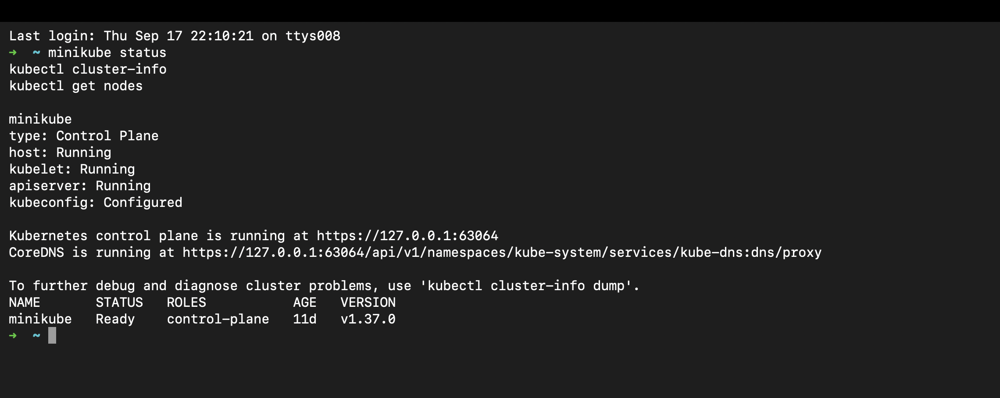
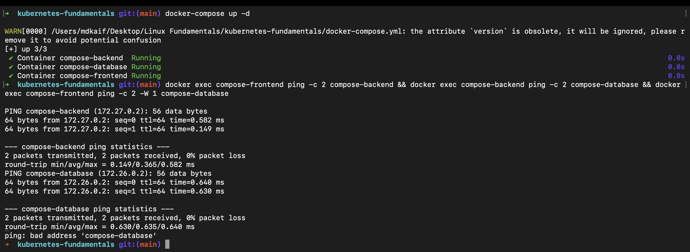

# Kubernetes Fundamentals: DevOps Homework

A comprehensive guide and practical laboratory covering Kubernetes architecture, local cluster initialization using Minikube, and multi-tier application orchestration using Docker Compose.

---

## Student Information

- **Name:** MD Kaif Molla
- **Enrollment Number:** 24BCS10221
- **Repository:** [WhySeriousKaif/DevOps-Homework](https://github.com/WhySeriousKaif/DevOps-Homework)

---

## Table of Contents

- [Task 1: Minikube Setup & Cluster Management](#task-1-minikube-setup--cluster-management)
  - [1.1 What is Minikube?](#11-what-is-minikube)
  - [1.2 Execution Commands & Cluster Lifecycle](#12-execution-commands--cluster-lifecycle)
  - [1.3 Cluster Verification](#13-cluster-verification)
- [Task 2: Kubernetes Core Architecture Deep-Dive](#task-2-kubernetes-core-architecture-deep-dive)
  - [2.1 High-Level Architecture](#21-high-level-architecture)
  - [2.2 Control Plane (Master Node) Components](#22-control-plane-master-node-components)
  - [2.3 Worker Node Components](#23-worker-node-components)
  - [2.4 End-to-End Request Flow](#24-end-to-end-request-flow)
- [Task 3: Docker Compose Multi-Tier Application](#task-3-docker-compose-multi-tier-application)
  - [3.1 Multi-Tier Architecture & Isolation](#31-multi-tier-architecture--isolation)
  - [3.2 Docker Compose Specification](#32-docker-compose-specification)
  - [3.3 Connectivity & Isolation Verification](#33-connectivity--isolation-verification)
- [Execution & Output Screenshots](#execution--output-screenshots)
- [Key Learnings & Summary](#key-learnings--summary)

---

## Task 1: Minikube Setup & Cluster Management

### 1.1 What is Minikube?

**Minikube** is a lightweight, local Kubernetes implementation that spins up a single-node or multi-node cluster inside virtualized environments (Docker, Hyperkit, VirtualBox) on your local workstation. It provides an ideal sandbox for learning, experimenting, and testing production-grade Kubernetes manifests without cloud provider costs.

---

### 1.2 Execution Commands & Cluster Lifecycle

```bash
# 1. Verify Minikube installation
minikube version

# 2. Start the local Kubernetes cluster using the Docker driver
minikube start --driver=docker

# 3. Check cluster and component health status
minikube status

# 4. View cluster information and node status
kubectl cluster-info
kubectl get nodes

# 5. Stop the cluster when done
minikube stop
```

---

### 1.3 Cluster Verification

When running `minikube status`, the four core operational layers report operational status:
- **host:** Running
- **kubelet:** Running
- **apiserver:** Running
- **kubeconfig:** Configured

---

## Task 2: Kubernetes Core Architecture Deep-Dive

Kubernetes operates on a declarative, master-worker architecture where the **Control Plane** maintains the desired state of the cluster, and **Worker Nodes** host the containerized application workloads.

```text
+-----------------------------------------------------------------------+
|                    KUBERNETES CONTROL PLANE (MASTER)                  |
|                                                                       |
|   +-------------------+      +------------------------------------+   |
|   |       ETCD        |<---->|             API SERVER             |   |
|   |  (Key-Value Store)|      |       (kube-apiserver: Hub)        |   |
|   +-------------------+      +-----------------+------------------+   |
|                                                ^                      |
|                               +----------------+----------------+     |
|                               |                                 |     |
|               +---------------+---------------+ +---------------+--+  |
|               |        KUBE-SCHEDULER         | | CONTROLLER MGR   |  |
|               |  (Node Selection & Placement) | | (Reconciliation) |  |
|               +-------------------------------+ +------------------+  |
+-----------------------------------------------------------------------+
                                        | (gRPC / HTTPS)
       +--------------------------------+--------------------------------+
       |                                                                 |
+------v--------------------------------+ +------------------------------v------+
|              WORKER NODE 1            | |              WORKER NODE 2          |
|                                       | |                                     |
|  +---------------------------------+  | |  +---------------------------------+ |
|  |             KUBELET             |  | |  |             KUBELET             | |
|  | (Node Agent, talks to runtime)  |  | |  | (Node Agent, talks to runtime)  | |
|  +---------------------------------+  | |  +---------------------------------+ |
|  |           KUBE-PROXY            |  | |  |           KUBE-PROXY            | |
|  |  (Network rules, iptables/IPVS) |  | |  |  (Network rules, iptables/IPVS) | |
|  +---------------------------------+  | |  +---------------------------------+ |
|  |        CONTAINER RUNTIME        |  | |  |        CONTAINER RUNTIME        | |
|  |          (containerd)           |  | |  |          (containerd)           | |
|  +---------------------------------+  | |  +---------------------------------+ |
|     [Pod A]      [Pod B]      [Pod C] | |     [Pod D]      [Pod E]            |
+---------------------------------------+ +-------------------------------------+
```

---

### 2.1 Control Plane (Master Node) Components

| Component | Responsibility | Technical Role |
|---|---|---|
| **API Server (`kube-apiserver`)** | The cluster's front-door | Exposes the Kubernetes HTTP REST API. All internal components and external tools (`kubectl`) communicate strictly through the API Server. Authenticates and validates requests. |
| **ETCD** | Distributed State Database | Consistent, highly-available key-value store (based on Raft consensus). Holds the entire cluster state, configuration, and metadata. |
| **Kube-Scheduler (`kube-scheduler`)** | Placement Engine | Observes newly created Pods without assigned nodes. Evaluates resource requests, taints/tolerations, affinity rules, and selects the optimal worker node. |
| **Kube-Controller-Manager** | Continuous Reconciler | Runs controller loops that continuously compare the **actual state** with the **desired state** (e.g., Node Lifecycle Controller, ReplicaSet Controller, EndpointSlice Controller). |

---

### 2.2 Worker Node Components

| Component | Responsibility | Technical Role |
|---|---|---|
| **Kubelet** | Node Supervisor Agent | Runs on every worker node. Accepts `PodSpecs` from the API Server and ensures the containers described in those PodSpecs are running and healthy via the CRI (Container Runtime Interface). |
| **Kube-Proxy** | Network Routing & Service Proxy | Maintains network rules on nodes (`iptables` / IPVS). Enables Kubernetes Service abstraction by routing traffic from Service IPs to healthy backend Pod IPs. |
| **Container Runtime (`containerd`)** | Container Execution Engine | Responsible for pulling container images from registries, unpacking image layers, and managing container lifecycles according to OCI specifications. |

---

### 2.3 End-to-End Request Flow

When an engineer runs `kubectl apply -f deployment.yaml`:
1. `kubectl` sends an HTTPS POST request with the manifest to **API Server**.
2. **API Server** authenticates, authorizes, and persists the desired state into **ETCD**.
3. **Deployment Controller** detects the new deployment and creates a **ReplicaSet** object.
4. **ReplicaSet Controller** creates unassigned **Pod** objects.
5. **Kube-Scheduler** detects unassigned Pods, filters suitable nodes, and binds each Pod to a node.
6. The **Kubelet** on the assigned node discovers the binding, contacts **containerd** via CRI, pulls the image, and starts the containers.

---

## Task 3: Docker Compose Multi-Tier Application

As practiced during the lecture, modern containerized systems enforce network tier isolation. A 3-tier application (Frontend, Backend, Database) requires:
- **Frontend $\rightarrow$ Backend:** Allowed (Frontend calls Backend API).
- **Backend $\rightarrow$ Database:** Allowed (Backend queries Database).
- **Frontend $\rightarrow$ Database:** **Blocked / Isolated** (Prevents direct database exploitation from web layer).

---

### 3.1 Docker Compose Specification

Located at [`kubernetes-fundamentals/docker-compose.yml`](./docker-compose.yml):

```yaml
version: '3.8'

services:
  frontend:
    image: nginx:alpine
    container_name: compose-frontend
    ports:
      - "8090:80"
    networks:
      - frontend-net
    depends_on:
      - backend

  backend:
    image: alpine:latest
    container_name: compose-backend
    command: sleep 3600
    networks:
      - frontend-net
      - backend-net
    depends_on:
      - database

  database:
    image: alpine:latest
    container_name: compose-database
    command: sleep 3600
    networks:
      - backend-net

networks:
  frontend-net:
    driver: bridge
  backend-net:
    driver: bridge
```

---

### 3.2 Connectivity & Isolation Verification

```bash
# 1. Start multi-tier services in background
cd kubernetes-fundamentals
docker-compose up -d

# 2. Verify Frontend can reach Backend (Same network: frontend-net)
docker exec compose-frontend ping -c 2 compose-backend

# 3. Verify Backend can reach Database (Same network: backend-net)
docker exec compose-backend ping -c 2 compose-database

# 4. Verify Frontend CANNOT reach Database (Full isolation)
docker exec compose-frontend ping -c 2 -W 1 compose-database 2>&1 || echo "Isolation Verified!"
```

#### Verification Result:
- `compose-backend` resolves and responds to pings from both `compose-frontend` and `compose-database`.
- `compose-frontend` fails to resolve `compose-database` (`bad address 'compose-database'`), proving complete network isolation.

---

## Execution & Output Screenshots

### Screenshot 1: Minikube Cluster Start & Status Verification
Terminal output demonstrating `minikube version`, `minikube start`, `minikube status`, and `kubectl get nodes` showing the single-node control plane.



---

### Screenshot 2: Docker Compose Multi-Tier Network Verification
Terminal output demonstrating `docker-compose up -d`, successful communication between Frontend $\rightarrow$ Backend and Backend $\rightarrow$ Database, and verified isolation between Frontend and Database.



---

## Key Learnings & Summary

1. **Local Kubernetes Mastery:** Minikube provides an isolated, standard Kubernetes environment matching cloud production behavior.
2. **Separation of Concerns:** The Control Plane focuses solely on state consensus and scheduling, leaving workload execution entirely to worker nodes.
3. **Layered Security (Defense-in-Depth):** Network segmentation in both Docker Compose and Kubernetes NetworkPolicies ensures database tiers are completely shielded from frontend exposure.

---

*Maintained by MD Kaif Molla (24BCS10221) — DevOps Homework Submission*
